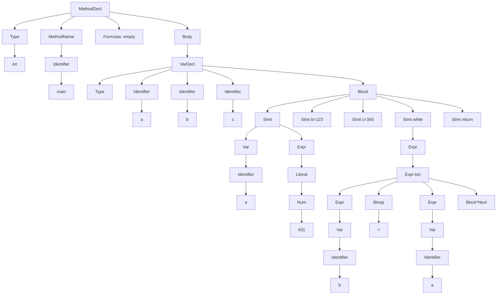
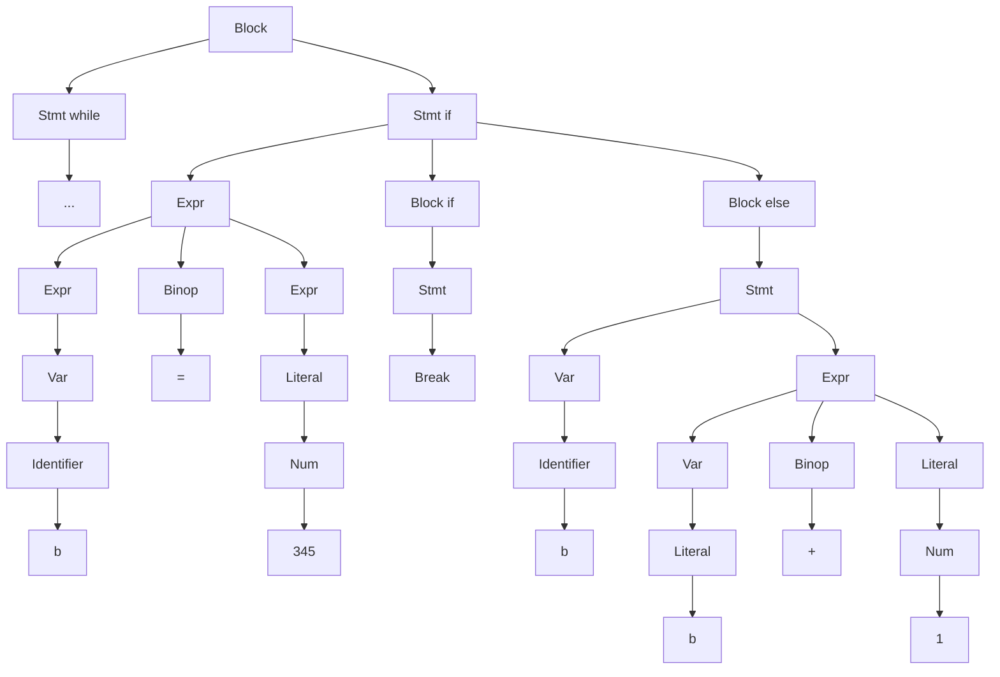

Several of the questions in this problem set refer to the following input character strings:
 I1 = `((32+100)*(16-4))`, I2 = `((32+(10*10))*(16-4))`, and I3 = `((32+(100*16))-4)`.

1. *Input character strings and token streams.
   \* For each input character string Ik (1 ≤ k ≤ 3), write down the corresponding token stream Sk that SamTokenizer would generate. What are the compression ratios for each input string, where *compression ratio* is defined as the number of characters in the input string divided by the number of resulting tokens?

   ```
   I1:
   (
   (
   32
   +
   100
   )
   *
   (
   16
   -
   4
   )
   )
   ```

   13 tokens, 17/13

   Same calculation methods for other two

2. *Abstract syntax trees.
   \* For each input character string Ik (1 ≤ k ≤ 3), show its corresponding abstract syntax tree Tk when parsed with the expression grammar of LiveOak. In what way are T1 and T2 the same? In what way are they different?
   **I1:**

   ```mermaid
   flowchart TB;
   		A[32]
   		B[100]
   		C[16]
   		D[4]
   		E[+] --> A
   		E[+] --> B
   		F[-] --> C
   		F[-] --> D
   		H[*] --> E
   		H[*] --> F
   ```

   **I2:**

   ```mermaid
   flowchart TB;
   		A[32]
   		B[10]
   		C[10]
   		D[16]
   		E[4]
   		F[*] --> B
   		F[*] --> C
   		G[+] --> A
   		G[+] --> F
   		H[-] --> D
   		H[-] --> E
   		I[*] --> G
   		I[*] --> H
   ```

   I1 and I2 are similar in level 0-1, but different at node “*” starting level 2 and down. It is because the expression added a branch in that slot.

   **I3:**

   ```mermaid
   flowchart TB;
   		A[32]
   		B[100]
   		C[16]
   		E[*] --> B
   		E --> C
   		F[+] --> A
   		F --> E
   		G[-] --> F
   		G  --> D[4]
   		
   ```

   

3. *Parsing and lookahead.
   \* Trace the individual steps of parsing and AST generation for input string I1 using a recursive-descent parser driven by the expression grammar of LiveOak. At each step, indicate the current and lookahead tokens, and sketch the shape of the parse tree and AST.

   ```
   getExpr('((32+100)*(16-4))'):
   token = '('
   lookahead = '('
     getExpr('(32+100)*(16-4))'):
       token = '('
       lookahead = '32'
       token = '32'
       exp1 = `PUSHIMM 32`
       token = '+'
       binop = `ADD`
       token = '100'
       exp2 = `PUSHIMM 100`
       token = ')'
     return expr(exp1+exp2+binop)
   exp1 = return1
   lookahead = '*'
   binop = `TIMES`
   token = '('
     getExpr('(16-4))'):
       token = '('
       lookahead = '16'
       token = '16'
       exp1 = `PUSHIMM 16`
       token = '-'
       binop = `SUB`
       token = '4'
       exp2 = `PUSHIMM 4`
       token = ')'
     return expr(exp1+exp2+binop)
   exp2 = return2
   token = ')'
   return expr(exp1 + exp2 + binop)
   ```

   

4. *Code generation.
   \* Show the SaM code generated for input string I2. Indicate the correspondence between code frag- ments and the AST nodes where they are generated and/or assembled.

```
getExpr('((32+(10+10))*(16-4))'):
token = '('
lookahead = '('

  getExpr('(32+(10+10))*(16-4))'):
    token = '('
    lookahead = '32'
    token = '32'
    exp1 = `PUSHIMM 32`
    token = '+'
    binop = `ADD`
    token = '('
    lookahead = '10'
    
    getExpr('(10+10)*(16-4))'):
      token = '('
      lookahead = '10'
      token = '10'
      exp1 = `PUSHIMM 10`
      token = '+'
      binop = `ADD`
      token = '('
      exp2 = `PUSHIMM 10`
      token = ')'
  		return expr(exp1+exp2+binop)
  		
    exp2 = return1
    token = ')'
  	return expr(exp1+exp2+binop)
  	
exp1 = return1
lookahead = '*'
binop = `TIMES`
token = '('

  getExpr('(16-4))'):
    token = '('
    lookahead = '16'
    token = '16'
    exp1 = `PUSHIMM 16`
    token = '-'
    binop = `SUB`
    token = '4'
    exp2 = `PUSHIMM 4`
    token = ')'
  	return expr(exp1+exp2+binop)
  	
exp2 = return2
token = ')'
return expr(exp1 + exp2 + binop)
```

```
// (...) * (...)
	// (32 + (...))
  PUSHIMM 32
  	// (10+10)
    PUSHIMM 10
    PUSHIMM 10
    TIMES
  ADD
  
  // (16 - 4)
  PUSHIMM 16
  PUSHIMM 4
  SUB
  
TIMES
```


1. *Code shape.
   \* Consider the following piece of LiveOak-2 code.

   ```java
       int main() {
               int a, b, c;
               
               a = 431; b = 123; c = 345;
               while((b<a)) {
                   while((b<c))
                       		b = (b+1);
                   if((b = 345))
                           break;
                   else
                   				b = (b + 1);
               }
               return b;
      	}
   ```

   

Work through the actions of the recursive-descent parser and the SaM code generator on this input. Show the structure of the AST and the contents of the symbol table. Indicate how the various code fragments are generated, stitched together, and passed around in the tree representation of the pro- gram.






```
// MethodDecl
	// VarDecl int a, b, c
		ADDSP 3
		(addToSymbolTable(a,b,c))
		(numVars = 3)
	
	// Stmt a = 431
    // Var a
      (symbol = symbolTable[a])
      PUSHOFF symbol.offset // redundent PUSH
     PUSHIMM 431
     STOREOFF symbol.offset
     ADDSP -1 // remove redundant PUSH
     
 	// Stmt b = 123
    // Var b
      (symbol = symbolTable[b])
      PUSHOFF symbol.offset // redundent PUSH
     PUSHIMM 123
     STOREOFF symbol.offset
     ADDSP -1 // remove redundant PUSH
     
 	// Stmt c = 345
    // Var c
      (symbol = symbolTable[c])
      PUSHOFF symbol.offset // redundent PUSH
     PUSHIMM 345
     STOREOFF symbol.offset
     ADDSP -1 // remove redundant PUSH
	
	// Stmt While
			// Expr (b<a)
					// Var b
            (symbol = symbolTable[b])
            PUSHOFF symbol.offset
          // Var a
            (symbol = symbolTable[a])
            PUSHOFF symbol.offset
          LESS
          
			// Block
					// Stmt While
							(Ltop, Lmid = newlabel(), newlabel())
							
							JUMP Lmid
							
							Ltop:
							// Block-Stmt b = (b+1)
								// Var b
                  (symbol = symbolTable[b])
                  PUSHOFF symbol.offset // redundent PUSH
                // Expr (b+1)
                  // Var b
                    (symbol = symbolTable[b])
                  	PUSHOFF symbol.offset 
                  PUSHOFF 1
                  ADD
                STOREOFF symbol.offset
                ADDSP -1 // remove redundant PUSH

              Lmid:
							// Expr (b<c)
								// Var b
                  (symbol = symbolTable[b])
                  PUSHOFF symbol.offset
                // Var c
                  (symbol = symbolTable[c])
                  PUSHOFF symbol.offset
								LESS
					
					// Stmt if
							(Lif, Lbreak = newlabel(), newlabel())
							// Expr (b = 345)
									// Var b
                    (symbol = symbolTable[b])
                    PUSHOFF symbol.offset
                  PUSHOFF 1
                  EQUAL
                
							JUMPC Lif
					
							// Block else b = (b + 1)
								// Var b
                  (symbol = symbolTable[b])
                  PUSHOFF symbol.offset // redundent PUSH
                // Expr (b+1)
                  // Var b
                    (symbol = symbolTable[b])
                  	PUSHOFF symbol.offset 
                  PUSHOFF 1
                  ADD
                STOREOFF symbol.offset
                ADDSP -1 // remove redundant PUSH
             
             Lif:
             // Block if
									// break
											JUMPC Lbreak
							
						 Lbreak:
	
	// Stmt return b
		// Var b
      (symbol = symbolTable[b])
      PUSHOFF symbol.offset
		JUMP fEnd

fEnd:
	STOREOFF -1 // [Q: should return slot always at -1?]
	ADDSP -numVars
	JUMPIND

```

