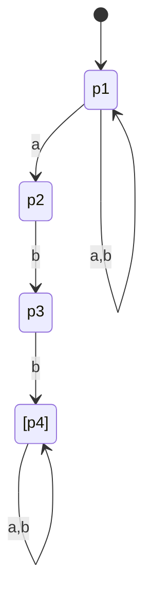
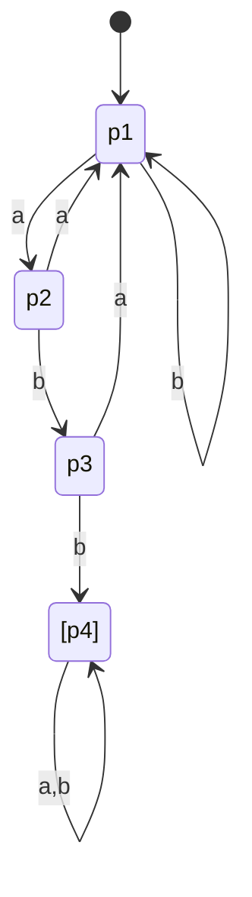
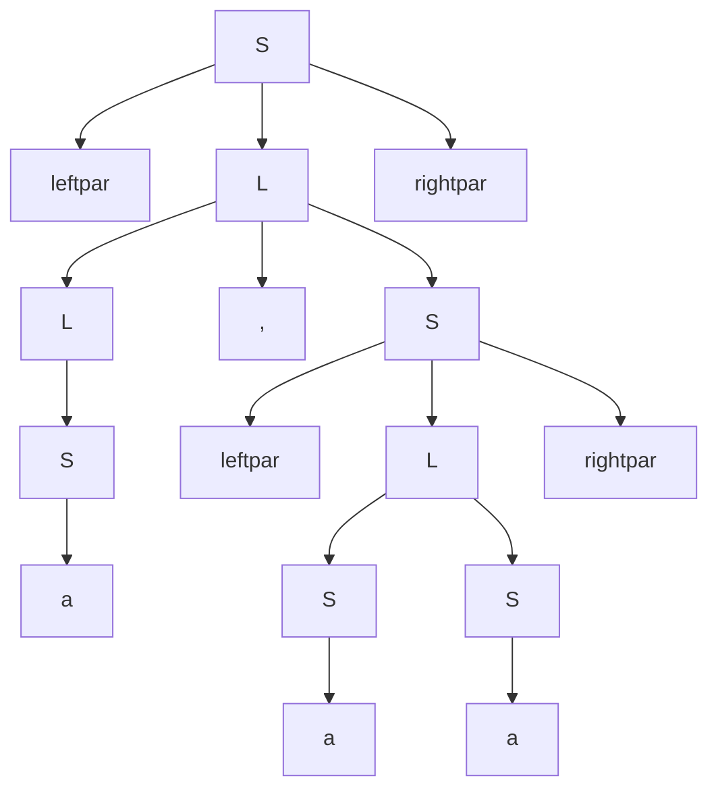
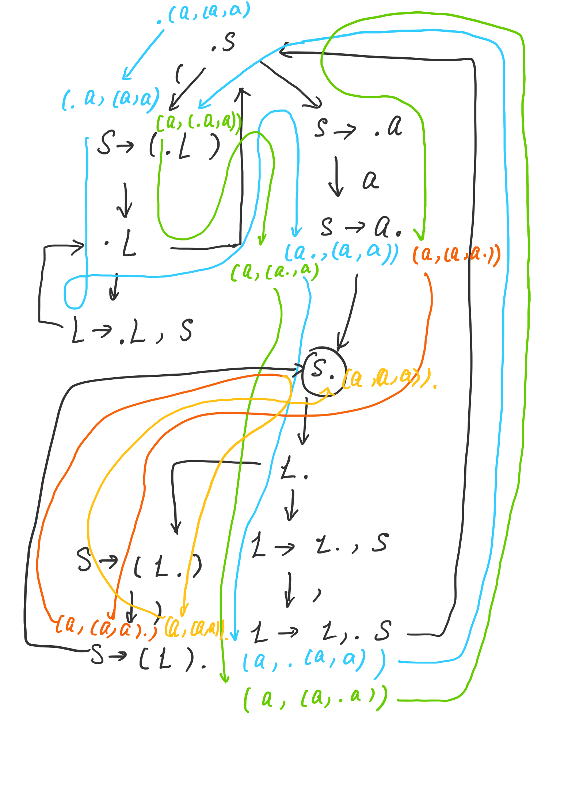

# Problem 1. *Finite automata and regular expressions.

\* Construct both non-deterministic and deterministic finite automata recognizing the language denoted by the regular expression (a|b)∗abb(a|b)∗. Show the sequence of moves made by each automaton in processing the input string ababbab.

**non-deterministic**



`a[p1]b[p1]a[p2]b[p3]b[p4]a[p4]b[p4]`

**Deterministic**




# Problem 2. Regular expressions in Ruby.

Use the websites https: / /rubular.com and https://ruby-doc.org/core-3.0.2/Regexp.
html to understand the syntax of regular expressions in Ruby.

### (a) 

Give an example of a string that matches the regular expression`/ˆ\d{1,3}\.\d{1,3}\.\d{1,3}\.\d{1,3}$/ ` and another that doesn't match it.

1-3 digits | . |  1-3 digits | . | 1-3 digits | .

match: 345.42.35.8

not match: 345a42.35.8

### (b) 

You have the following string:
"Hughes Missile Systems Company, Tucson, Arizona, is being awarded a $\$ 7,311,983$ modification to a firm fixed price contract for the FY94 TOW missile production buy, total 368 TOW 2Bs. Work will be performed in Tucson, Arizona, and is expected to be completed by April 30, 1996 . Of the total contract funds, $\$ 7,311,983$ will expire at the end of the current fiscal year. This is a sole source contract initiated on January 14, 1991. The contracting activity is the U.S. Army Missile Command, Redstone Arsenal, Alabama (DAAH01-92-C-0260).
Conventional Munitions Systems, Incorporated, Tampa, Florida, is being awarded a $\$ 6,952,821$ modification to a firm fixed price contract for Dragon Safety Circuits Installation and retrofit of Dragon I Missiles with Dragon II Warheads. Work will be performed in Woodberry, Arkansas (90%), and Titusville, Florida (10%), and is expected to be completed by May 31, 1996. Contract funds will not expire at the end of the current fiscal year. This is a sole source contract initiated on May 2, 1994. The contracting activity is the U.S. Army Missile Command, Redstone Arsenal, Alabama (DAAH01-94-C-S076)."

What are the matches that the regular expressions 

``/\$[\d,]+/`: $\$ 6,952,821$ , $\$ 7,311,983$, $\$ 7,311,983$

`/\w+ \d{1,2}, \d{4}/` : `April 30, 1996` // `May 31, 1996` //   `May 2, 1994`

` (?:\s*\b([A-Z]+(?:\s*\w*)?)\b)+` :

```
Match 1
1.	Company
Match 2
1.	Tucson
Match 3
1.	Arizona
Match 4
1.	TOW missile
Match 5
1.	TOW 2Bs
...
```


### Problem 3. Context-free grammars.

Consider the following grammar:

⟨S⟩→ ( ⟨L⟩ )
⟨S⟩→ a

⟨L⟩→⟨L⟩ ,  ⟨S⟩

⟨L⟩ → ⟨S⟩

(a) What are the terminals, non-terminals, and start symbol?

T: a (  )  ,

N: L, S

S: S

(b) Construct the parsing table for the grammar.

|      | (                  | a                  | )    | ,    |
| ---- | ------------------ | ------------------ | ---- | ---- |
| S    | → ( ⟨L⟩ )          | → a                |      |      |
| L    | → ⟨S⟩, →⟨L⟩ ,  ⟨S⟩ | → ⟨S⟩, →⟨L⟩ ,  ⟨S⟩ |      |      |

(c) Find a parse tree for the sentence (a, (a, a))




(d) Construct a leftmost and a rightmost derivation for the sentence (a,(a, a) ).

**Leftmost**

S -> ( L ) -> ( L, S ) -> ( S, S ) -> (a, S) -> (a, ( L )) -> (a, (L , S)) -> (a, (S, S)) -> (a, (a, S)) -> (a, (a, a))

**Rightmost**

S -> ( L ) -> ( L, S ) -> ( S, S ) -> (S, a) -> (S, ( L )) -> (S, (L , S)) -> (S, (L, a)) -> (S, (S, a)) -> (S, (a, a)) -> (a, (a, a))

(e) Construct the GFG for this grammar. Show the steps of the NGA in parsing the sentence (a, (a, a)) .





