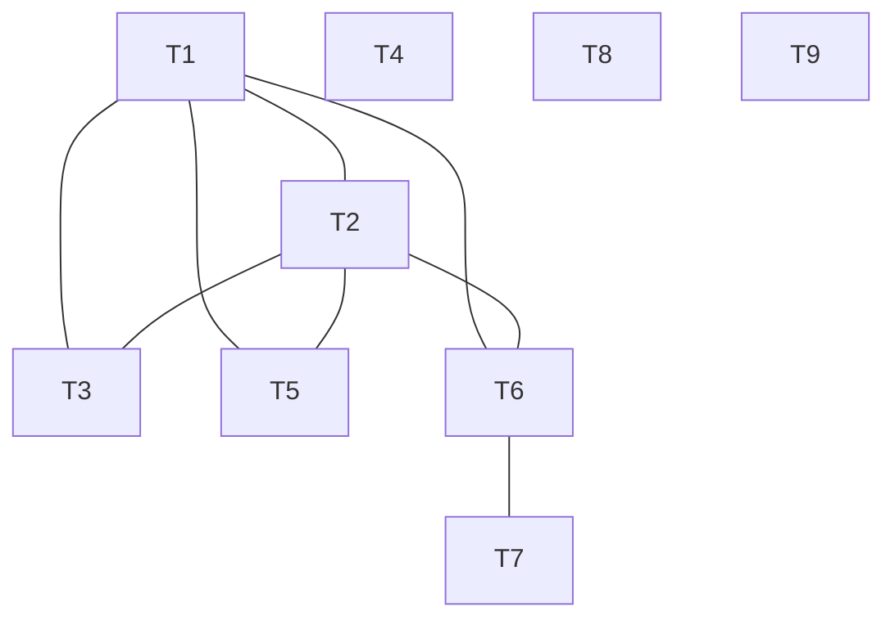
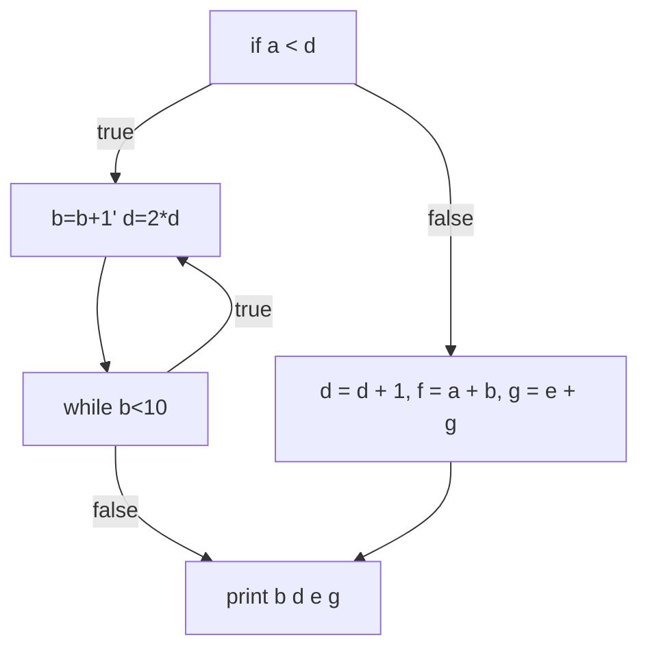
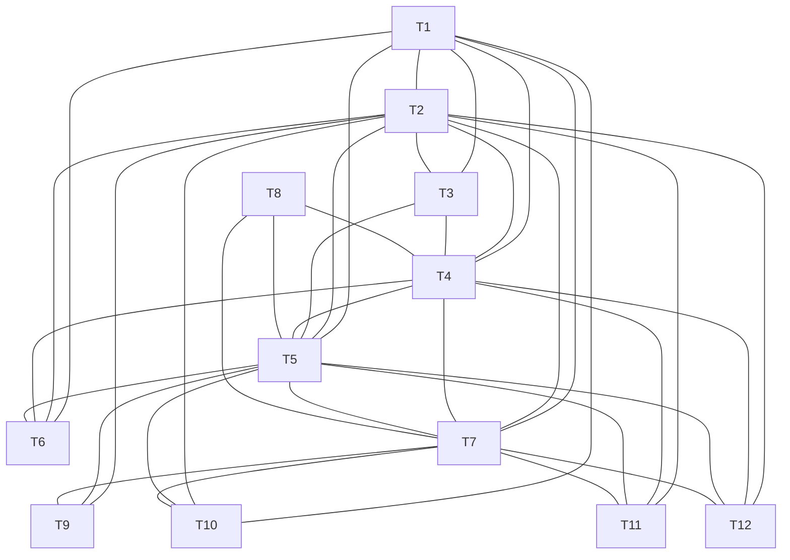

# Problem 1. *C’s “short-circuit evaluation” for conditionals.

\* Generate x86-64 assembly code for the following boxed fragments of C code, obeying C’s semantics for && and ||. You are given the location of the variables. If the condition evaluates to TRUE (respectively, FALSE), have the generated code branch to the label Ltrue (respectively, Lfalse).

```assembly
if((year%4==0&&year%100!=0)||year%400==0)
year in %rdi

# year%4==0
movl %rdi, %eax # number must be stored at %rax
movl $4, %edx # divisor
divl %edx # quotient in rax, remainder in rdx
movl %edx, %eax
testl %eax, %eax # %eax & %eax
jne Lfalse1
movl $1, %ebx # must be true now

# year%100!=0
movl %rdi, %eax 
movl $100, %edx 
divl %edx 
movl %edx, %eax
text %eax, %ebx # result 2 & result 1
je Ltrue2
movl $0, %ebx # must be false now


Lfalse1:

# year%400==0
movl %rdi, %eax
movl $400, %edx
divl %edx
movl %edx, %eax
testl %eax, %eax
jne Lfalse1


Ltrue2:
Ltrue:
// if block

Lfalse2:
Lfalse:
// else

```


```assembly
if (s[n] != ’ ’ && s[n] != ’\t’ && s[n] != ’\n’)
s (char *) in %rdi
n (int) in %rbx

# s[n] != ’ ’
movlsq %rbx, %rax #[Q: check when to use what type (q or l)]
addq %rdi, %rax 
movzbq (%rax), %rax #[Q: use ]
cmpb $32, %al
jne Lfalse

# s[n] != ’\t’
movlsq %rbx, %rax #[Q: check when to use what type (q or l)]
addq %rdi, %rax 
movzbq (%rax), %rax #[Q: use ]
cmpb $9, %al
je Lfalse

# s[n] != ’\n’
movlsq %rbx, %rax #[Q: check when to use what type (q or l)]
addq %rdi, %rax 
movzbq (%rax), %rax #[Q: use ]
cmpb $10, %al
je Lfalse

Ltrue:

Lfalse:


```


```assembly
if (p >= allocbuf && p < allocbuf + ALLOCSIZE)
p (char *) in %r11
allocbuf (static char *) in %r12

# p >= allocbuf
movq %r12, %rax
compq %r11, %rax
jb Lfalse

# p < allocbuf + ALLOCSIZE
movq %r12, %rax
addq $ALLOCSIZE, %rax
compq %r11, %rax
jnb Lfalse

Ltrue:

Lfalse:
```


```assembly
if (p >= p->s.ptr && (bp > p || bp < p->s.ptr))
p (Mystery *) in %r8
bp (Mystery *) in %r9

# p >= p->s.ptr
movq %r8, %rax
movq (%rax), %rax
cmpq %r8, %rax
jb Lfalse

# bp > p
movq %r8, %rax
cmpq %r9, %rax
jbe Ltrue

# bp < p->s.ptr
movq %r8, %rax
movq (%rax), %rax
cmpq %r9, %rax
jnb Lfalse

Ltrue:

Lfalse:
```


# Problem 2. *Stack frame for a complicated procedure.

```
extern int _foo1(int a, int b, int c, int d, bool w, bool x, bool y, bool z);
extern int _foo2(int a, int b, int c, int d, bool w, bool x);
extern int _foo3(int a, int b, int c, int d);

int foo(int argc, int argv[]) {
  switch (argc) {
    case 4: return _foo3(argv[0], argv[1], argv[2], argv[3]);
    case 6: return _foo2(argv[0], argv[1], argv[2], argv[3], argv[4], argv[5]);
    case 8: return _foo1(argv[0], argv[1], argv[2], argv[3], argv[4], argv[5], argv[6], argv[7]);
    default: return -1;
```

(a) Show the layout of the stack frame for foo. Indicate each of the four areas of the stack frame, how much each area takes, and the total size of the stack frame. [Q: what are 4 areas of stack frame? Aren’t they describing assembly code blocks rather than stack frame of the function itself? Ask for solution]

```
Prologue: 
old rbp --4
(vars all in register)

Pre-call:
1-8 parameters: put all in stack (n*4)

Post-return:
(NA)

Epilogue:
ret addr --8
```

(b) Generate x86-64 assembly code for foo, following the code generation templates discussed earlier. Remember that you do not know the internal structure of the procedures foo1, _ foo2, and $_{-}$ foo3.

```assembly
# int foo(int argc, int argv[]) {
# argc in rdi, argv in rsi
pushq %rbp
movq %rsp, %rbp
pushq %rbx
movl %rsi, %rax # make space rsi for future arguments
#  switch (argc) {
#    case 4: return _foo3(argv[0], argv[1], argv[2], argv[3]);
cmpl $4, %rdi
jne Lpass1
movl (%rax), %rdi #arg0
movl 4(%rax), %rsi #arg1
movl 8(%rax), %rdx #arg2
movl 12(%rax), %rcx #arg3
call Q


Lpass1:
#    case 6: return _foo2(argv[0], argv[1], argv[2], argv[3], argv[4], argv[5]);
cmpl $6, %rdi
jne Lpass2
movl (%rax), %rdi #arg0
movl 4(%rax), %rsi #arg1
movl 8(%rax), %rdx #arg2
movl 12(%rax), %rcx #arg3
movl 16(%rax), %r8 #arg4
movl 20(%rax), %r9 #arg5
call Q

Lpass2:
#    case 8: return _foo1(argv[0], argv[1], argv[2], argv[3], argv[4], argv[5], argv[6], argv[7]);
cmpl $8, %rdi
jne Lpass2
movl (%rax), %rdi #arg0
movl 4(%rax), %rsi #arg1
movl 8(%rax), %rdx #arg2
movl 12(%rax), %rcx #arg3
movl 16(%rax), %r8 #arg4
movl 20(%rax), %r9 #arg5
movl 24(%rax), %r11
movl %r11, %rbp #arg6
movl 28(%rax), %r11
movl %r11, %rbp #arg7
call Q

Lpass3:
#    default: return -1;
movq $-1, %rax
popq %rbx
popq %rbp
retq
```

(c) How can you make the generated code more compact?

```assembly
# int foo(int argc, int argv[]) {
# argc in rdi, argv in rsi
pushq %rbp
movq %rsp, %rbp
pushq %rbx
movl %rsi, %rax # make space rsi for future arguments
movl %rdi, %rbx

#  switch (argc) {
#    case 4: return _foo3(argv[0], argv[1], argv[2], argv[3]);
movl (%rax), %rdi #arg0
movl 4(%rax), %rsi #arg1
movl 8(%rax), %rdx #arg2
movl 12(%rax), %rcx #arg3
cmpl $4, %rbx
jne Lpass1
call Q


Lpass1:
#    case 6: return _foo2(argv[0], argv[1], argv[2], argv[3], argv[4], argv[5]);
movl 16(%rax), %r8 #arg4
movl 20(%rax), %r9 #arg5
cmpl $6, %rbx
jne Lpass2
call Q

Lpass2:
#    case 8: return _foo1(argv[0], argv[1], argv[2], argv[3], argv[4], argv[5], argv[6], argv[7]);
movl 24(%rax), %r11
movl %r11, %rbp #arg6
movl 28(%rax), %r11
movl %r11, %rbp #arg7
cmpl $8, %rbx
jne Lpass3
call Q

Lpass3:
#    default: return -1;
movq $-1, %rax
popq %rbx
popq %rbp
retq
```


# Problem 3. Register allocation, straight-line code.

Perform register allocation by graph coloring for the following code.
$$
\begin{aligned}
&\mathrm{x}=2 \\
&\mathrm{y}=4 ; \\
&\mathrm{w}=\mathrm{x}+\mathrm{y} \\
&\mathrm{z}=\mathrm{x}+1 \\
&\mathrm{u}=\mathrm{x} \star \mathrm{y} \\
&\mathrm{x}=\mathrm{z} \star 2
\end{aligned}
$$
(a) Rewrite it with symbolic registers substituted for the variables.

```
T1 := x 
{1}
T2 := y 
{1, 2}
T3 := T1 + T2 
{1, 2, 3}
T4 := w 
{1, 2, 3}
T4 = T3 
{1, 2}
T5 := T1 + 1
{1, 2, 5}
T6 := z
{1, 2, 5}
T6 = T5
{1, 2, 6}
T7 := T1 * T2
{6, 7}
T8 := u
{6, 7}
T8 = T7
{6}
T9 := T6 * 2
{9}
T1 = T9
```


(b) Draw the interference graph for the rewritten code.




(c) Show an allocation for it with three registers, assuming that variables $y$ and $w$ are dead on exit from this code.

```
T1 := x 				1: a
{1}
T2 := y 				1: a, 2: b
{1, 2}
T3 := T1 + T2 	1: a, 2: b, 3: c
{1, 2, 3}		
T4 := w 				
{1, 2, 3}
T4 = T3 				1: a, 2: b, 4: c
{1, 2}
T5 := T1 + 1		1: a, 2: b, 5: c
{1, 2, 5}
T6 := z					
{1, 2, 5}
T6 = T5					1: a, 2: b, 6: c
{1, 2, 6}
T7 := T1 * T2		1: a, 7: b, 6: c
{6, 7}
T8 := u					
{6, 7}
T8 = T7					1: a, 8: b, 6: c
{6}
T9 := T6 * 2		9: a, 8: b, 6: c
{9}
T1 = T9					9: a (x), 8: b (u), 6: c (z)
```


# Problem 4. *Register allocation with control flow.

\* Perform register allocation by graph coloring for the following program


```c
a = 2;
b = 3;
d = c;
e = a;
g = c + 1;
if (a < d) {
	do {
	b = b + 1;
    d = 2 * d;
  } while (b < 10);
 } else {
   d = d+1;
f = a + b;
g = e + g; }
print(b, d, e, g);
```


(a) Draw the control flow graph for this program.




(b) Rewrite it with symbolic registers substituted for the variables.

```assembly
1a 2b 3c 4d 5e 7g 12f

T1 := a = 2;
T2 := b = 3;
T3 := c;
T4 := d;
T4 := T3;
T5 := e;
T5 = T1
T6 := T3 + 1;
T7 := g;
T7 = T6

cmpq T1, T4
jnb Lelse

Lhead:
T8 := T2 + 1
T2 = T8
T9 := 2 * T4
T4 = T9

cmp1 T2, $10
jb Lhead	# while
jump Lend #exit while & if

Lelse:
T10 := T4 + 1
T4 = T10
T11 := T1 + T2
T12 := f
T12 = T11
T12 := T5 + T7
T13 := g
T13 = T12

Lend:
print(T2, T4, T5, T7);
```


(c) Draw the interference graph for the rewritten code.

```assembly
1a 2b 3c 4d 5e 7g 12f

T1 := a = 2;
{1}
T2 := b = 3;
{1, 2}
T3 := c;
{1, 2, 3}
T4 := d;
{1, 2, 3}
T4 := T3;
{1, 2, 3, 4}
T5 := e;
{1, 2, 3, 4}
T5 = T1
{1, 2, 3, 4, 5}
T6 := T3 + 1;
{1, 2, 4, 5, 6}
T7 := g;
{1, 2, 4, 5, 6}
T7 = T6

{1, 2, 4, 5, 7}
cmpq T1, T4
jnb Lelse

Lhead:
{2, 4, 5, 7}
T8 := T2 + 1
{8, 4, 5, 7}
T2 = T8
{2, 4, 5, 7}
T9 := 2 * T4
{2, 5, 7, 9}
T4 = T9

{2, 4, 5, 7}
cmp1 T2, $10
jb Lhead	# while
jump Lend #exit while & if

Lelse:
{1, 2, 4, 5, 7}
T10 := T4 + 1
{1, 2, 5, 7, 10}
T4 = T10
{1, 2, 4, 5, 7}
T11 := T1 + T2
{2, 4, 5, 7, 11}
T12 := f
{2, 4, 5, 7, 11}
T12 = T11
{2, 4, 5, 7}
T12 := T5 + T7
{2, 4, 5, 7, 12}
T13 := g
{2, 4, 5, 7, 12}
T13 = T12

Lend:
{2,4,5,7}
print(T2, T4, T5, T7);
```




(d) Show an allocation for it with five registers. (You will need to perform coalescing.)

```assembly
1a 2b 3c 4d 5e 7g 12f

T1 := a = 2;
{1} 						1: x
T2 := b = 3;
{1, 2} 					1: x, 2: y
T3 := c;
{1, 2, 3} 			1: x, 2: y 3: z
T4 := d;
{1, 2, 3}				
T4 := T3;				
{1, 2, 3, 4}		1: x, 2: y 3: z, 4: w
T5 := e;
{1, 2, 3, 4}
T5 = T1
{1, 2, 3, 4, 5}	1: x, 2: y 3: z, 4: w, 5: v
T6 := T3 + 1;
{1, 2, 4, 5, 6}	1: x, 2: y 6: z, 4: w, 5: v
T7 := g;
{1, 2, 4, 5, 6}
T7 = T6

{1, 2, 4, 5, 7}	1: x, 2: y 7: z, 4: w, 5: v
cmpq T1, T4
jnb Lelse

Lhead:
{2, 4, 5, 7}	1: x, 2: y 7: z, 4: w, 5: v
T8 := T2 + 1
{8, 4, 5, 7}	1: x, 8: y 7: z, 4: w, 5: v
T2 = T8
{2, 4, 5, 7}	1: x, 2: y 7: z, 4: w, 5: v
T9 := 2 * T4
{2, 5, 7, 9}	1: x, 2: y 7: z, 9: w, 5: v
T4 = T9

{2, 4, 5, 7}	1: x, 2: y 7: z, 4: w, 5: v
cmp1 T2, $10
jb Lhead	# while
jump Lend #exit while & if

Lelse:
{1, 2, 4, 5, 7}	1: x, 2: y 7: z, 4: w, 5: v
T10 := T4 + 1
{1, 2, 5, 7, 10}	1: x, 2: y 7: z, 10: w, 5: v
T4 = T10
{1, 2, 4, 5, 7}	1: x, 2: y 7: z, 4: w, 5: v
T11 := T1 + T2
{2, 4, 5, 7, 11}	11: x, 2: y 7: z, 4: w, 5: v
T12 := f
{2, 4, 5, 7, 11}
T12 = T11
{2, 4, 5, 7}
T12 := T5 + T7
{2, 4, 5, 7, 12}	12: x, 2: y 7: z, 4: w, 5: v
T13 := g
{2, 4, 5, 7, 12}
T13 = T12

Lend:
{2,4,5,7}
print(T2, T4, T5, T7);
```

