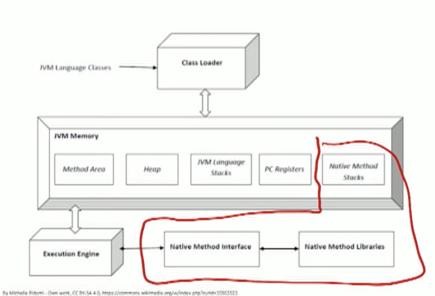
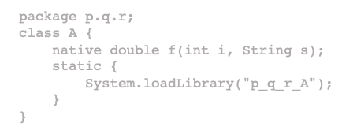
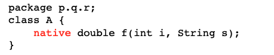
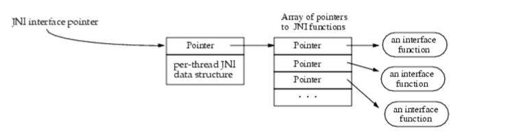

# Cross-language Interoperability

## Issues

### Multilingual Programs

- Why are large programs often written in a combination of different programming languages?
  - To use the most suitable language for a given problem.
  - To gradually migrate existing projects from one language to another.
  - To reuse existing source code.
- Examples
- Diversity of hardware ISAs that no single low-level language can cover: a RISC ISA, a multithreaded GPU, a VLIW DSP, a FPGA.
  - Domain-specific languages such as SQL make certain categories of operations impossible to implement but make common tasks within their domain possible to express in a few lines of code.
  - Languages like Java sacrifice the ability to manipulate pointers directly (and unsafely) in exchange for a more abstract memory model.
  - Mixed-mode programs.
    - HLLs typically call code written in lower-level languages as part of their standard libraries (e.g., GUI rendering).
    - Business logic written in JavaScript uses a database driver written in $\mathrm{C}$.

### Common Areas of Mismatch

- Object models.
  - Are factory objects (classes) a first-class construct? If so, are they also objects?
  - Are there zero, one, or many superclasses for an object?
  - Is method lookup tied to the static type system? Can it be modified at runtime?
- Memory models.
  - Is deallocation manual or automatic?
  - Is destruction deterministic or nondeterministic?
  - Are memory accesses safe or unsafe? null pointer
- Exceptions and unwinding.
  - Exception models differ widely in structure and usage frequency.
- Mutability and side effects. 
  - An immutable reference can lead to a mutable object. (functional programming)
  - Shallow vs. deep copying.
- Models of parallelism.

### Approaches to Interoperability

- Common language runtime (e.g., CLR)
  - Restrict languages to a subset of features that can be mapped to a common object/memory model, so that conformant languages can exchange data.
- Foreign function interfaces (e.g., JNI, CXX)
  - Define a specific interface between a pair of languages that allows accessing foreign objects.
- Multi-language source code (e.g., Jeannie, PyHyp)
  - Compose languages at a very fine granularity by allowing the programmer to toggle between syntax and semantics of languages on the source code level.
- Interface definition languages (e.g., XPCOM, CORBA)
  - Define message-based inter-process communication interfaces that can be mapped to multiple languages.
- Multi-language semantics
  - Mostly theoretical underpinnings.

## Case study Java Native interface

### The Java Native Interface (JNI)

- [Ref: Java Native Interface Specification. https://docs.oracle.com/en/iava/iavase/16/docs/specs/ini/ index.htm|]
- The JNI is a native programming interface. It allows Java code that runs inside a Java Virtual Machine (VM) to interoperate with applications and libraries written in other programming languages, such as $\mathrm{C}, \mathrm{C}++$, and assembly.
- Reasons for needing native methods in Java code
  - To provide platform-dependent features needed by the application that are not supported by the standard Java class library.
  - To make an existing library written in another language accessible to Java code.
  - To implement a small portion of time-critical code in a lower-level Ianguage such as assembly.

### JNl Usage Models

- java call C: Using JNI functions (JNI, $\S 4$ ) to allow native methods (written in C, C++…) to:
  - Create, inspect, and update Java objects (including arrays and) strings).
  - Call Java methods.
  - Catch and throw exceptions.
  - Load classes and obtain class information.
  - Perform runtime type checking.
- C call java: Using the Invocation API (JNI, §5) to enable an arbitrary native application to embed the Java VM.
  - This allows programmers to easily make their existing applications Java-enabled without having to link with the VM source code.
- JNI and COM: common object model
  - Although Java objects are not exposed to the native code as COM objects, the JNI interface itself is binary-compatible with COM.

### Example

- library “p_q_r_A” has native implementation of f
- [Compiling] As the Java VM is multithreaded, native libraries must be compiled/linked with multithread-aware native compilers.
  - For code complied with gcc, use the flags -D_REENTRANT or -D_POSIX_C_SOURCE.
- [Loading and linking] The argument to System. loadLibrary is a library name chosen arbitrarily by the programmer.
  - The system follows a standard, but platform-specific, approach to convert the library name to a native library name.
  - For example, a Linux converts the name p_q_r_A to libp_q_r_A.so.

- The JNI defines a $1: 1$ mapping from the name of the Java native method to the name of its implementation by concatenating the following components.
  - the prefix ("Java-") ;
  - the given binary name, in internal form, of the class which declares the native method (the result of escaping the name);
  - an underscore ("_");
  - the escaped method name;
- only if the native method declaration is overloaded by another native method: two underscores (" ") followed by the escaped) parameter descriptor (JVMS $\S 4.3 .3$ ) of the method declaration.
- Short name: Java_p_q_r_A_f.
- Long name:
Java_p_q_r_A_f____java_lang_String_2.

- First argument:
  - JNI interface pointer, of type JNIEnv.
- Second argument:
  - For non-static method, a reference to the object.
  - For static method, a reference to its Java class.
- Method arguments follow, with Java types mapped to native equivalents.
- Results passed back via return value.

### JNI Interface Pointer

- Organized like a C++ virtual function table.
  - Over 200 interface functions (JNI §4) for class and module operations, exceptions, global and local references, object operations, reflection, etc.
  - Separates the JNI name space from the native code, allowing for multiple versions of JNI function tables (e.g., for debugging arid $\mathrm{fcl}$ production).
  - The JNI interface pointer has thread scope.
- Primitive types are copied, but arbitrary Java objects are nassed by reference.
  - This has implications for the JVM's garbage collector.

### Case study common language runtime

The Comnnon Language Infrastructure

- [Ref: Common Language Infrastructure specification, https://www.ecma-international.org/wp-content/uploads/ECMA335 6th edition june 2012.pdf
- The Common Language Infrastructure (CLI) provides a specification for executable code and the execution environment in which it runs. It is a unifying infrastructure for designing, developing, deploying, and executing distributed components and applications.
- The Common Type System (CTS) provides a rich type system that supports the types and operations found in many programming languages.
- Metadata is used to describe and reference the types defined by the CTS. Metadata is stored in a way that is independent of any particular programming Ianguage. Thus, metadata provides a common interchange mechanism for use between tools (such as compilers and debuggers) that manipulate programs, as well as between these tools and the VES.
- The Common Language Specification (CLS) is an agreement between language designers and framework (that is, class library) designers. It specifies a subset of the CTS and a set of usage conventions.
- The Virtual Execution System (VES) implements and enforces the CTS model. The VES is responsible for loading and running programs written for the CLI. It provides the services needed to execute managed code and data, using the metadata to connect separately generated modules together at runtime.

- The Common Language Runtime (CLR) is an implementation of the $\mathrm{CLI}$ and is part of Miscrosoft's overall .NET framework.
  - Modules are of a standard format, containing metadata and code in the Microsoft intermediate language (MSIL).
  - Supports multiple languages, including C#, Java, Visual Basic .NET, and Managed C++.

### Validity and Verifiability

- Code modules can be verified for type safety similar to Java binary classes.
  - Verifiability is desirable but not mandatory.
  - Verification helps establish a run-time protection domain that allows untrusted code to execute safely.
  - User can explicitly permit the use of verified and unverified modules through a security manager.

- However, all programs must be valid.
  - E.g., a stack underflow that is detectable by inspecting the code at load time.
- Three categories of application programs.
  - Those that are verifiable and valid.
  - Those that are unverifiable and valid.
  - Those that are invalid.
- Java: verifiable and unverifiable (not allowed) classes.

### Assemblies

- Assemblies form the fundamental units of deployment, version control, reuse, activation scoping, and security permissions for .NETbased applications.
  - An assembly is a collection of types and resources that are built to work together and form a logical unit of functionality.
  - Assemblies take the form of executable ( . exe) or dynamic link library $(.$ dil $)$ files in PE/COFF format.
  - They provide the CLR with the information it needs to be aware of type implementations.
  - Assemblies are only loaded into memory if they are required.

### MSIL

- Object-oriented, stack-based bytecode.
  - Similar in many ways to Java bytecode.
  - Typically JIT-compiled into native code.
- Differences from Java bytecode.
  - The local data area and argument area for an MSIL method are not defined to be part of a stack frame (although they might be implemented as such).
  - Rather than a single constant pool, MSIL supports a number of metadata tables called streams.
    - These tables are accessed by tokens identifying the stream and the entry within it.
  - MSIL instructions are type-generic (only one add instruction, with the type being inferred from the operand types).
  - Certain MSIL instructions are unverifiable, in order to support Clike memory operations and control flow.

### interoperability

- Interoperability is supported in a more integrated way than in Java, extending to data.
  - A type defined in one language can be used across other languages.
    - Made possible by common metadata.
    - Hidden cost: may require significant changes to existing language implementations.
- The CLS component of the CLI contains a set of standard rules intended to ensure interoperability.

# Fixpoint Equations

## Introduction

### The Goal

- solving a set of mutually recursive equations.
- Given a set $D$ and functions $f, g: D \times D \rightarrow D$, solve
$$
\begin{aligned}
&x=f(x, y) \\
&y=g(x, y)
\end{aligned}
$$
- Underlying questions
  - What assumptions on $D, f$, and $g$ are sufficient to ensure that such a system of equations has a solution?
  - If such a system has multiple solutions, which solution do we really want?
  - How do we compute that solution?

### Example 1: LL(1) Parsing Table

- The computation of NULLABLE, FIRST, and FOLLOW can be formulated in terms of solving such a system of equations.
- $\operatorname{FIRST}(\varepsilon)=\{\varepsilon\}$
- $\forall t \in T, F I R S T(t)=\{t\} .$
- FIRST $\left(Y_{1} \cdots Y_{k}\right)=$
$\operatorname{FIRST}\left(Y_{1}\right)+{ }_{1} \cdots+{ }_{1}$ FIRST $\left(Y_{k}\right)$
- $\left(A \rightarrow Y_{1} \cdots Y_{k} \in P\right) \wedge(f \in$
$\left.\operatorname{FIRST}\left(Y_{1} \cdots Y_{k}\right)\right) \Rightarrow f \in$
$\operatorname{FIRST}(A)$
- $\$ \in F O L L O W(S)$.
- $\left(A \rightarrow X_{1} \cdots X_{k} B Y_{1} \cdots Y_{m} \in P\right) \wedge$
$(t \in$
$\left.\operatorname{FIRST}\left(Y_{1} \cdots Y_{m}\right)+_{1} F O L L O W(A)\right) \Rightarrow$ $t \in F O L L O W(B) .$

### Example 2: Live Variables

- The computation of the $I n$ and Out sets for basic blocks can be formulated in terms of solving such a system of equations.
- Given the CFG, assemble the full system of equations.
- Compute use and def sets for each instruction $I$ and each basic block $B$.
- For each instruction $I$ :
$$
\begin{gathered}
\operatorname{In}(I)=(\text { Out }(I) \backslash \\
\operatorname{def}(I)) \cup \operatorname{use}(I)
\end{gathered}
$$
- For each basic block B:

$$
\operatorname{Out}(B)=\bigcup_{B^{\prime} \in \operatorname{succ}(B)} \operatorname{In}\left(B^{\prime}\right)
$$

### Example 3: Type Inference

t0 = ((t3 -> **bool**) * (t3 -> **int**) * t3) -> **int**

- The computation of polytypes can be formulated in terms of solving such a system of equations.
- Form a system of equations among unknown type variables, following the language's typing rules "in reverse".
- For the judgment $\frac{E \vdash f: T \rightarrow U, E \vdash e: T}{E \vdash f(e): U}$, if $f, e$, apply have been assigned symbolic type names $t_{1}, t_{2}, t_{3}$ then add the equation $t_{1}=t_{2} \rightarrow t_{3}$.
- For the judgment $\frac{E \vdash e_{0} \text { :bool }, E \vdash e_{1}: T, E \vdash e_{2}: T}{E \vdash \text{if}  e_{0} \text { then } e_{1} \text { else } e_{2}}$, if $e_{0}, e_{1}, e_{2}$, if have been assigned symbolic type names $t_{0}, t_{1}, t_{2}, t_{3}$, then add the equations $\left\{t_{0}=\right.$ bool,$t_{1}=$ $\left.t_{2}, t_{3}=t_{1}\right\}$

### Game Plan

1. Finite partially-ordered set $D$ with least element $\perp$ Function $f: D \rightarrow D$
Monotonic function $f: D \rightarrow D$
2. Fixpoints of monotonic function $f: D \rightarrow D$
- Least fixpoint
3. Solving equation $x=f(x)$
- Least solution is least fixpoint of $f$
4. Generalization to when $D$ has a greatest element $\mathrm{T}$
- Least and greatest solutions to equation $x=f(x)$
- Generalization to systems of equations
5. Semi-lattices and lattices

## Posets and Domains

### Partially-Ordered Set

- A partially-ordered set (or poset) is a set $S$ paired with a binary relation $\sqsubseteq$ that is
  - reflexive: $\forall x \in S: x \sqsubseteq x$.
  - anti-symmetric: $\forall x, y \in S: x \sqsubseteq y \wedge y \sqsubseteq x \Rightarrow x=y$.
  - transitive: $\forall x, y, z \in S: x \sqsubseteq y \wedge y \subseteq z \Rightarrow x \sqsubseteq z$.
- Example: the set of integers ordered by $\leq$.
  - Poset generalizes this notion.
- Graphical representation of poset.
  - Nodes are elements of $S$. The relation $\sqsubseteq$ is shown by directed edges (i.e., $(x, y) \in E \equiv x$ 드 $y$ ).
  - We omit self-loops and transitive arrows to simplify the picture.
- Not a poset:
  - $S=\{a, b\},\{a \sqsubseteq a, b \subseteq b, a \subseteq b, b \subseteq a\} .$
  - a, b can’t be distinct element in a set

### Another Example of A Poset

- The powerset of any set ordered by set containment is a poset.
- In this example
  - The poset elements are $\emptyset,\{a\}$, $\{a, b\},\{a, b, c\}$, etc.
  - $x$ 드 $y \equiv x \subseteq y .$

### Domain

- A domain is a poset in which
  - the set $S$ is finite; and
  - there is a least element: 
    - an element of $S($ denoted $\perp)$ that is "below" all elements in the poset (i.e., $\forall x \in S: \perp \sqsubseteq x)$.
- Examples
  - The set of prime numbers ordered by natural ordering is a poset but is not a domain, because the set is not finite.
  - The powerset of $\{a, b, c\}$ ordered by set containment is a poset and a) domain (with $\perp=\emptyset$ ).
  - The factors of 12 ordered by natural] ordering on integers is a poset and a domain (with $\perp=1$ ).
  - 
- We will write $D=(S, \sqsubseteq)$.

### Functions on Domains

- If $D=(S, \sqsubseteq)$ is a domain, let $f: S \rightarrow S$ be a function that maps each element of $S$ to some element of $S$ itself.
- For $D=$ powerset of $\{a, b, c\}$ ordered by set containment:
$$
\begin{aligned}
&\quad f_{1}(x)=x \cup\{a\} \\
&\cdot \quad \text { So, } f_{1}(\emptyset)=\{a\}, f_{2}(b)=\{a, b\}, \text { etc. } \\
&\text { - } f_{2}(x)=x \backslash\{a\} \\
&\bullet \quad f_{3}(x)=\{a\} \backslash x
\end{aligned}
$$
- Such a function $f$ is said to be:
  - monotonic if $\forall x, y \in S: x \sqsubseteq y \rightarrow f(x) \sqsubseteq f(y)$.
  - extensive if $\forall x \in S: x \sqsubseteq f(x)$.
- Examples
  - Function $f_{1}$ is extensive and monotonic.
  - Function $f_{2}$ is not extensive but monotonic.
  - Function $f_{3}$ is neither extensive nor monotonic.

## Fixpoint

### Fixpoint of Function $f: D \rightarrow D$

- Let $D=(S, \sqsubseteq)$, and let $f: D \rightarrow D$ be a function on this domain.
- A value $x \in S$ **is called a fixpoint of $f$** if $f(x)=x$
- For the powerset domain:
  - Every element of the domain is a fixpoint for the identity function $I=\lambda x$. $x$.
  - For the function $G=\lambda x . x \cup\{a\}$, the elements $\{a\},\{a, b\},\{a, c\}$, and $\{a, b, c\}$ are fixpoints.
  - The function $H=\lambda x .\{a\} \backslash x$ has no fixpoints. [TODO_MT: prove]

### Fixpoint Theorem #1

- If $D=(S, \sqsubseteq)$ is a domain, $\perp$ is its least element, and $f: D \rightarrow D$ is **monotonic, then $f$ has a least fixpoint that is the largest element** in the sequence (chain) $[\perp, f(\perp), f(f(\perp)), f(f(f(\perp))), \ldots]$
  - Example
    - For the powerset domain, $\perp=\emptyset$.
    - For the identity function $I$, the sequence is $[\emptyset, \emptyset, \emptyset, \emptyset, \ldots]$, so the least fixpoint is $\emptyset$, which is correct.
    - For the function $G=\lambda x \cdot x \cup\{a\}$, the sequence is $[\emptyset,\{a\},\{a\},\{a\}, \ldots]$, so the least fixpoint is $\{a\}$, which is correct.

- Proof:
  - The largest element of the sequence is a fixpoint.
    - $\perp \sqsubseteq f(\perp)$ (by definition of $\perp$ ).
    - $f(\perp) \sqsubseteq f(f(\perp))$ (from previous fact and monotonicity of $f$ ).
    - $f(f(\perp)) \sqsubseteq f(f(f(\perp)))$ (same argument).
    - Since the set $D$ is finite, the chain $[\perp, f(\perp), f(f(\perp)), f(f(f(\perp))), \ldots]$ cannot grow arbitrarily, so it has some largest element that $f$ maps to itself. Therefore, we have] constructed a fixpoint of $f$.
  - This is the least fixpoint.
    - Let $p$ be any other fixpoint of $f$.
    - $\perp \sqsubseteq p$ (from definition of $\perp$ ).
    - So $f(\perp) \sqsubseteq f(p)=p$ (by monotonicity of $f$ ).
    - Similarly, $f(f(\perp)) \sqsubseteq p$, etc.
    - Therefore, all elements of the chain are $\sqsubseteq p$, so largest element of chain must be $\sqsubseteq p$.
    - Therefore, the largest element of chain is the least fixpoint of $f$.

### Solving A Fixpoint Equation

- If $D$ is a domain and $f: D \rightarrow D$ is monotonic, then the equation $x=f(x)$ has a least solution given by the largest element in the sequence
$[\perp, f(\perp), f(f(\perp)), f(f(f(\perp))), \ldots]$
- Proof: follows trivially from fixpoint theorem #1.
- Generalization #1: The proof goes through even if $D$ is not a finite set but only has finite height.
  - All we need is that there be no infinite chains.
  - 
- Generalization #2: If $D$ is a domain with a greatest element T and $f: D \rightarrow D$ is monotonic, then the equation $x=$ $f(x)$ has a greatest solution given by the smallest element in the descending sequence $[\mathrm{T}, f(\mathrm{~T}), f(f(\mathrm{~T})), f(f(f(\mathrm{~T}))), \ldots]$

### Functions with Multiple Arguments

- If $D$ is a domain, a function $f: D \times D \rightarrow D$ that takes two arguments is said to be monotonic if it is monotonic in each argument when the other argument is held constant.
$$
\therefore \forall x_{0}, x_{1}, y \in D: x_{0} \subseteq x_{1} \Rightarrow f\left(x_{0}, y\right) \subseteq f\left(x_{1}, y\right)
$$
$$
\text { - } \forall x, y_{0}, y_{1} \in D: y_{0} \sqsubseteq y_{1} \Rightarrow f\left(x, y_{0}\right) \subseteq f\left(x, y_{1}\right) .
$$
- Fixpoint Theorem #2
  - If $D$ is a domain and functions $f, g: D \times D \rightarrow D$ are monotonic, the following system of simultaneous equations has a least solution computed in the obvious way.
$$
\begin{aligned}
&x=f(x, y) \\
&y=g(x, y)
\end{aligned}
$$
- This theorem generalizes to more than two equations and to the case when $D$ has a greatest element $\mathrm{T}$.

### Formalization: Product Constructor

- Suppose $D_{1}=\left(S_{1}, \sqsubseteq_{1}\right)$ and $D_{2}=\left(S_{2}, \subseteq_{2}\right)$ are domains.
- Define $D=D_{1} \times D_{2}=(S, \sqsubseteq)$ to be the following domain:
  - Set $S=S_{1} \times S_{2}$, i.e., elements are ordered pairs in which the first member is from $S_{1}$ and the second is from $S_{2}$.
  - The ordering relation 5 is defined by $\left\langle d_{1}, d_{2}\right\rangle \subseteq\left\langle d_{3}, d_{4}\right\rangle \equiv d_{1} \sqsubseteq_{1} d_{3} \wedge d_{2} \sqsubseteq_{2} d_{4}$
- Replace the system of equations
$$
\begin{aligned}
&x=f(x, y) \\
&y=g(x, y)
\end{aligned}
$$
with one equation $\langle x, y\rangle=h(\langle x, y\rangle)=\langle f(x, y), g(x, y)\rangle$.
- Check that $D$ is a domain and that $h$ is a monotonic function.

## Computing The Least Solution

- Consider the system
$$
\begin{gathered}
x=f(x, y, z) \\
y=g(x, y, z) \\
z=h(x, y, z)
\end{gathered}
$$
- Obvious strategy: Evaluate all equations at every step, until solution converges.
$\left[\langle\perp, \perp, \perp\rangle,\langle f(\perp), g(\perp), h(\perp)\rangle,\left\langle f^{2}(\perp), g^{2}(\perp), h^{2}(\perp)\right\rangle, \ldots,\right]$,
- This strategy corresponds exactly to the Jacobi method in iterative solvers for linear systems.
- The general approach is called round-robin scheduling of equations.

### Worklist-Based Algorithm

- Obvious point: it is not necessary to re-evaluate a function if its inputs have not changed.
- Worklist-based algorithm:
  - Initialize worklist with all equations.
  - Initialize solution vector $v$ to the vector of all $\perp s$.
  - While the worklist is not empty:
    - Pick an equation from the worklist.
    - Evaluate RHS of this equation with the current value of the solution vector and update the entry corresponding to LHS variable in the solution vector $v$.
    - Add all equations that use this variable in their RHS to the worklist.
- You can show that this algorithm will compute the least solution to the system of equations.

## Lattices

### Power-Set Domains: $U$ and $\bigcap$

- Consider a power-set domain.
- As set union and intersection are monotonic functions, we can use them in systems of fixpoint equations.
- Example:
$$
f(x, y)=\{a\}
$$
- Equations:
$$
\begin{gathered}
x=f(x, y) \\
y=g(x, y)
\end{gathered}
$$
- Can we generalize this idea to domains that are not power-sets?

### Meet and Join

- If $D=(S, \sqsubseteq)$ is a poset and subset of S $T \subseteq S$, then $\ell \in S$ is a lower bound of $T$ if $\forall x \in T . \ell \sqsubseteq x$.
  - Example: lower bounds of $\{c, d\}$ are $d$ and $f$.
- In general, a given $T$ may have multiple lower bounds.
- The greatest lower bound (glb) of $T$ is the greatest element of $S$ that is a lower bound of $T$, if such an element exists.
  - GLB of $\{c, d\}$ Is $d$ .
  - Caveat: The glb may not always exist. E.g., $d, e$, and $f$ are all lower bounds of $\{b, c\}$, but there is no glb.
- If $\operatorname{glb}(\{x, y\})$ exists for every pair of elements $x, y \in S$, we can define a function called meet $(\Lambda: D \times D \rightarrow D)$ as $x \wedge y=\operatorname{glb}(\{x, y\})$
- A meet semilattice is a partially ordered set in which every pair of elements has a glb.
- Analogous notions:
  - upper bounds, least upper bounds, join (V), join semilattice.
- A lattice is a poset that is both a meet and a join semilattice. We write $L=(S, \sqsubseteq, \Lambda, V)$.

### Back To Power-Set Domains

- The powerset of a finite set under subset ordering is a canonical example of a lattice, with $\perp=\emptyset, \Lambda=\cap$, and $V=U$.
- If you "flip" this lattice over, you get another lattice, in which $\perp=\{a, b, c\}, \wedge$ $=U$, and $V=\cap$.
- Another canonical example of a lattice is the set of divisors of a composite number under "is-a-divisor-of" ordering, with **meet being GCD and join being LCM.**
- Examples of posets that are not lattices
  - See previous slide.

### Fixpoint Equations in Lattices

- If $(D, \sqsubseteq, \Lambda, V)$ is a finite lattice:
  - It has a least and greatest element.
  - The meet and join functions are monotonic.
- Therefore, if $(D, \sqsubseteq, \Lambda, V)$ is a finite lattice, fixpoint theorem #2 applies even if some of the functions $f, g$ etc. are $\wedge$ or V.
- Similarly, if $(D, \sqsubseteq, V)$ is a finite join semi-lattice, fixpoint theorem #2 applies even if some of the functions are $V$.

### Final Thoughts

- Do the systems of equations for our motivating examples have multiple solutions?
- If they do, why is the least solution the "right" one for our purposes?
- If a system of fixpoint equations does multiple equations for an unknown, is the system still guaranteed to have a solution?
Example: consider the system
$$
\begin{aligned}
x &=f(x) \\
x &=g(x)
\end{aligned}
$$
where $f$ and $g$ are monotonic.
- Do these ideas and techniques carry over to infinite sets? Yes

