### The Dark Side of Data-Code Duality

- The stack frame organization on $x 86$ mixes both data and pointers to code.
  - Data: Local variables.
  - Pointers to code: Return address.
    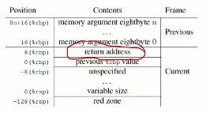
- What happens if we write some inappropriate bit pattern into the return address location? 
- We will corrupt the stack, subvert the control flow of the program, and cause it to demonstrate unexpected behavior
- This corruption can be unintended or malicious.
  - A common source of such corruption is known as **buffer overflow**.
  - following example: if put more than 8 bytes into buf, can overflow to return address and above

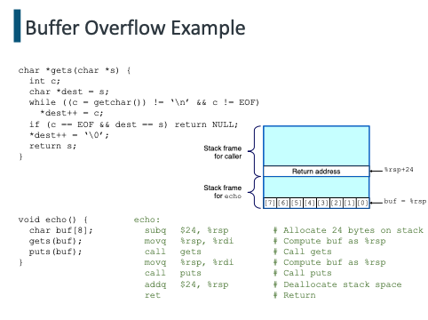

### Consequences of Buffer Overflow

- In our example, the consequence was unexpected behavior, possibly a core dump.
- More pernicious uses are possible.
  - Feed the program with a string that contains the byte encoding of some executable (aka the exploit code), plus some extra bytes that overwrite the return address with a pointer to the exploit code.
  - In this case, executing the ret instruction causes the program to jump to the exploit code.
  - The exploit code can now use a system call to start up a shell program.
  - Or the exploit code can perform some otherwise unauthorized task, repair the damage to the stack, and then execute a second ret, thereby hiding its malicious behavior from the user.

### Thwarting Buffer Overflow: #1

- Stack randomization (or address-space layout randomization)
  - Insight:
  In order to insert exploit code, the attacker needs to inject both the code and a pointer to this code as part of the attack string. We need to know the stack address of the string in order to generate the pointer value.
  - Solution:
  Make the position of the stack vary from one run of a program to another.
  - int main () {
  long local;
  print.f("local at sp $\backslash \mathrm{n}$ ", slocal);
  return 0 ;}
  - Weakness:
  Still susceptible to brute force attacks.

### Thwarting Buffer overflow #2

- Stack Corruption Detection
  - Insight:
  If a buffer overflows, it will leave a trace in memory.
  - Solution:
    Put a stack protector into the generated code to detect buffer overflows.
    - Store a special canary value (aka guard) value) in the stack frame between any local buffer and the rest of the stack state.
    - Canary value is generated randomly for each run of program.
    - Before restoring register state and returning from the function, the canary value has been checked for possible alteration.
  - Weakness:
  A small performance penalty. Does not protect against other ways of corrupting the state of an executing program.

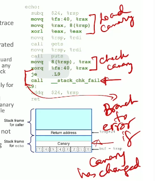

### Thwarting Buffer Overflow: #3

- Limiting Executable Code Regions
  - Insight:
  The exploit won't work unless the exploit code is actually executable.
  - Solution:
    Limit the memory regions that can hold executable code.
    - Only the . text section should be executable.
    - Use memory protection mechanisms in the operating system to accomplish this.
    -  writable xor execuatble (not at the sametime)
  - Weakness:
    - Needs to be modified for JIT compilers (or dynamic compilers in general) that generate code at run-time.
    - Still susceptible to return-oriented programming attacks.

## Return Oriented Programming

### Return-Oriented Programming

- Return-Oriented Programming (ROP) is an attack technique that injects no code, yet can induce arbitrary behavior in the targeted system.
- The code aggregates malicious computing by **linking together short code snippets already present in the program's address space**.
  - **Each snippet ends with a ret instruction**, which allows an attacker controlling the stack to chain them together.
  - Because the executed code is stored in memory marked executable, page protection mechanisms won't help.
- Still needs a buffer overflow or similar mechanism to subvert the control flow of the program.

### Program Layout

- An ordinary program (OP) is a sequence of machine instructions (MIs) laid out in the text segment of the program.
  - Each MI is a byte pattern that, when interpreted by the processor, induces a small amount of change in machine state.
  - The instruction pointer %rip governs the MI that is fetched and executed next.
- A return-oriented program (RP) is a sequence of returnoriented instructions (RIs) laid out in the **stack segment** (not in the text segment) of the exploited program.
  - Each RI is a sequence of words on the stack pointing to a sequence of MIs ending in a ret, somewhere in the address space of the exploited program.
  - The stack pointer governs what MI sequence is to be fetched next in the following way. The execution of a ret instruction has two effects: first, the word to which $\circ r s p$ points is read and used as the new value for $\circ r i p$; second,  %rsp is incremented by 8 bytes to point to the next word on the stack.

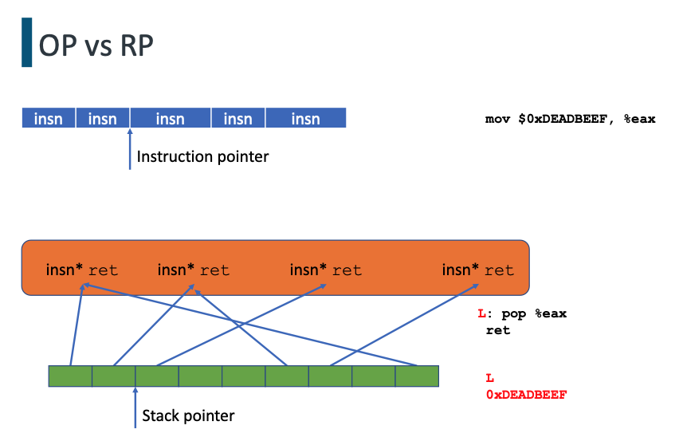

### Gadgets

- A gadget is an arrangement of words on the stack, including one or more instruction sequence pointers and associated immediate values, that encodes a logical unit of work in the RP.
  - Gadgets act like a return-oriented instruction set and are the natural target of a return-oriented compiler's assembler.
- Example: A memory-load gadget.
  - MI sequences
    - $S_{1}:$ pop  %eax; ret
    - $S_{2}$ : mov (%eax), %ebx; ret
  - On stack
  [Pointer to $S_{1}$, address of word to load, pointer to $S_{2}$ ]

### Gadget Execution

- Correct execution of a gadget
  - Precondition: $\circ r \operatorname{sp}$ points to the first word in the gadget and the processor executes a ret instruction.
  - Postcondition: when the ret instruction in its last instruction sequence is executed,  %rsp points to the next gadget to be executed.
- Together, these conditions guarantee that the returnoriented program will execute correctly, one gadget after another.
- Exploitation
  - Place the payload containing these gadgets in the memory of the program to be exploited, and redirect the stack pointer so that it points to the first gadget.
  - The easiest way to accomplish these tasks is by means of a buffer overflow on the stack; the gadgets are placed on the overflowed stack so that the first has overwritten the saved instruction pointer of some function. When that function tries to return, the returnoriented program is executed instead.

### Finding Useful Instruction Sequences

- Every instruction sequence ending in a ret instruction (represented by the byte $0 x c 3$ on $x 86$ ) is potentially useful.
- The suffix of any useful instruction sequence is also useful.
- The frequency of occurrence of some sequence is not relevant; only its existence is.
- On variable-length instruction sequences, there can also be **unintended instruction sequences.**

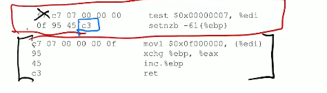

# Typed Assembly Language

### Language-Based Security

- Types express invariants that help programmers understand their programs, and strongly-typed languages prevent many common programming errors.
- Until now, we have used types to carry around information about code and data through the compilation process.
  - Statically-typed intermediate languages (e.g., ASTs) are effective tools for staging the compilation of high-level languages.
  - Compiler writers can use these properties to debug sophisticated program transformations and optimizations.
  - Types help check the correctness of transformations and enable analyses or optimizations that are extremely difficult otherwise.
- When we get to assembly or machine code, we seem to lose this type information, allowing attacks such as ROP.
  - Can we carry type information through to the assembly language level?

### Typed Assembly Language (TAL)

- Long-running project at Cornell (https://www.cs.cornell.edu/talc/) that extends traditional assembly languages with typing annotations, memory management primitives, and a sound set of typing rules.
  - These typing rules guarantee the memory safety, control flow safety, and type safety of TAL programs.
  - The typing constructs are expressive enough to encode most source language programming features including records and structures, arrays, higher-order and polymorphic functions, exceptions, abstract data types, subtyping, and modules.
  - TAL is flexible enough to admit many low-level compiler optimizations.
  - The TAL compiler (TALC) generates code for the Intel 32-bit family of assembly languages. This assembly code is **annotated** with type information that can be verified by the TAL type checker before the code is assembled by the MASM assembler.
- For simplicity, we will use an idealized RISC ISA.

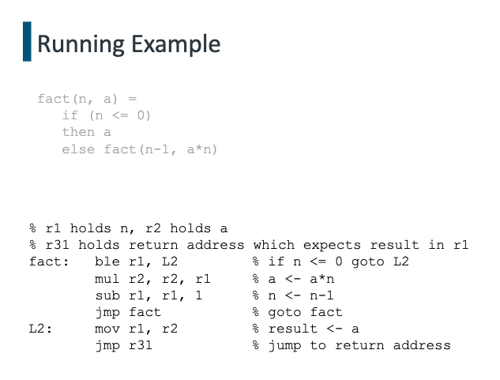

### TAL-0: Control Flow and Basic Types

- Registers: $r \in\{r 1, r 2, \ldots\}$.
- Labels: $L \in$ Identifier.
- Integers: $n \in\left[-2^{k-1} . .2^{k-1}\right)$.
- Basic blocks: $B \rightarrow$ jmp $v \mid i ; B$
- Instructions: $i \rightarrow$ aop $r_{d}, r_{s}, v \mid$ bop $r, v \mid \operatorname{mov} r, v$
- Operands: $v \rightarrow r|n| L$
- Arithmetic operations: aop $\rightarrow$ add $\mid$ sub $\mid$ mul $\mid \ldots$
- Branch operations: bop $\rightarrow$ beq $\mid$ bgt $\mid \ldots$

### The TAL-O Abstract Machine

- Machine state: $\Sigma=(H, R, B)$.
  - $H$ (for "heap") is where code is stored.
    - It is a partial map from labels to basic blocks.
  - $R$ (for "registers") is where data is stored.
    - It is a map from registers to values, extended to handle literals and labels.
    - $R(n)=n$
    - $R(L)=L$
    - $R(r)=v$ if $R=\{\ldots, r \mapsto v, \ldots\}$
  - $B$ (for "basic block") corresponds to the current program counter.
  - Executing an instruction is a transition function mapping machine states to machine states: $\Sigma \mapsto \Sigma$.

### TAL-0: Operational Semantics

- $\left(H, R, \operatorname{mov} r_{d}, v ; B\right) \mapsto\left(H, R\left[r_{d} \leftarrow R(v)\right], B\right)$
  - left: instruction
  - right: after instruction
- $\left(H, R, \operatorname{add} r_{d}, r_{s}, v ; B\right) \mapsto\left(H, R\left[r_{d} \leftarrow R\left(r_{s}\right)+R(v)\right], B\right)$
- $(H, R, \operatorname{jmp} v) \mapsto(H, R, B)]$
where $R(v)=L$ and $H(L)=B$
- $(H, R$, beq $r, v ; B) \mapsto(H, R, B)$
where $R(r) \neq 0$, fall through to next instruction if test is false
- $(H, R$, beq $r, v ; B) \mapsto\left(H, R, B^{\prime}\right)$
where $R(r)=0, R(v)=L$, and $H(L)=B^{\prime}$
- The other instructions follow a similar pattern.

### TAL-0: Error Conditions

- The abstract machine is stuck if there is no transition from its current state to some next state.
  - The stuck states define bad things that may happen.
  - We would like to be able to reason (statically) about a TAL-0 program to determine whether or not the program can get stuck.
- Example stuck states (type errors)
  - $\left(H, R\right.$, add $\left.r_{d}, r_{s}, v ; B\right)$, and either $r_{s}$ or $v$ is not an int.
  - $(H, R, \mathrm{jmp} v)$, but $v$ is not a label.
  - $(H, R$, beq $r, v ; B)$, and $r$ isn't an int/register or $v$ isn't a label.

### TAL-0: Type System

- In order to recognize stuck states, we need to introduce a type system to distinguish between integers and labels.
  - $\tau \rightarrow$ int $\mid$ Label
  - How should we describe label types?
- Labels are attached to code fragments.
- What we would like to be able to know for labels are the types that each register should contain when the program reaches that label. So we need a type $\Gamma$ for register files.
  - $\Gamma \rightarrow\left\{r_{1}: \tau_{1}, r_{2}: \tau_{2}, \ldots\right\} .$
  - Label $\rightarrow \Gamma \mapsto\{\} .$
- **To jump to a code label with a given type, the registers must contain values of the correct types.**
- Intuitively, code blocks are functions that take a record of arguments but never return, because they always end with a jump to another label.

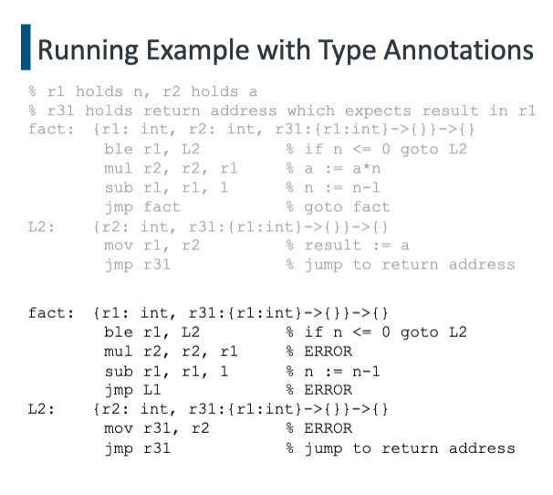

### TAL-0: Type Checking

- We need to keep track of:
  - The types of the registers at each point in the code
  - The types of the labels in the code
- Heap types: $\Psi$ will map labels to label types.
- Register types: $\Gamma$ will map registers to types.

### TAL-0: Type-Checking Operands

- Typing judgments for operands are of the form
  $\quad \Psi ; \Gamma \vdash v : \tau$
  - Integer literals are ints: $\quad \Psi ; \Gamma \vdash n$ : int
  $\begin{array}{ll}\text { - Look up register types in } \Gamma: & \Psi ; \Gamma \vdash r: \Gamma(r) \\ \text { - Look up label types in } \Psi: & \Psi ; \Gamma \vdash L: \Psi(L)\end{array}$
- Register file types, like record types, are covariantly subtyped (add an additional item, becomes a subtype).
$$
\left\{r_{1}: \tau_{1}, \ldots, r_{i}: \tau_{i}, r_{i+1}: \tau_{i+1}\right\} \leq\left\{r_{1}: \tau_{1}, \ldots, r_{i}: \tau_{i}\right\}
$$
- Label types, like function types, are contravariantly subtyped in their arguments.
  v has label type: $v: \Gamma \rightarrow\{\}$
$$
\frac{\Gamma^{\prime} \leq \Gamma}{\left.\Gamma \rightarrow\{\} \leq \Gamma^{\prime} \rightarrow \{\right\}}
$$
- Subtyping is reflexive and transitive.
- Subsumption: A value can be used at a supertype (of itself).

$$
\frac{\Psi ; \Gamma \vdash v: \tau_{1} \quad \tau_{1} \leq \tau_{2}}{\Psi ; \Gamma \vdash v: \tau_{2}}
$$

### TAL-0: Type-Checking Instructions

- instructions: map register state to register state
- Typing judgments for instructions will be of the form $\Psi \vdash i: \Gamma_{1} \rightarrow \Gamma_{2}$
  - $\Gamma_{1}$ describes the registers on input to the instruction.
  - $\Gamma_{2}$ describes the registers on output from the instruction.
  - $\Psi$ remains invariant.
- Arithmetic operations:
$$
\frac{\Psi ; \Gamma \vdash r_{S}: \text { int } \Psi ; \Gamma \vdash v: \text { int }}{\Psi \vdash \text { aop } r_{d}, r_{S}, v: \Gamma \rightarrow \Gamma\left[r_{d} \mapsto \text { int }\right]}
$$
- Conditional branches: v is lable ({}), register state doesn’t change
$$
\frac{\Psi ; \Gamma \vdash r: \text { int } \Psi ; \Gamma \vdash v: \Gamma \rightarrow\{\}}{\Psi \vdash \text { bop } r, v: \Gamma \rightarrow \Gamma}
$$
- Data movement:

$$
\frac{\Psi ; \Gamma \vdash v: \tau}{\Psi \vdash \operatorname{mov} r, v: \Gamma \rightarrow \Gamma[r \mapsto \tau]}
$$

### TAL-0: Type-Checking Basic Blocks

- All basic blocks end in a jump instruction.
$$
\frac{\Psi ; \Gamma \vdash v: \Gamma \rightarrow\{\}}{\Psi \vdash j m p v: \Gamma \rightarrow\{\}}
$$
- Instruction sequences:
$$
\frac{\Psi \vdash i: \Gamma_{1} \rightarrow \Gamma_{2} \Psi \vdash B: \Gamma_{2} \rightarrow\{\}}{\Psi \vdash i ; B: \Gamma_{1} \rightarrow\{\}}
$$
- The subtyping rule is admissible for basic blocks:

$$
\frac{\Psi \vdash B: \Gamma_{2} \rightarrow\{\} \quad \Gamma_{1} \leq \Gamma_{2}}{\Psi \vdash B: \Gamma_{1} \rightarrow\{\}}
$$

### TAL-0: Type-Checking Machine States

- The heap:
$$
\frac{\operatorname{Dom}(H)=\operatorname{Dom}(\Psi) \quad \forall L \in \operatorname{Dom}(H) . \Psi \vdash H(L): \Psi(L)}{\vdash H: \Psi}
$$
- The register file:
$$
\frac{\forall r \in \operatorname{Dom}(\Gamma) . \Psi ;\{\} \vdash R(r): \Gamma(r)}{\Psi \vdash R: \Gamma}
$$
- The machine:

$$
\frac{\vdash H: \Psi \quad \Psi \vdash R: \Gamma \quad \Psi \vdash B: \Gamma \rightarrow\{\}}{\vdash(H, R, B)}
$$

### TAL-0: Type Safety

- The type system has the following safety property.
  - If $\vdash \Sigma$ and $\Sigma \vdash^{*} \Sigma^{\prime}$, then $\Sigma$ is not stuck.
- (Preservation) Each step in evaluation preserves typing.
- (Progress) If a state is well-typed then it is not stuck.
- Corollaries
  - All jumps are to valid labels (control-flow safety)
  - All arithmetic is done with integers (not labels)

### TAL-1: TAL-0 + Polymorphism

- Changes to types:
  - Add type variables: $\alpha, \beta$, etc.
  - Label types can be polymorphic:
    - swaping two values
    - $\forall \alpha, \beta .\left\{r_{1}: \alpha, r_{2}: \beta, r_{31}:\left\{r_{1}: \beta, r_{2}: \alpha\right\} \rightarrow\{\}\right\} \rightarrow\{\}$
  - Describes a function that swaps the values in registers $r_{1}$ and $r_{2}$, for values of arbitrary types.
- Changes to operands: $v \rightarrow r|n| L \mid v[\tau]$
  - Explicitly instantiate type variables.

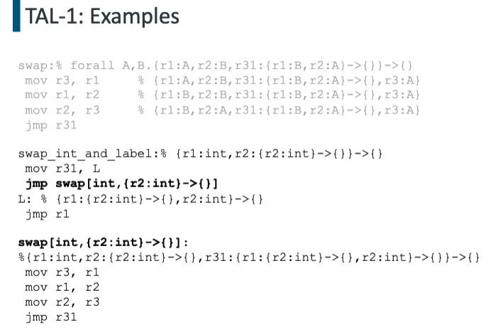

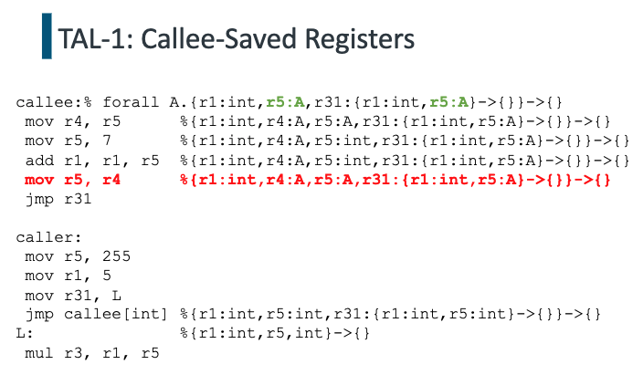

Can actually be formally proved that callee preserves not 
just the types but the values of its callee-saved registers.

### TAL-2: TAL-1 + Run-Time Stack

- Machine states: $M \rightarrow(H, R, S, B)$
- Model the stack as a list of values: $S \rightarrow$ nil $\mid v ; S$
- Additional instructions:
  $i \rightarrow$ salloc $n \mid$ sfree $n \mid$ sld $r_{d}, n \mid$ sst $r_{s}, n$
  - We have a designated stack pointer register $s p$ that points to TOS.
  - Stack grows downwards in memory.
  - salloc $n \equiv \operatorname{sub} s p, s p, n$
  - sfree $n \equiv \operatorname{add} s p, s p, n$
  - $\operatorname{sld} r_{d}, n \equiv \operatorname{ld} r_{d}, s p(n)$
  - $\operatorname{sst} r_{s}, n \equiv \operatorname{st} s p(n), r_{s}$
- Error conditions:
  - The machine will get stuck if we free too much or read/write invalid stack locations.

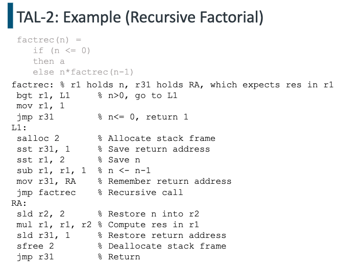

### TAL-2: Operational Semantics

- Newly-allocated stack locations will have garbage values, shown as ? (solely for defining the operational semantics). S: stack
- $(H, R, S$, salloc $n ; B) \mapsto\left(H, R[sp\mapsto R(sp) -n], ?^{n} ; S, B\right)$
- $\left(H, R, v_{1} ; \cdots ; v_{n} ; S\right.$, sfree $\left.n ; B\right) \mapsto(H, R[sp\mapsto R(sp) +n], S, B)$
- $(H, R, S, \operatorname{sld} r, n ; B) \mapsto\left(H, R\left[r \leftarrow v_{n}\right], S, B\right)$ where $S=v_{1} ; \cdots ; v_{n} ; S^{\prime}$
- $\left(H, R, S_{1}\right.$, sst $\left.r, n ; B\right) \mapsto\left(H, R, S_{2}, B\right)$
where $S_{1}=v_{1} ; \cdots ; v_{n-1} ; v_{n} ; S^{\prime}, S_{2}=v_{1} ; \cdots ; v_{n-1} ; R(r) ; S^{\prime}$

### TAL-2: Types

- Stack types: $\sigma \rightarrow$ void $|\tau ; \sigma| \rho$
  - The empty stack (i.e., nil) has type void.
  - The stack $v ; S$ has type $\tau ; \sigma$, i.e., we have $v: \tau$ and $S: \sigma$. 
    - v: a specific item in stack
    - S: rest of the stack
  - $\rho$ is a stack type variable that describes some unknown tail of the stack.
- The junk value ? has type $\perp$.
  - This type is never a valid type for an instruction.
- The register file type will contain a type for the register $s p$ that is mapped to the state of the current stack.
  - $\left\{s p:\right.$ int $; \rho, r_{1}:$ int,$\left.\ldots\right\}$
- Label types can be polymorphic over stack types.
  - $\forall \rho .\left\{s p:\right.$ int $; \rho, r_{1}:$ int, $\left.\ldots\right\} \rightarrow\{\}$
    - stack has int on top (sp: int)
    - rest of stack has anything ($\rho$)

### TAL-2: Type-Checking Instructions

- Typing judgments for instructions will now be of the form $\Psi ; \Delta \vdash i: \Gamma_{1} \rightarrow \Gamma_{2}$
  - $\Gamma_{1}$ describes the registers on input to the instruction.
  - $\Gamma_{2}$ describes the registers on output from the instruction.
  - $\Psi$ (the heap state) remains invariant.
  - $\Delta$ represents the bindings for type variables.

- Stack allocation: $\frac{}{\Psi ; \Delta \vdash-\operatorname{salloc} n: \Gamma[s p \mapsto \sigma] \rightarrow \Gamma\left[s p \mapsto \perp^{n} ; \sigma\right]}$
- Stack free: $\overline{\Psi ; \Delta \vdash \text { sfree } n: \Gamma\left[s p \mapsto \tau_{1} ; \cdots ; \tau_{n} ; \sigma\right] \rightarrow \Gamma[s p \mapsto \sigma]}$
- Stack load: $\frac{\Gamma(s p)=\tau_{1} ; \cdots ; \tau_{n} ; \sigma}{\Psi ; \Delta \vdash-s l d r, n: \Gamma \rightarrow \Gamma\left[r \mapsto \tau_{n}\right]}$
- Stack store: $\quad \frac{\Psi ; \Delta ; \Gamma \vdash v: \tau \quad \Gamma(s p)=\tau_{1} ; \cdots ; \tau_{n-1} ; \tau_{n} ; \sigma}{\Psi ; \Delta \vdash-s s t v, n: \Gamma \rightarrow \Gamma\left[s p \mapsto \tau_{1} ; \cdots ; \tau_{n-1} ; \tau ; \sigma\right]}$

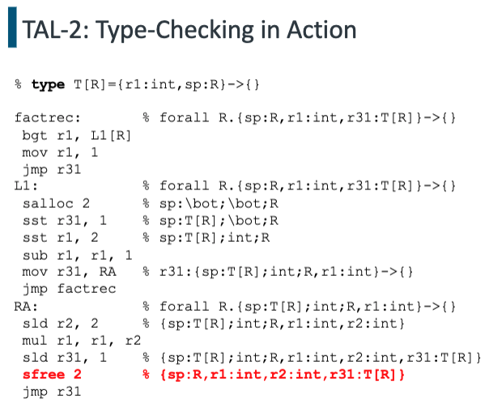

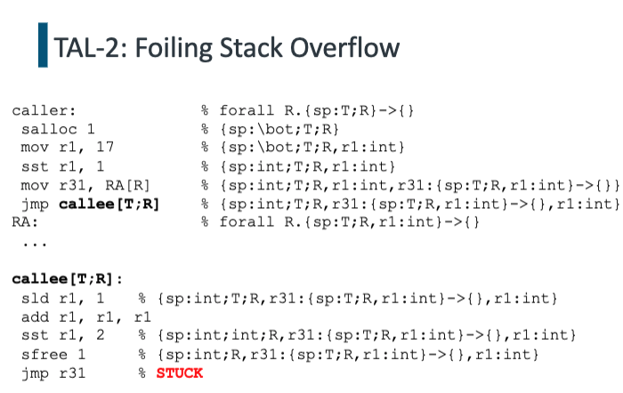