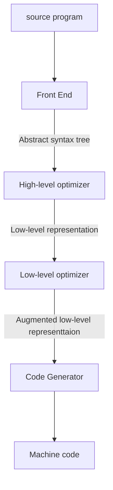

# 1. Introduction

### Topics:

+ program text to execution
+ Physical machine and virtual machine
+ how language features are mapped to capabilities to machine
+ mathematical underpinnings of program translation

### Focus:

+ Automatic techniques for analyzing and transforming programs in a given language to execute on target machine
+ sequential, imperative, class-based source language

### Analysis framework

+ Cost: time, space, energy
+ Benifit: high performance, low memory use, energy efficiency, portability
+ Risk: correctness, security

### Execution Models

+ Physical machine
+ (language level/ process) Virtual machine: eg. JVM, compile to abstraction at slightly higher level

### Transformation workflow

### Binding Time

+ when source program gets lowerd in its level of abstraction until it’s suitable for execution
+ Phases
  + Blue, red: static
  + red line: code distribution
    + Translate: process modules individually
    + (static) Link: package modules together
  + Green: dynamic
    + (dynamic) Link: pull in dynamic libraries
    + Interpret: actual execution (by physical or virtual machine)
+ .c, .java, 
  