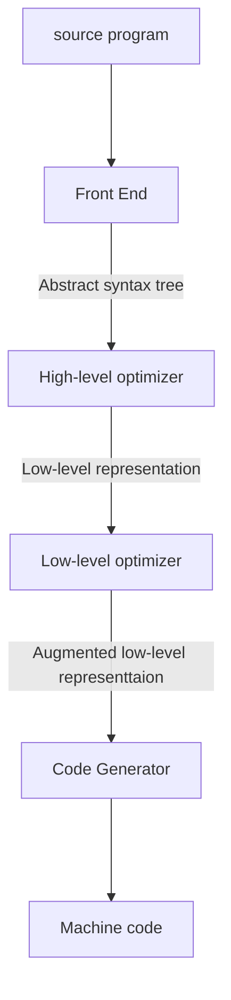

# Introduction

## Course Intro

### Topics

+ program text to execution
+ Physical machine and virtual machine
+ how language features are mapped to capabilities to machine
+ mathematical underpinnings of program translation

### Focus

+ Automatic techniques for analyzing and transforming programs in a given language to execute on target machine
+ sequential, imperative, class-based source language

### Analysis framework

+ Cost: time, space, energy
+ Benifit: high performance, low memory use, energy efficiency, portability
+ Risk: correctness, security

### Execution Models

+ Physical machine
+ (language level/ process) Virtual machine: eg. JVM, compile to abstraction at slightly higher level

### Transformation workflow




### Binding Time

+ when source program gets lowerd in its level of abstraction until it’s suitable for execution

+ Phases

  + Blue, red: static
  + red line: code distribution
    + Translate: process modules individually
    + (static) Link: package modules together
  + Green: dynamic
    + (dynamic) Link: pull in dynamic libraries
    + Interpret: actual execution (by physical or virtual machine)

+ .c, .java, .py

  $$

### Languages, Grammars, Recognizers

+ Language:  $\mathcal{L}$ , a set of strings over some alphabet $\Sigma$. Infinite
+ Grammar: $\mathcal{G}(\mathcal{L})$, a formal system that provides a finite generative description of $\mathcal{L}$. Finite
+ Recognizer: $\mathcal{R}(\mathcal{L}, w)$, an automaton (i.e., machine) that can decide whether a given string belongs to language:  $w \in \mathcal{L}$.


## Live Oak

### Intro

+ Facts
  + High-level language
  + derived from Bali
  + statically typed, strict (no lazy variables), imperative (not functional, have notion of state)
+ Tiers
  + LiveOak-0: Expressions, assignment statements, sequential control flow.
  - LiveOak-1: Imperative programming with structured control flow.
  - LiveOak-2: Procedural programming (methods).
  - LiveOak-3: Objects and classes, no inheritance.

### Grammar: Backus-Naur Form (BNF)

+ Symbols in red are terminals.
  - Lower-case symbols denote literal values (e.g., int) that are reserved keywords and cannot be used as identifiers for variables, methods, or classes.
  - Non-alphanumeric characters (e.g., \{) denote literals consisting of only the nonalphanumeric characters. These are typically operators or grouping constructs.
- UPPER-CASE symbols are non-terminals.
+ Several grammar symbols (in blue) have special meaning:
  - $\star$ means zero or more occurrences.
  - $+$ means one or more occurrences.
  - ? means one or zero occurrences.
  - $[\;]$ is the character class construction operator.
  - ( ) are parentheses used for grouping.


+ Interpreting above grammar
  + Program is a body
  + body is variable declaration followed by a block
  + …
  + Identifier: start with alphabets, then followed by 0 or more a-zA-Z0-9_


## Architecture

+ *Architecture*, as applied to computer systems, refers to a formal specification of an interface in the system, including the logical behavior of resources managed via the interface.
- Implementation describes the actual embodiment of an architecture.
- *Abstraction levels* correspond to implementation layers, whether in hardware or software, each associated with its own interface or architecture.
- We are assuming the standard von Neumann architecture.

### Interfaces

- Instruction Set Architecture (ISA)
  - Interface 4: User ISA. 
  - Interface 3: System ISA. for managing recourses, higher level privilage than user ISA
- Application Binary Interface (ABI)
  - Interface 4: User ISA.
  - Interface 2: System calls. Used for writing libraries (eg. memory allocator library in Linux, SBRK)
- Application Programming Interface (API)
  - Interface 4: User ISA.
  - Interface 1: HLL library calls.


#### Interface 4: The User ISA

The formal contract between execution hardware and software

$$\mathbb{A}=(\Sigma, \mathcal{J})$$

- $\Sigma:$ Universe of machine states.
  - $\sigma=\left(\sigma_{M}, \sigma_{p}\right) \in \Sigma$ : An individual state.
  - $\sigma_{M}$ : Memory state (value of each addressable memory unit in the useraccessible virtual address space).
  - $\sigma_{P}$ : Processor state.
    - Essential: Program counter (PC): $\mathcal{P}$
    - Typical: A small amount of fast storage close to processor (registers) whose units are accessed by name.
    - Optional: Condition flags
- $\mathcal{J}:$ Set of (user-level) machine instructions (for state transformation).
  - $\iota \in \mathcal{J}$ : An individual instruction that transforms an input state to an output state. $\iota: \Sigma \rightarrow \Sigma$.

### ISA Taxonomy

+ Based on the maximum number of operands explicitly specified in instructions.
+ 0-operand machine,  "stack machine"
  - Operands come implicitly from the top items in a stack of values.
  - Java Virtual Machine.
+ [Q] 1-operand machine, aka "accumulator machine"
  - Single implicit accumulator register that is both the left operand and the result. The right operand is specified explicitly.
  - Early machines, small microcontrollers (MOS 6502).
+ [Q] 2-operand machine: source operand (and what gets updatd) +  
  - Two named operands, one of which also serves as the result.
  - x86-64
+ [Q] 3-operand machine
  - Three named operands, two for inputs, one for result.
  - ARMv8.

### JVM

+ Abstract computing machine
  - stack-based instruction set (aka bytecodes).
  - Manipulates various memory areas at run time.
  - Does not assume any particular implementation technology, host hardware, or host operating system.
+ Orthogonal to the Java programming language
  + Program unit is a class file (binary file).
    - Contains bytecodes and a symbol table.
    - Must satisfy strong syntactic and structural constraints for security.
  - Other language can run on JVM: Any language that can be expressed in terms of a valid class file can be hosted on the JVM, e.g., Groovy, Kotlin, Scala, Clojure.
  - Java can run on other VM: Java on Android used to be compiled to JVM bytecode, which was then translated to Dalvik bytecode (. dex files). Since Android $5.0$ "Lollipop", Dalvik VM has been replaced by Android Runtime (ART).

#### Architecture

+ Class Loader
+ JVM memory states: method area, heap, JVM language stacks, PC registers, native method stacks
+ Execution Engine


#### Instruction set (Opcodes)

+ Bytecode, i.e., 8 -bit opcodes.
- Additional arguments may be specified.
+ Instruction categories
  - Constants (00-20): nop, iconst_0, bipush, Idc, ...
  - Loads (21-53): iload, fload_1, aload_3, aaload, ...
  - Stores (54-86)
  - Stack (87-95): pop, dup, swap, ...
  - Math (96-132): ladd, dsub, ishl, iand, ...
  - Conversions $(133-147): i 21, f 2 i, f 2 d, i 2 b, \ldots$
  - Comparisons (148-166): Icmp, iflt, if_icmpge, if_acmpne, ...
  - Control (167-177): goto, jsr, ret, areturn, ...
  - References (178-195): getstatic, putfield, invokevirtual, new, ...
  - Extended (196-201): wide, ifnull, goto_w,...
  - Reserved (202-255): breakpoint, ...


## Stack Abstract Machine (SAM)

+  Facts
  + stack machine
  + Start up with `java -jar SaM-2.6.3.jar`
+ Registers:
  + Program counter
  + stack pointer
  + frame based register: impose additional structure on top of the stack

### Program Execution in SaM


+ Execute command: involves changing PC pointing to next value


+ Loader: open files

+ Interpreter: executes teh program

+ Supports symbolic labels

  ```
  foo: PUHSIMM 1
  		...
  		JUMP foo
  ```


## SaM

Installation on M1


+ Setup ubuntu desktop DigitalOcean:
  +  https://www.digitalocean.com/community/questions/how-can-i-create-a-vm-with-ubuntu-desktop-in-digital-ocean
  + https://www.digitalocean.com/community/tutorials/how-to-install-and-configure-vnc-on-ubuntu-20-04

+ SASM on ubuntu:
  +  http://sureshatt.blogspot.com/2016/10/installing-sasm-assembly-ide-in-ubuntu.html
  + Use https://download.opensuse.org/repositories/home:/Dman95/xUbuntu_20.04/amd64/

+ Start vnc server on digital ocean: `vncserver -localhost`
+ Start local vnc connection: `ssh -L 59000:localhost:5901 -C -N -l arky 137.184.38.122`
+ Use screen sharing to connect to local host: 
  + Finder -> Go -> connect to server -> `vnc://localhost:59000`

### Stack Machine

#### Components

+ All data is stored in the stack or the heap.
  - No data registers. Three control registers (PC, SP, FBR).
- Stack also contains addresses.
- Stack pointer (SP) points to the first free location in the stack.
- Stack grows upwards from location $0 .$
+ Atomic types and addresses take one stack location. (elements of fixed size)
  - Strings and objects are stored in the heap.

#### Structure of operations

- General invariant
  - Pop necessary number of operands from top of stack (TOS)
  - Push result value(s) to TOS.


+ PUSHIM c
  + push immediate: push value c to TOS

##### ALU Commands

+ Commands
  + $A D D, S U B, \ldots$
  + DUP: duplicate TOS.
  + ISPOS ("is positive"):
  + Pop stack; let popped value be $V t$.
  + If $V t$ is positive, push true (1); otherwise push false (0).
  + ISNEG ("is negative"): Same, but tests for negative value on TOS.
  + ISNIL ("is null"): Same, but tests for zero value on TOS.
  + CMP:
  + Pop two values $V t$ and $V b$ from stack.
  + If $(V b<V t)$, push 1 .
  + If $(V b=V t)$, push 0 .
  + If $(V b>V t)$, push $-1$.
+ SaM ALU commands operate on values at or near TOS.
  + To operate on values from the interior of the stack, we need to copy them from an interior location to TOS, or write them from TOS to an interior location.
  + PUSHIND, STOREIND.
    + put address to the value on TOS
  + PUSHOFF, STOREOFF.
    - put address offset on TOS