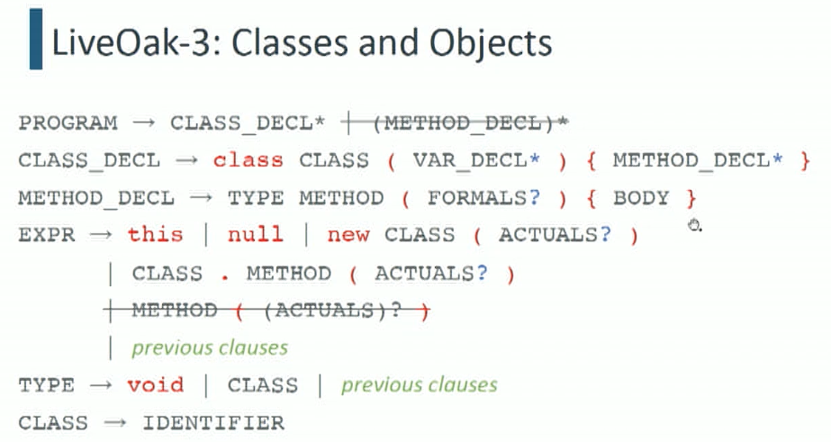
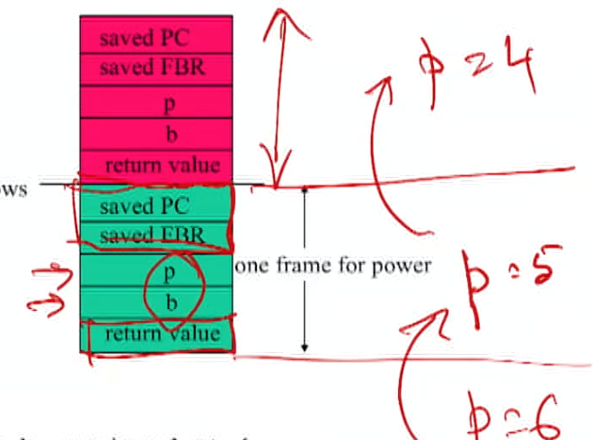

# Introduction

## Course Intro

### Topics

+ program text to execution
+ Physical machine and virtual machine
+ how language features are mapped to capabilities to machine
+ mathematical underpinnings of program translation

### Focus

+ Automatic techniques for analyzing and transforming programs in a given language to execute on target machine
+ sequential, imperative, class-based source language

### Analysis framework

+ Cost: time, space, energy
+ Benifit: high performance, low memory use, energy efficiency, portability
+ Risk: correctness, security

### Execution Models

+ Physical machine
+ (language level/ process) Virtual machine: eg. JVM, compile to abstraction at slightly higher level

### Transformation workflow


### Binding Time

+  ==[Binding](https://en.wikipedia.org/wiki/Name_binding) is the act of associating properties with names==. Binding time is the moment in the program's life cycle when this association occurs, when source program gets lowerd in its level of abstraction until it’s suitable for execution

+ Phases

  + Blue, red: static
  + red line: code distribution
    + Translate: process modules individually
    + (static) Link: package modules together
  + Green: dynamic
    + (dynamic) Link: pull in dynamic libraries
    + ==Interpret: actual execution== (by physical or virtual machine)

+ .c, .java, .py

  $$

### Languages, Grammars, Recognizers

+ ==Language (Infinite)==:  $\mathcal{L}$ , a set of strings over some alphabet $\Sigma$. 
+ ==Grammar (Finite)==: $\mathcal{G}(\mathcal{L})$, a formal system that provides a finite generative description of $\mathcal{L}$. 
+ Recognizer: $\mathcal{R}(\mathcal{L}, w)$, an automaton (i.e., machine) that can decide whether a given string belongs to language:  $w \in \mathcal{L}$.


## Live Oak

### Intro

+ Facts
  + High-level language
  + derived from Bali
  + statically typed, strict (no lazy variables), imperative (not functional, have notion of state)
+ Tiers
  + LiveOak-0: Expressions, assignment statements, sequential control flow.
  - LiveOak-1: Imperative programming with structured control flow.
  - LiveOak-2: Procedural programming (methods).
  - LiveOak-3: Objects and classes, no inheritance.

### Grammar: Backus-Naur Form (BNF)

+ Symbols in red are terminals.
  - Lower-case symbols denote literal values (e.g., int) that are reserved keywords and cannot be used as identifiers for variables, methods, or classes.
  - Non-alphanumeric characters (e.g., \{) denote literals consisting of only the nonalphanumeric characters. These are typically operators or grouping constructs.
- UPPER-CASE symbols are non-terminals.
+ Several grammar symbols (in blue) have special meaning:
  - $\star$ means zero or more occurrences.
  - $+$ means one or more occurrences.
  - ? means one or zero occurrences.
  - $[\;]$ is the character class construction operator.
  - ( ) are parentheses used for grouping.


+ Interpreting above grammar
  + Program is a body
  + body is variable declaration followed by a block
  + …
  + Identifier: start with alphabets, then followed by 0 or more a-zA-Z0-9_





## Architecture

+ *Architecture*, as applied to computer systems, refers to a formal specification of an interface in the system, including the ==logical behavior of resources managed via the interface.==
- Implementation describes the actual embodiment of an architecture.
- *Abstraction levels* correspond to implementation layers, whether in hardware or software, each associated with its own interface or architecture.
- We are assuming the standard von Neumann architecture.

### Interfaces

- Instruction Set Architecture (ISA)
  - Interface 4: User ISA. 
  - Interface 3: System ISA. for managing recourses, higher level privilage than user ISA
- Application Binary Interface (ABI)
  - Interface 4: User ISA.
  - Interface 2: System calls. Used for writing libraries (eg. memory allocator library in Linux, SBRK)
- Application Programming Interface (API)
  - Interface 4: User ISA.
  - Interface 1: HLL library calls.


#### Interface 4: The User ISA

The formal contract between execution hardware and software

$$\mathbb{A}=(\Sigma, \mathcal{J})$$

- $\Sigma:$ Universe of machine states.
  - $\sigma=\left(\sigma_{M}, \sigma_{p}\right) \in \Sigma$ : An individual state.
  - $\sigma_{M}$ : ==Memory state== (value of each addressable memory unit in the useraccessible virtual address space).
  - $\sigma_{P}$ : ==Processor state.==
    - Essential: ==Program counter== (PC): $\mathcal{P}$
    - Typical: A small amount of fast storage close to processor (==registers==) whose units are accessed by name.
    - Optional: ==Condition flags==
- $\mathcal{J}:$ Set of (user-level) machine instructions (for state transformation).
  - $\iota \in \mathcal{J}$ : An individual instruction that transforms an input state to an output state. $\iota: \Sigma \rightarrow \Sigma$.

### ISA Taxonomy

+ Based on the maximum number of operands explicitly specified in instructions.
+ 0-operand machine,  "stack machine"
  - Operands come implicitly from the top items in a stack of values.
  - Java Virtual Machine.
+  1-operand machine, aka "accumulator machine"
  - Single implicit accumulator register that is both the left operand and the result. The right operand is specified explicitly.
  - Early machines, small microcontrollers (MOS 6502).
+  2-operand machine: source operand (and what gets updatd) +  
  - Two named operands, one of which also serves as the result.
  - x86-64
+  3-operand machine
  - Three named operands, two for inputs, one for result.
  - ARMv8.

### JVM

+ Abstract computing machine
  - stack-based instruction set (aka bytecodes).
  - Manipulates various memory areas at run time.
  - Does not assume any particular implementation technology, host hardware, or host operating system.
+ Orthogonal to the Java programming language
  + ==Program unit is a class file (binary file).==
    - Contains bytecodes and a symbol table.
    - Must satisfy strong syntactic and structural constraints for security.
  - Other language can run on JVM: Any language that can be expressed in terms of a valid class file can be hosted on the JVM, e.g., Groovy, Kotlin, Scala, Clojure.
  - Java can run on other VM: Java on Android used to be compiled to JVM bytecode, which was then translated to Dalvik bytecode (. dex files). Since Android $5.0$ "Lollipop", Dalvik VM has been replaced by Android Runtime (ART).

#### Architecture

+ Class Loader
+ JVM memory states: method area, heap, JVM language stacks, PC registers, native method stacks
+ Execution Engine


#### Instruction set (Opcodes)

+ Bytecode, i.e., 8 -bit opcodes.
- Additional arguments may be specified.
+ Instruction categories
  - Constants (00-20): nop, iconst_0, bipush, Idc, ...
  - Loads (21-53): iload, fload_1, aload_3, aaload, ...
  - Stores (54-86)
  - Stack (87-95): pop, dup, swap, ...
  - Math (96-132): ladd, dsub, ishl, iand, ...
  - Conversions $(133-147): i 21, f 2 i, f 2 d, i 2 b, \ldots$
  - Comparisons (148-166): Icmp, iflt, if_icmpge, if_acmpne, ...
  - Control (167-177): goto, jsr, ret, areturn, ...
  - References (178-195): getstatic, putfield, invokevirtual, new, ...
  - Extended (196-201): wide, ifnull, goto_w,...
  - Reserved (202-255): breakpoint, ...


## Stack Abstract Machine (SAM)

+  Facts
  + stack machine
  + Start up with `java -jar SaM-2.6.3.jar`
+ Registers:
  + Program counter
  + stack pointer
  + frame based register: impose additional structure on top of the stack

### Program Execution in SaM


+ Execute command: involves changing PC pointing to next value


+ Loader: open files

+ Interpreter: executes teh program

+ Supports symbolic labels

  ```
  foo: PUHSIMM 1
  		...
  		JUMP foo
  ```


# SaM

Installation on M1


+ Setup ubuntu desktop DigitalOcean:
  +  https://www.digitalocean.com/community/questions/how-can-i-create-a-vm-with-ubuntu-desktop-in-digital-ocean
  + https://www.digitalocean.com/community/tutorials/how-to-install-and-configure-vnc-on-ubuntu-20-04

+ SASM on ubuntu:
  +  http://sureshatt.blogspot.com/2016/10/installing-sasm-assembly-ide-in-ubuntu.html
  + Use https://download.opensuse.org/repositories/home:/Dman95/xUbuntu_20.04/amd64/

+ Start vnc server on digital ocean: `vncserver -localhost`
+ Start local vnc connection: `ssh -L 59000:localhost:5901 -C -N -l arky 137.184.38.122`
+ Use screen sharing to connect to local host: 
  + Finder -> Go -> connect to server -> `vnc://localhost:59000`

## Stack Machine

#### Components

+ All data is stored in the ==stack or the heap.==
  - No data registers. Three control registers (PC, SP, FBR).
- Stack also contains addresses.
- Stack pointer (SP) points to the first free location in the stack.
- Stack grows upwards from location $0 .$
+ Atomic types and addresses take one stack location. (elements of fixed size)
  - ==Strings and objects are stored in the heap.==

## Operations

- General invariant
  - Pop necessary number of operands from top of stack (TOS)
  - Push result value(s) to TOS.


+ **PUSHIM** c
  + push immediate: push value c to TOS

### ALU Commands

#### Commands

+ $A D D, S U B, \ldots$
+ DUP: duplicate TOS.
+ ISPOS ("is positive"):
+ Pop stack; let popped value be $V t$.
+ If $V t$ is positive, push true (1); otherwise push false (0).
+ ISNEG ("is negative"): Same, but tests for negative value on TOS. (compare to 0)
+ ISNIL ("is null"): Same, but tests for zero value on TOS.
+ CMP:
  + Pop <u>two values</u> $V t$ and $V b$ from stack.
  + If $(V b<V t)$, push 1 .
  + If $(V b=V t)$, push 0 .
  + If $(V b>V t)$, push $-1$.

+ SaM ALU commands operate on values at or near TOS. And there is no notion of memory and registers (how to know where things are in interior of stack?)
  + To operate on values from the interior of the stack, we need to copy them from an interior location to TOS, or write them from TOS to an interior location.
  + indirect mode: PUSHIND, STOREIND.
    + put address to the value on TOS
    + **PUSHIND**
      + TOS contains the address
      + pop address
      + read content of the address
      + push contents on stack
      + 
    + **STOREIND**
      + TOS contains: first - value, second - address
      + 
  + offset mode: PUSHOFF, STOREOFF.
    - put address offset on TOS, offset as argument
    - **PUSHOFF**
      - has frame base register pointing to base address, offset is relative to the base address
      - Stack[FBR+n] -> v, push v to TOS
      - 
    - **STOREOFF**
      - TOS contains v
      - pop v
      - Stack[FBR+n] <- v
      - 

### Control Commands

#### Motivation

+ Implicitly, PC increment by 1 at end of interpreting an instruction
+ Loops, conditions: need transfer control to non-sequential instruction

#### Branching Instruction

+ JUMP (unconditional jump) *t*
  + jump to command at Program[*t*]
  + 
+ JUMPC (conditional jump) *t*
  + Vt <- TOS (Vt is a boolean, generated before this step)
  + if Vt is true, then PC <- *t*, else PC <- PC + 1

#### Example

Find $\text{abs}(x) = x > 0 \; ? \; x : -x$

init: [x]

0. DUP [x | x]

1. ISPOS [x | x > 0 ? : Bool]: replace TOS with boolean result
2. JUMPC 5
   + true branch: jump to STOP
   + false branch: move to next
3. PUSHIMM -1: [x | -1] [A: does all operations except for DUP automatically replace the TOS value? JUMPC, binop, unop, JUMPIND … consume TOS value]
4. TIMES: [-x] 
5. STOP: pop TOS and finish

x>0 case: 0, 1, 2, 5

x <= 0 case: 0, 1, 2, 3, 4, 5

### Method Invocation

#### Background

+ Stack machine: LIFO to store data, and also maintain values of control registers (stack pointer, frame/base register, program counter)
  + stack frames: a group of stack cells, used to capture data being passed from caller routine (P) to callee routine (Q)
  + parameters: P -> Q
  + return value: Q -> P
  + Linkage info: allows control between activating Q and P , FBR points to the saved FBR of current active frame
    + FBR + (on top of) : local variables & saved PC
    + FBR - (below) : parameters & return value
  + 

```c
int power(int b, unsigned p){
	if (p == 0) return 1;
	else return b * power(b, p-1) [mult happens on empty stacks on top]
}
```



#### Control registers

##### Stack Pointer (SP)

Always point to TOS empty stack cell

- **PUSHSP**
  - Push value of SP to stack.
  $\operatorname{Stack}[\mathrm{SP}] \leftarrow \mathrm{SP} ; \mathrm{SP} \leftarrow \mathrm{SP}+1$
- **POPSP**
  - Inverse of PUSHSP.
  - SP <- SP - 1; SP <- Stack[SP]
- **ADDSP** $n$
  - Convenient for method invocation.
  - $\mathrm{SP} \leftarrow \mathrm{SP}+n$
  - Shorthand for the sequence [PUSHP, PUSHIMM n, ADD, POPSP].

##### Frame Base Register (FBR)

- **PUSHFBR**
  - Push value of FBR to stack.
    $\operatorname{Stack}[\mathrm{SP}] \leftarrow \mathrm{FBR} ; \mathrm{SP} \leftarrow \mathrm{SP}+1$
- **POPFBR**
  - Inverse of PUSHSP.
  - SP <- SP - 1; SP <- Stack[FBR]
- **LINK**
  - push FBR to SP, then update FBR with current SP
  - similar to PUSHFBR, but also updates FBR to the SP location before incrementing
  - Stack[SP] <- FBR; <u>FBR <- SP</u>; SP <- SP-1
  - 

##### Program Counter (PC)

Call at position _n_, return at position _n+1_ 

+ **JSR** _label_ : Jump to subroutine [jal]
  + for saving next caller program position and go to callee to start the subroutine
  + save value of PC+1 and jump to _label_
  + Stack[PC] <- PC + 1, SP <- SP+1,  PC <- _label_

+ **JUMPIND** (RET) [jr]
  + for return from method call
  + pop off stack, PC goes to the address pointed by current top stack value (should be "saved PC")
  + SP <- SP -1; PC <- Stack[SP]
+ **JSRIND** (_label_ is put on stack, not part of instruction)
  + temp <- Stack[SP]; Stack[SP] <- PC + 1; PC <- temp [A: what is temp? Stack[SP] from beginning, temp is just a temp variable used in implementation of the SaM machine]

- 