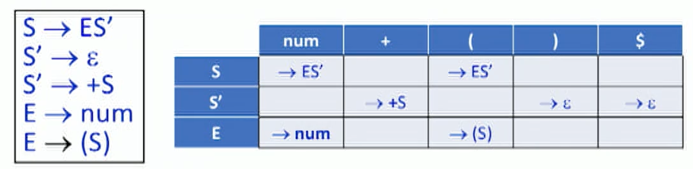
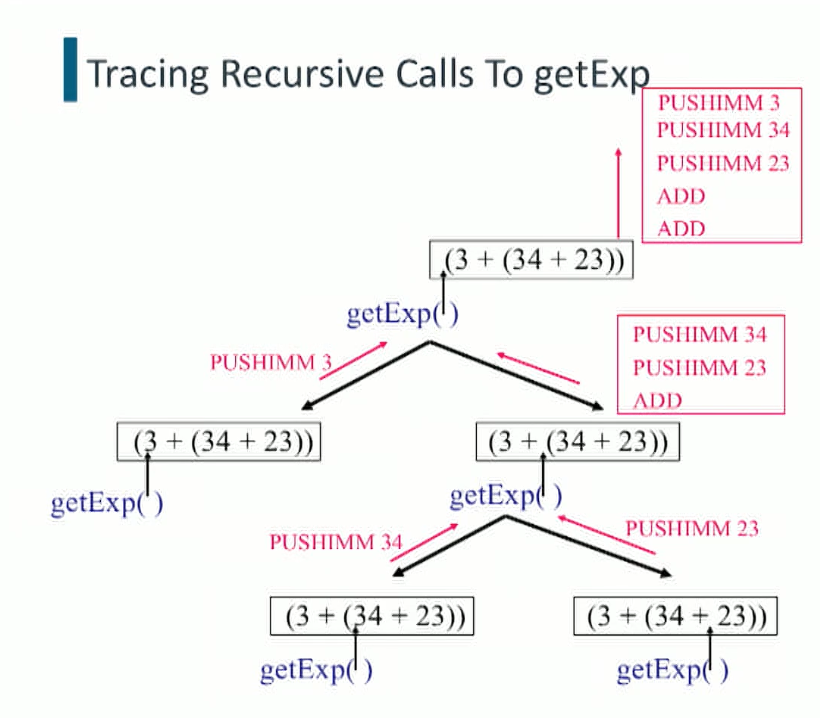

# Syntactic Analysis

## Background

### Front-end vs back-end:

+ Front-end: analysis + (optimization)
  + ==Lexical Analysis: Scanning, character stream (concrete syntax, source code) => **token stream**.== (concrete syntax) e.g. `‘if’ '(' 'b' '==' '0' ')' 'a' '=' 'b' ';'`
  + ==Syntactic Analysis: Parsing, token stream => **Abstract Syntax Tree (AST)**.== e.g. `(if ( (==, (b, 0)), (=, (a, b))))`
  + Semantic Analysis [A: what is this? the third phase of [Compiler](https://www.geeksforgeeks.org/introduction-compiler-design/). uses syntax tree and symbol table to check whether the given program is semantically consistent with language definition. Type, reserved keywords, undeclared variables]
+ Back-end: synthesis of machine instructions


### Language vs. Grammar

+ Language: inifinite set of strings over alphabet
+ Grammar: finite generative description of a language
+ Grammar G generates language L(G)


## Context-free Grammar

https://www.seas.upenn.edu/~cit596/notes/dave/cfg0.html

### Definition

- Context-Free Grammar $G=(N, T, P, S)$, where

  - $N$ is a set of non-terminals;

  - $T$ is a set of terminals (tokens), $L(G) \sube T^{*}$, $N \cap T=\Phi$

  - $P$ is a finite set of productions (rewrite rules) of the form $A \rightarrow \alpha$, where A is non-terminal and $\alpha$ is sentential form (a string of terminals and non-terminals)

    - $$
      \begin{gathered}
      A \in N\\
      \alpha \in(N \cup T)^{*} \\
      P \subseteq N \times(N \cup T)^{*}
      \end{gathered}
      $$

    - No context for when we can replace A with some specific $\alpha $ 

    - $\alpha $: **Sentential form**

      - Sentential form: is the start symbol $S$ of a grammar or any string in $(V \cup T)^{*}$ that can be derived (produced) from $S$.
      - Sentence: A sentential form without non-terminals, i.e., a word in the language $L(G)$.

  - $S \in N$ is the start symbol.


### Recognition and Parsing

+ Given a grammar $G$ and a sentence $s$
  - **Recognition** is a decision problem: $s \in L(G) ?$
  + **Parsing** is a construction problem: Show a derivation (proof) that $s \in L(G)$
    - **Derivation**: Start from $S$ and repeatedly re-write one non-terminal at a time using the productions of the grammar, until there are no nonterminals left to re-write .(all become terminals)
    - **Leftmost/rightmost derivation**: A derivation in which the leftmost/rightmost non-terminal of the current sentential form is rewritten at each step.

#### Simple Example

- Consider
  - Grammar: $\mathrm{E} \rightarrow(\mathrm{E}+\mathrm{E}) \mid$ num , here the $E$ on the left side of the arrow is the start symbol
  - String: $(2+3)$
  - Leftmost derivation (each $\Rightarrow$ is a derivation step)
    - $E \Rightarrow(E+E) \Rightarrow(2+E) \Rightarrow(2+3)$
  - Rightmost derivation
    - $E \Rightarrow(E+E) \Rightarrow(E+3) \Rightarrow(2+3)$
  - Parse tree
    - 
    - 

#### Ambiguity of grammar

+ more than one leftmost derivations for the same sentence $s \in L(G)$

+ Grammar: $\mathrm{E} \rightarrow \mathrm{E}+\mathrm{E}\left|\mathrm{E}^{*} \mathrm{E}\right|(\mathrm{E}) \mid$ num

+ 2 + 3 * 5: two different derivations (different precedence)
  $$
  E \Rightarrow E+E \Rightarrow 2+E \Rightarrow 2+E^{*} E \Rightarrow 2+3^{*} \mathrm{E} \Rightarrow 2+3 * 5 \\
  \mathrm{E} \Rightarrow \mathrm{E}^{*} \mathrm{E} \Rightarrow \mathrm{E}+\mathrm{E}^{*} \mathrm{E} \Rightarrow 2+\mathrm{E} * \mathrm{E} \Rightarrow 2+3 * \mathrm{E} \Rightarrow 2+3 * 5
  $$

  + 
  + 

+ (2+3) * 5 and 2 + (3*5) have unambiguous derivations
  $$
  \mathrm{E} \Rightarrow \mathrm{E}^{*} \mathrm{E} \Rightarrow(\mathrm{E})^{*} \mathrm{E} \Rightarrow(\mathrm{E}+\mathrm{E})^{*} \mathrm{E} \Rightarrow \cdots \Rightarrow(2+3)^{*} 5\\
  \mathrm{E} \Rightarrow \mathrm{E}+\mathrm{E} \Rightarrow \mathrm{E}+(\mathrm{E}) \Rightarrow \mathrm{E}+\left(\mathrm{E}^{*} \mathrm{E}\right) \Rightarrow \cdots \Rightarrow 2+\left(3^{*}-5\right)
  $$


# Recursive-Descent Parser

## Background

- Top-down parser
  - Grow a parse tree top-down beginning with the start symbol (the root) and ending with the given sentence (the leaves).
  - Naturally traces a leftmost derivation.
- Bottom-up parser
  - Contract a parse tree bottom-up beginning with the given sentence and ending with the start symbol.
  - Naturally traces a rightmost derivation (in reverse).

### LL(1) Grammar

Allows deterministic leftmost derivations using look-ahead of 1 token. **recursive-descent parser** [A: does it have to be LL(1) or k can be other numbers?  A form of recursive-descent parsing that does not require any back-tracking is known as predictive parsing, it handles LL(k) grammar]

Grammar: $\mathrm{E} \rightarrow(\mathrm{E}+\mathrm{E}) \mid$ num

- Sentence: $(2+3)$
- We want a parsing algorithm that makes a **single left-to-right scan** of the sentence and runs in time linear in the number of tokens in the sentence.

+ Look ahead the next k tokens (look-ahead token: rule):
  + num: E-> num
  + ‘(’: E -> (E + E)
  + Otherwise: Parsing error


### Recursive-descent recognizer


### Non-LL(1) Grammar

- Consider the grammar
  - $S \rightarrow E+S \mid E$
  - $\mathrm{E} \rightarrow$ num $\mid(\mathrm{S})$
- Consider the two derivations
  - $\mathrm{S} \Rightarrow \mathrm{E} \Rightarrow(\mathrm{S}) \Rightarrow(\mathrm{E}) \Rightarrow(3)$
  - $\mathrm{S} \Rightarrow \mathrm{E}+\mathrm{S} \Rightarrow(\mathrm{S})+\mathrm{S} \Rightarrow(3)+\mathrm{E} \Rightarrow(3)+4$
- How can we decide between the productions $\mathrm{S} \rightarrow \mathrm{E}$ and $\mathrm{S} \rightarrow \mathrm{E}+\mathrm{S}$
  in the first derivation step based on one (or even some finite number $k$ ) of look-ahead tokens?
  - We can't! This grammar is not LL(1). This grammar is not $\mathrm{LL}(k)$ for any $k$. (problem is with the E+S with no ‘()’ )
  - But it can be converted into an **equivalent** ( $L\left(G_{1}\right)=L\left(G_{2}\right)$) LL(1) grammar., with left-factoring
    - Factor the common prefix $\mathrm{E}$ of $\mathrm{S}$.
    - Add a new non-terminal $S$ ' for what follows that prefix.
    - [A: what’s the $\epsilon$ here? empty, or error]
    - 

## Implementation of Recursive-Descent Parser

- Input: $L L(1)$ grammar $G=(N, T, P, S)$
- The global variable token contains the look-ahead token.
- One method for each non-terminal $n \in N$
  - Pre-condition: Variable token has look-ahead token. [A: what does the ‘condition’ mean? END token? Not important…]
  - Action: Consume a sequence of terminals that can be derived from $n$.
  - Post-condition: Variable token has look-ahead token. e.g. ‘)’
  - The methods are mutually recursive.
- The method body is a big switch statement. Each case of the switch:
  - Handles one possible look-ahead token (say, $t \in T)$.
  - Invokes parsing actions for some production $p \in P$ of the form $n \rightarrow \alpha$.


### Predictive Parsing Table -> Parser

[TODO(midterm): try deriving the table, parsing tree, and code for this example.]

+ Row for each non-terminal, column for each terminal and END symbol ($)
+ Table[r, c] to expand non-terminal r with look-ahead token c
+ <=1 entry for each cell for LL(1) grammar



```java
void parse_S() {
	switch (token) { // lookahead token
		case num: case '(': // either of the two cases
      parse_E();
      parse_S'();
      return;
		default: throw new ParseError();
	}
}

void parse_S'() {
	switch (token) {
		case '+': 
			token = input.read(); // consume token
      parse_S();
      return;
    case ')': 
      	token = input.read();
      	return;
    case $: return; // done parsing S'
		default: throw new ParseError();
	}
}

void parse_E() {
	switch (token) {
		case num: token = input.read(); return;
    case '(':
      token = input.read(); parse_S(); // should have consumed '(' and S
      if (token != ')') throw new ParseError();
      token = input.read(); return; // consume ')' token
		default: throw new ParseError();
	}
}
```


+ Call tree (right) and parse tree (left) have the same structure
  


### Code Generation within Parser

```
2:
PUSHIMM 2 // each command is a string generated by the parser
STOP

(2+3): // reverse polish notation (postfix)
PUSHIMM 2
PUSHIMM 3
ADD
STOP
```

- `getExp`  return SaM code (string) for the (sub-)expression it has parsed (generated recursively).

  ```
  case k:
  	return "PUSHIMM" + k + "\n"
  case (E1+E2):
    S1, S2 = getExp(E1), getExp(E2)
    return S1 + S2 + "ADD\n"
  ```

  

- top-level method `expParser` should tack on a `STOP` command after the code that it receives from `getExp`.



### LiveOak 0

| Construct                              | Code shape                                                   |
| -------------------------------------- | ------------------------------------------------------------ |
| num                                    | PUSHIMM val                                                  |
| x // variable                          | PUSHOFF yy <br />//push offset<br />// yy: location offset of x in stack frame |
| (e1 + e2)                              | getExp(e1)<br />getExp(e2)<br />ADD                          |
| x = e                                  | getExp(e)<br />STOREOFF yy<br />//store offset               |
| {S1 … Sn} // just a sequence of things | getExp(S1)<br />…<br />getExp(Sn)                            |

### Declaration & symbol table

+ `int x`
  + introduce new symbol `x`
  + associates to attributes: `name, type, loc, val ...`
+ parser actions
  + insert attributes into dictionary
  + no machine code generation
+ Symbol table
  + key: symbol name
  + operations: insertion, deletion, lookup
  + data structure: linked list, binary search tree, hash table. 
+ Communication between symbol table and compiler
  + **Lexer**: add `x` into table with empty set of attributes
  + **Parser**: associates type attribute with `x`
  + **intermediate code generator**: assign `loc` (yy) to `x`
  + **back-end code generator**: use `loc` to generate machine code
  + **AST-based interpreter**: use record to execute interpreter actions
+ For LiveOak (LO)
  + single global symbol table (LO-0, LO-1)
  + one symbol table per method (LO-2) or class (LO-3)
  + use `java.util.Hashtable`

#### Handle scope

|                  | One Symbol Table                                             | Stack of Symbol tables                                       |
| ---------------- | ------------------------------------------------------------ | ------------------------------------------------------------ |
| Key Idea         | extra tag field to each hash table entry,  identifies the scope in which the identifier was declared. | maintain a stack of symbol tables                            |
| Scope entry      | Increment a global (or class-static) scope counter. `scope ++` | Push new symbol table to TOS                                 |
| Symbol insertion | Insert symbol record at head of chain, using scope counter value as tag. `x: {scope: scope, val: val}` | Insert symbol to symbol table at TOS                         |
| Symbol lookup    | Return first true match of name. (Ignore tag.)               | search start with TOS then go iteratively deeper until match is found |
| Scope Exit       | Unlink (but don't delete) all symbol records from hash table buckets whose tag matches the current scope counter value. `unlink x where scope = scope` | Pop off TOS symbol table<br />unlink all symbol records of that table |
| Tradeoff         | time-consuming symbol exit                                   | time-consuming symbol lookup (lookup typically dominate among operations) |

### Conditional expressions

+ `bool b; b = (x < y)`

```
// following 3 lines are for 'x < y'
PUSHOFF xxx // push offset of x (xxx)
PUSHOFF yyy // push offset of y
LESS // check if x < y

STOREOFF bbb // store the value to b
```


+ `if (E) { B1 } else { B2 }`

  ​	E: some bigger expression, eg. `x < y`, B1, B2: block of statements. Use `JUMPC L_true` 

  ​	e.g. `int z; z = (x < y) ? x : y`

```
codegen():

[CODE FOR E] // have boolean on TOS
JUMPC L
[CODE FOR B2]
JUMP A
L: [CODE FOR B1]
A: 
```


+ `while (E) { B }`

```
E: [CODE FOR E] // have boolean on TOS
JUMPC B
JUMP A
L: [CODE FOR B1]
JUMP E
A: 
```


#### Short-circuit evaluation

Evaluation is **at run time**, at compile time, we still need to generate code for E1 and E2 block

Don’t evaluate entire expression if can get final result only by looking at part of the expression (early termination)

```
// E = (E1 & E2)
if !E1: JUMP L_false
else: eval(E2)

// E = (E1 | E2)
if E1: JUMP L_true
else: eval(E2)

// E = (!E1)
if !E1: JUMP L_false
```

##### Code generation

```python
def codegen(E, Ltrue, Lfalse): # normal conditional generation

# E = (E1 & E2)
def codegenAND(E, Ltrue, Lfalse):
	Lnew = newlabel()
  Lend = newlabel()
  C1 = codegen(E1, Lnew, Lfalse) # jump to Lfalse if C1 evaluates to false
  C2 = codegen(E2, Ltrue, Lfalse)
  return C1 
				+ "Lnew:\n"
  			+ C2
    		+ "Ltrue:\n"
      	+ "PUSHIMM 1\n"
        + "JUMP Lend\n"
        + "Lfalse:\n"
        + "PUSHIMM 0\n"
        + "Lend:\n"
        
        
 # E = (E1 | E2)
def codegenOR(E, Ltrue, Lfalse):
	~~~
  C1 = codegen(E1, Ltrue, Lnew) # jump to Lfalse if C1 evaluates to false
  C2 = codegen(E2, Ltrue, Lfalse)
  return ~~~ # same as above


 # E = (!E1)
def codegenNOT(E, Ltrue, Lfalse):
  return codegen(E1, Lfalse, Ltrue)
```

##### Complex example

```
codegen(((a<b) | ((c<d) & (e<f))), Ltrue, Lfalse)
```


### Non-sequential Control Flow

`if else`, `while`, `break`

```python
# S = if(E, S1, S2), Lnext is equivalent to END
def codegenIF(E, Lnext, Lbreak):
	Lif, Lend = newlabel(), newlabel()
	condition = codegen(E, newlabel(), newlabel())
  ifBlock = codegen(S1, Lnext, Lbreak) # 
  elseBlock = codegen(S2, Lnext, Lbreak)
  return condition 
				+ "JUMPC Lif\n" # if E, jump to CS1
      	+ elseblock # else
      	+ "JUMP Lend"
        + "Lif:\n"
      	+ ifblock
        + Lend
 
# S = while(E,S1)
def codegenWHILE(E, Lnext, Lbreak):
	Lhead = newlabel()
	CE = codegen(E, newlabel(), newlabel())
  CS1 = codegen(S1, Lhead, Lnext)
  return "Lhead:\n"
				+ CE 
  			+ "ISNIL\n" # reverse if E to if not E
				+ "JUMPC Lnext\n" # if not E, exit
      	+ CS1 # if E, execute
      	+ "JUMP Lhead\n" # and loop
        # Lnext
 # better strategy:
  return "JUMP Lmid\n"
				+ "Ltop:\n"
  			+ CS1
    		+ "Lmid:\n"
      	+ CE
        + "JUMPC Ltop\n" # if E, goto CS1, else exit
        # Lnext
        
# S = break
def codegenBREAK(S, Lnext, Lbreak):
  return "JUMPC Lbreak\n"
```

### Methods

Constructs: Invocation, definition, return


#### Invocation

`f(e1, ..., en)`

+ Stack after calling f: caller stack (TOS at c) + return value from f on TOS

```java
// setup
PUSHIMM 0 // make room for return value SP = (c+1), return slot
[Code for e1] // after e1 finishes, put its value SP = (c+2)
...
[Code for en] // SP = (c+n+1)
LINK // save frame based register FBR (f) to (c+n+2) and point FBR to (c+n+2)
  
// call
JSR f //jump to subroutine f, transfer control from caller to callee
  		//save PC+1 (line after return) to return address (c+n+3) and jump PC to label f
  		//when f returns, it will jump to PC+1
  
// post-return
POPFBR // point FBR to address value of stack pointed by FBR (f)
ADDSP -n // remove all parameter slots
```

#### Definition

`f(e1, ..., en){int x1, ..., xc; B}`

```java
	ADDSP c // total c local variables
	[Code for B] // execution
fEnd:
	STOREOFF -(n+1) // store TOS value to (FBR - numParams - 1) where the return slot is, from caller
	ADDSP -c // remove local varable slots, then TOS is saved PC (rv) (line after return from JSR f)
	JUMPIND // jump to instruction after func call
```

#### Return

`return e`

```java
[Code for e]
JUMP fEnd // label in definition part, need to use 'JUMP' if multiple returns exist
```

|                   | Invocation (1)         | Definition (1)      | Return                             | fEnd                           | Invocation(2)   |
| ----------------- | ---------------------- | ------------------- | ---------------------------------- | ------------------------------ | --------------- |
|                   |                        | <u>[Code for B]</u> | [Code for E]<br /><u>JUMP fEnd</u> | STOREOFF r                     |                 |
| Local n           |                        | ADDSP c             |                                    |                                |                 |
| …                 |                        |                     |                                    |                                |                 |
| Local 1           |                        |                     |                                    |                                |                 |
| Saved PC (prevPC) | <u>JSR f (PC -> f)</u> |                     |                                    | ADDSP -c                       |                 |
| Saved FBR         | LINK (FBR ->)          |                     |                                    | <u>JUMPIND (PC -> prev PC)</u> | POPFBR          |
| parameter n       | [Code for en]          |                     |                                    |                                |                 |
| …                 |                        |                     |                                    |                                |                 |
| Paramater 1       | [Code for e1]          |                     |                                    |                                |                 |
| Return value      | PUSHIMM 0              |                     |                                    | (return value)                 | <u>ADDSP -n</u> |
|                   |                        |                     |                                    |                                | (FBR -> )       |

