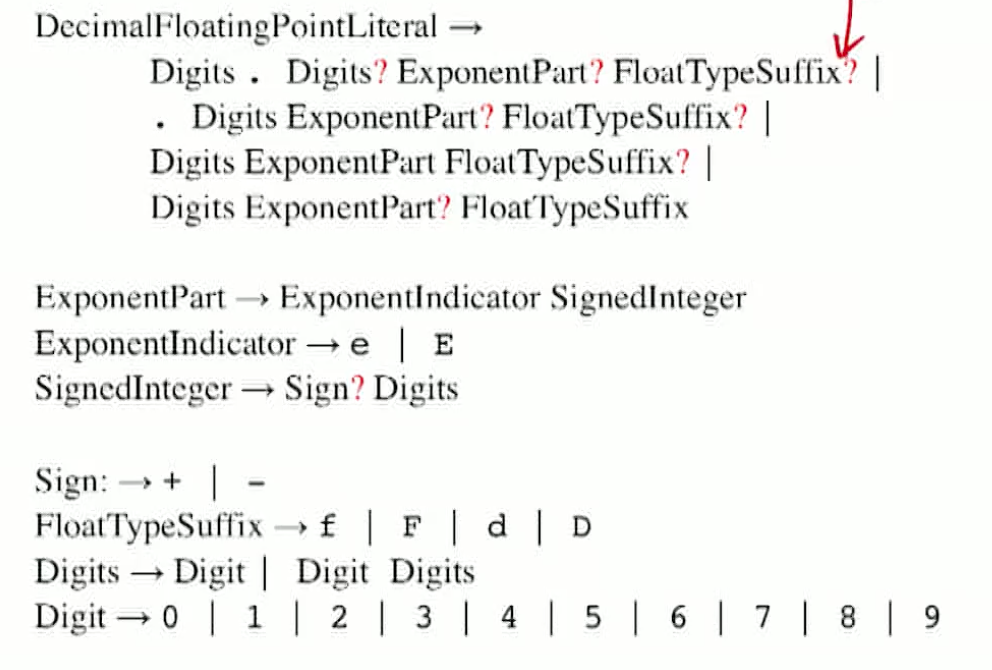
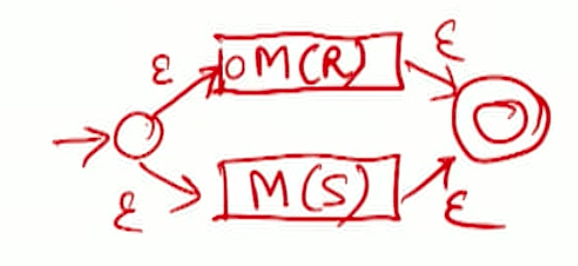

# Lexical analysis - theory

## Functions

- Scan the input **character stream** 
- convert it into a stream of **tokens** for use by the parser.
  - Handle comments and whitespace.
- Track source coordinates to correlate error messages with source text. (lineNo, colNo)
- Implement some preprocessing functions.

### Definitions

- **Token**
  - The output of the lexer, and a **terminal symbol** in the parser's grammar.
  - E.g., ID for identifiers, KWD for keywords.
- **Pattern**
  - **Map rule**: set of input strings ->  token.
  - E.g., "an identifier is a letter followed by any number of letters, digits, or underscores".
- **Lexeme**
  - A (maximal) sequence of source characters that **matches the pattern** for a token.
  - can be lexeme without token (white space, comment etc.)
  - E.g.pi, D2, this_token.

```
1:if a=0 then a:=b; (* entry := default *)
1|:|if| |a|=|0| |then| |a|:=|b|;| |(* entry := default *)|
label|colon|keyword| |id|relational|const| |keyword| |id|assign|id|semicolon| |comment|
```

## Regular languages

- a particularly simple class of patterns describing the structure of tokens in programming languages.
  - Also known as type-3 languages in the Chomsky hierarchy.
  - Typically described compactly using **regular expression notation**.
- Generated by **regular grammars**, which are a proper subclass of **context-free grammars**.
- Recognized by **finite automata** (recogonizers for languages) (finite state machines), which are a very restricted form of Turing Machines. 
  - Can read input but **not write to tape (state)**
  - Only scan from left to right

### Example: Floating-point literals in Java

> - Java Language Specification Java SE 16 Edition, 2021-02-12, $\$$ 3.10.2.
>
> A floating-point literal has the following parts: a whole-number part, a decimal point (represented by an ASCII period character), a fraction part, an exponent, and a type suffix.
>
> For floating-point literals, <u>at least</u> one digit (in either the whole number or the fraction part) and either a decimal point, an exponent, or a float type suffix are required. All other parts are <u>optional</u>. The exponent, <u>if present</u>, is indicated by the ASCII letter e or E followed by an <u>optionally signed</u> integer.
>
> A floating-point literal is of type float if it is suffixed with an ASCII letter F or f; otherwise its type is double and it can <u>optionally be suffixed with</u> an ASCII letter D or d.

Write into grammar:

+ ? : optional
+ |: or



Write in regular expression

- Standard grep syntax
  - Shortcuts: [acd] for enumeration; [a-b] for contiguous range;
  - Set operations: | for union; juxtaposition for concatenation;
  - Closure operations: 
    - ? for zero or one instance; 
    - for one or more instances; 
    - $*$ for zero or more instances;
  - Grouping: ( ), for clarity only.


### Recognizer for regular langauges

- Recognition: A **decision** problem. **(does string belong to language?)**
  - Given a regular expression $r$ over an alphabet $\Sigma$ and a string $s \in \Sigma^{*}$
  - **is $s \in L(r) ?$**
- Such a recognizer is known as a **finite automaton**.
  - Examines each symbol of $s$ **exactly once, in sequence order.**
  - After examining each character, **updates a summary** of the string prefix it has encountered so far in some **fixed finite amount of state.**
  - After completing the scan of the string, either ends up in an **accepting state** (in which case $s \in L(r))$ or in a **non-accepting state** (in which case $s \notin L(r))$

### Finite Automaton

A finite automaton (FA) is defined as the 5 -tuple
$$
M=\left(Q, \Sigma, \delta, q_{0}, F\right), \text { where }
$$
- $Q$ is a **finite set of states**;
- $q_{0} \in Q$ is the **start state**: state of automation before input
- $F \subseteq Q$ is the set of **accepting states** (final)
- $\Sigma$ is the **input alphabet**; 
- $\delta$ is the **transition function** describing the behavior of the FA. 3 versions:
  - A FA with $\delta: Q \times \Sigma \rightarrow Q$ is called a **deterministic finite automaton** (DFA). 
    - current state and current input gives a deterministic next state
    - With every input, we have only one next state
  - A FA with $\delta: Q \times \Sigma \rightarrow 2^{Q}$ is called a **nondeterministic finite automaton** (NFA).
    - current state and current input gives a non-deterministic next state
    - Have more than one state to go to next
    - ok as long as reach an accepting state in the end
  - A FA with $\delta: Q \times(\Sigma \cup\{\varepsilon\}) \rightarrow 2^{Q}$ is called a **nondeterministic finite automaton with $\epsilon$-moves $(\epsilon-\mathrm{NFA})$.**
    - Can change the state spontaneously without consuming input ( reading empty string $\epsilon$)
    - More compact/ intuitive descriptions
  - These versions give same power (expressiveness or recognition)

#### Finite Automaton as a graph

- Given the FA $M=\left(Q, \Sigma, \delta, q_{0}, F\right)$, define the labeled directed $\operatorname{graph} G(M)=(V(M), E(M))$, where
  - $V(M)=Q ;$ and
  - For **each transition** $\delta(p, \sigma)=q, E(M)$ contains the directed edge $(p, q)$ with label $\sigma$. 
    - for a transition, p is the start state and q is the end state
    - eg: $\delta(q_0, 0)=q_0$: self loop, $\delta(q_0, 1)=q_1$, $\delta(q_0, 1)=q_3$, non-deterministic
      
      - Bold arrow: start state
      - double circle: accepting state

- The language recognized by $M=\left(Q, \Sigma, \delta, q_{0}, F\right)$ (denoted $L(M))$ is the set of input strings $s \in \Sigma^{*}$ for which $M$, starting from $q_{0}$ and scanning the symbols of $s$ in sequence order, transitions to some state $q^{\prime} \in F$

  - **computation**: Such a sequence of state transitions (irrespective of whether the state reach is an accepting state). 

    - Take the whole sequence as $\delta(q_0, s)=q$,  then $s \in L(M) \equiv q^{\prime} \in F$, i.e. string belongs to language recognized by the machine iff. q’ is among the final states.
      

  -  Theorem: Every regular language (L) can be recognized by a finite automaton (M), and the language recognized by every finite automaton is regular (R).
    $$
    \forall R \quad \exists M: L(M)=R\\
    \forall M \quad \exists R: L(M)=R\\
    $$

#### Example of finite automata

$$
(a|b)^*abb
$$


##### Above: non-deterinistic, 4 states (from intuition)


##### $\epsilon$ -NFA 10 states:

+ `abb` : Concat : a, b, b 

+ `a|b`:  2 $\epsilon$ ‘s 
+ `*`: 0 or more, use $\epsilon$ to close the loop 

+ Final, 10 states: 


##### DFA, 5 states:


##### DFA, 4 states: 

min amount of states

##### 


#### Other uses of finite automata

- Finite automata are found in all areas of computer science and electrical engineering.
  - In several contexts, they act as transducers rather than as recognizers. Mealey machine, Moore machine
    
  - Statechart: extend to the above graph to a large number of states
- The abstract computational model of a finite automaton can be implemented either in hardware or in software.

### Properties of regular languages

- A finite language is (trivially) regular. (a single line of transitions)
- Closure properties 
  - Given regular languages $R$ and $S$, the following languages are also regular.
  - union: $R \cup S=\left\{x \in \Sigma^{*}: x \in R \vee x \in S\right\}$ 
  - intersection: $R \cap S=\left\{x \in \Sigma^{*}: x \in R \wedge x \in S\right\}$
  - set difference: $R \backslash S=\left\{x \in \Sigma^{*}: x \in R \wedge x \notin S\right\}$
  - Concatenation: $R \circ S=\left\{x y \in \Sigma^{*}: x \in R \wedge y \in S\right\}$ 
  - Complement: $\bar{R}=\left\{x \in \Sigma^{*}: x \notin R\right\}$: change all accepting to non-accepting state, and vise versa
  - Reverse string: $R^{\prime}=\left\{x \in \Sigma^{*}: x^{\prime} \in R\right\}$: take every edge in graph and reverse them
  - Repetitions
    - $R^{i}=\left\{\begin{array}{lr}\{\varepsilon\}, \quad i=0 \\ L^{i-1} L, i>0\end{array}\right.$
    - $R^{*}=\bigcup_{i=0}^{\infty} R^{t}$
    - $R^{+}=\bigcup_{i=1}^{\infty} R^{t}$

#### The Pumping lemma for regular sets

+ The **adversary** of it is used show that a language is not regular


##### For a regular set L: 

+ When we have a long enough string: exists a constant $n$ such that if $z \in L$ and $|z| \geq n$, 
+ We can identify a piece of substring early on in the string: we may write $z=u v w$ in such a way that $|u v| \leq n$ $|v| \geq 1$, 
  
+ We can repeat that substring for any times: and for all $i \geq 0$
  
+ The string will still be in the language: $u v^{i} w \in L$  
+ Furthermore, $n$ is no greater than the number of states of the smallest FA accepting $L$.


##### Existence of non-regular languages

- Examples of non-regular languages
  - strings whose length is a square: $L_{1}=\left\{0^{i^{2}}: i \geq 1\right\}$
  - Context free ones:
    - nested parantheses of 0 and 1s of equal numbers: $L_{2}=\left\{0^{i} 1^{i}: i \geq 1\right\}$ [Q: why is this context free and #4 is context senstive?]
    - set of palindromes: $L_{3}=\left\{s: s=s^{R}\right\}$
  - Context sensitive ones:
    - extension of #2: $L_{4}=\left\{0^{i} 1^{i} 2^{i}: i \geq 1\right\}$.
    - extension of #4: $L_{5}=\left\{a^{i} b^{j} c^{i} d^{j}: i \geq 1, j \geq 1\right\}$.

##### Chomsky hierarchy


+ Non-determinism do not affect FA and TM, but do for LBA and PDA


# Lexical analysis - practice

- Until now, we have abstracted the lexical analysis task as the **recognition** problem: "Is $s \in L(r) ?^{\prime \prime}$
- In reality:
  - We have a string $t$.
  - We have to repeatedly find maximal prefixes $s$ of $t$ such that $s \in L$ remove them from $t$, and return appropriate **tokens** and attributes.
  - Also, we need to handle errors meaningfully.

### Issue #1: Returning Tokens

- Tag each final state with the token that it matches, and return that token.
  - Some final states may not return tokens (e.g., whitespace, comments).
- Use a **trap state** (non-accepting state) to simplify finding the **longest nonempty prefix** of the input string that matches. (“Principle of maximal scan")
- Example: recognizer for integer literals.
  


### Issue #2: Lookahead and Pushback

- Suppose the input string is $123<x$ (i.e., no whitespace characters).
  - The integer literal 123 is recognized only after scanning the next character.
  - Modern HLLs usually require a small number of lookahead characters.
  - Not so in the case in older languages such as fortran: 
    DO $5 \quad \mathrm{I}=1, \; 8$ 
    DO $5 \quad \mathrm{I}=1.8$
- Consider a recognizer for relational operators $<,<=,=,>=,>$.
  - look ahead, if “=”, then is “<=” or “>=”, if not, then “<” or “>”
- Need to push back the lookahead character on the input stream.


### Issue #3: DFA Simulation

- Two approaches: table-driven, direct encoding.

  - Table-driven
    Encode the transition diagram as an array indexed by the current state and the class of the character being scanned.
    state $=$ nextstate [ state] [map [nextchar ] ]

    - T: state (table) on left
    - S: state
    - $\delta$ nextstate
    - c: nextchar

    $$
    \delta(S, c)=T
    $$

    

  - Direct coding
  Encode the transition diagram directly, using while-loops and switch statements.

- Efficiency concerns
  - Minimize the cost of processing single source characters. Typically, there are $5-10$ times as many characters as tokens in the input.
  - Minimize the cost of skipping single spaces.


### Issue #4: Input Buffering

- Operations on input stream
  - Read the next character (frequent).
  - Push back lookahead character (occasional).
- Use specialized buffer management within the lexer.
  - Read a chunk of input at a time
  - E.g., double buffering with an EOF sentinel. [Q: what do the two buffer actually do? not getting it]


### Issue #5: Conversion

- The process of scanned lexeme -> token
  - May involve finding a value, a symbol, or some other attribute(s) of the lexeme.
- Different kinds of tokens may need different kinds of conversion.
  - The lexeme $123:$ tokentype $=\mathrm{INT}$, value $=123$.
  - The lexeme abc: tokentype $=\mathrm{ID}$, namestring $=$ "abc".
  - The lexeme while: tokentype = KWD.
  - A string lexeme: May need to handle continuation characters or convert escape sequences.


### Issue #6: Keyword Recognition

- Are keywords reserved?
  - Yes, in pretty much all modern programming languages.
  - But consider $\mathrm{PL} / \mathrm{I}$, where they were not. 
  <u>keywords</u> :  <u>IF</u> THEN <u>THEN</u> THEN : = ELSE; <u>ELSE</u> ELSE : = THEN;
- Two approaches
  - Separate keywords from identifiers in scanning.
  - Separate keywords from identifiers during conversion.

