# Syntactic analysis - theory

## Context-Free Grammars

### Definition

- Context-free grammar $G=(N, T, P, S)$, where

  - $N$ is a finite set of non-terminals, with <u>no useless non-terminals</u>
  - $T$ is a finite set of terminals (aka tokens);
  - $P$ is a finite set of productions (rewrite rules) of the form $A \rightarrow \alpha$, where $A \in N$, and $\alpha \in(N \cup T)^{*}$ is a sentential form;
  - $S \in N$ is the start symbol, <u>which does not appear of the RHS of any production.</u>

- augment an input string $s$ with a distinct **end-of-string symbol $\$$**, and change all productions of the form $S \rightarrow \alpha$ to $S \rightarrow \alpha \$$ (call this change **\$-augmentation**).

- Notational shortcuts: $\Sigma=N \bigcup T$,$ \mathrm{~F}=T \cup\{\varepsilon\}$ (empty string), $ T^{\prime}=T \cup\{\$\}$.

- A **derivation** $\alpha \stackrel{*}{\Longrightarrow} \beta$, with $\alpha, \beta \in \Sigma^{*}$, is a finite sequence of (valid) applications of productions that rewrites $\alpha$ to $\beta$.
  $$
  s \in L(G) \equiv S \stackrel{*}{\Longrightarrow} s
  $$
  

+ Goal: construct parsing table from grammar
  + S, S’, E: state
  + num, + ,… : terminal symbol
  + $\epsilon$: error condition
  + 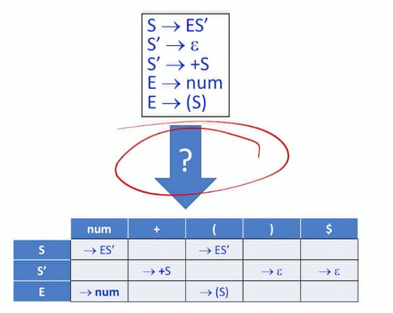

### From Grammar To Parsing Table

#### Problem statement

- Decide whether the production $A \rightarrow \alpha$ of the context-free grammar $G=(N, T, P, S)$ is a candidate for rewriting $A$ when the input token is $t$, i.e., whether $A \rightarrow \alpha \in$ ParsingTable $[A, t]$.  [A: what is A and what is $\alpha$? Are they just anything belong to $\Sigma$ ? A: the nonterminal, $t$ : the next token,  $A \rightarrow \alpha$ means the next token allows the production] 

#### Term definitions

**S:** start symbol
**a:** terminal symbol
**A:** a non-terminal symbol
**$\alpha, \beta:$** a string composed of terminals and non-terminals (typically, $\alpha$ is the RHS of a production)

$ \mathrm{~F}=T \cup\{\varepsilon\}$: augmented terminal set with empty string

$\Sigma=N \bigcup T$

$ T^{\prime}=T \cup\{\$\}$.

$\stackrel{*}{\Longrightarrow}$: derived in 1  or more step

$\Longrightarrow$: derived in 0 or more steps

$\Rightarrow^{+}$: derived in 1 or more steps

**For the following example:**
$$
\begin{aligned}
&\mathrm{S} \rightarrow \mathrm{A} \mathrm{B} \$ \\
&\mathrm{A} \rightarrow x \mathrm{a} \mathrm{A} \\
&\mathrm{A} \rightarrow \mathrm{y} \mathrm{a} \mathrm{A} \\
&\mathrm{A} \rightarrow \lambda (empty)\\
&\mathrm{B} \rightarrow \mathrm{b}
\end{aligned}
$$

$$

$$


+ $\operatorname{FIRST}(\alpha) \subseteq F$: First sets, the set of terminals (and/or λ) that begin all strings that can be derived from α
  $$
  \Sigma^* \rightarrow \{F\}; \quad F=T \cup \epsilon \\
  \operatorname{First}(\alpha)=\left\{\mathrm{a} \in \mathrm{V}_{\mathrm{t}} \mid \alpha \Rightarrow^{*} \mathrm{a} \beta\right\} \cup\left\{\lambda \mid \text { if } \alpha \Rightarrow^{*} \lambda\right\}
  $$

  + Examples:
    + First $(\mathrm{A})=\{\mathrm{x}, \mathrm{y}, \lambda\}$
    - First $(x a A)=\{x\}$
    - First $(\mathrm{AB})=\{\mathrm{x}, \mathrm{y}, \mathrm{b}\}$
  + Formal definition by induction:
    + base case:
      + $F \operatorname{lRST}(\varepsilon)=\{\varepsilon\}$
      - $\forall t \in T, F I R S T(t)=\{t\} .$
    + Induction:
      + $\operatorname{FIRST}\left(Y_{1} \cdots Y_{k}\right)=\operatorname{FIRST}\left(Y_{1}\right)+_{1} \cdots+_{1} \operatorname{FIRST}\left(Y_{k}\right)$ 
      + $\left(A \rightarrow Y_{1} \cdots Y_{k} \in P\right) \wedge\left(f \in \operatorname{FIRST}\left(Y_{1} \cdots Y_{k}\right)\right) \Rightarrow f \in \operatorname{FIRST}(A)$: 
        + for a production, any symbol that belongs to the FIRST of the right hand side also belongs to the first of the left hand side
        + If Y1 is not nullable, then f is the FIRST(Y1). If Y1 is nullable, then might need to look at FIRST(Y2)
  + Helper function $+_{1}: 2^{F} \times 2^{F} \rightarrow 2^{F}$ is a binary helper function on subsets of $F$ defined thus:
    + ~~Concatenate each element of the first set with each element of the second set, and truncate first symbol of the resulting string~~
    + I.e., $\{\varepsilon, a, b\}+{ }_{1}\{\varepsilon, c\}=\{\varepsilon, a, b, c\}$  [A: where in this definition asks for omitting $\epsilon$ in the second string? In what case do we omit? and why are we not tuncating the first $\epsilon$ in the resulting string? IGNORE the definition above, if only looking at concatenation and derive FIRST, $\varepsilon + \varepsilon = \varepsilon$, ==if current set has $\varepsilon$ , add all elements of next sets except for $\varepsilon$ to FIRST, and so on==] , but $\{\varepsilon, a, b\}+{ }_{1}\{c\}=\{a, b, c\}$.

+ $\operatorname{FOLLOW}(\alpha) \subseteq T'$: the set of terminals (and/ or $, but no λs) that can appear immediately after  **non_terminal A** in some partial derivation
  $$
  \text { Follow }(A)=\left\{a \in V_{t} \mid S \Rightarrow^{+} \ldots A a \ldots\right\} \cup\left\{\$ \mid \text { if } S \Rightarrow^{+} \ldots A \$\right\}
  $$

  + Example: Follow $(A)=\{b\}$

  + Formal definition by induction:

    + base case:

      + $\$ \in F O L L O W(S)$ [A: can start symbol by default always be followed immediately by EOS? Is that by definition? Yes for the augmentation method]

    + Induction:

      + $\left(A \rightarrow X_{1} \cdots X_{k} B Y_{1} \cdots Y_{m} \in P\right) \wedge$

        $\left(t \in \operatorname{FIRST}\left(Y_{1} \cdots Y_{m}\right)+{ }_{1}\right.$ FOLLOW $\left.(A)\right) \Rightarrow t \in F O L L O W(B)$: 

        ​	 ====add FIRST(all non-terminals following B in the production) to FOLLOW(B)== 
        ​	if that FIRST is empty, add FOLLOW(A) to FOLLOW(B)==   [A: here A is not preceding B, but producing B, thus if all non-terminals following B are empty, then B is the last non-terminal of A’s production, then FOLLOW(A) can be added to FOLLOW(B)]

+ $N U L LABLE(\alpha)$ : a predicate, $\alpha \stackrel{*}{\Longrightarrow} \varepsilon$, i.e. production A -> empty string. The production is still a candidate if $S \stackrel{*}{\Longrightarrow} \eta A t \xi$. [A: what does each term mean here and what does this production mean? just some random stuff, not important]
  $$
  \Sigma^* \rightarrow \{true, false\}\\
  N U L L A B L E(\alpha)=\text { true iff } \alpha \stackrel{*}{\Rightarrow} \varepsilon
  $$
  
  + if $N U L L A B L E(\alpha)$, then the production $A \rightarrow \alpha$ is also a candidate if $t \in$ FOLLOW $(A)$.
  + Formal definition by induction:
    + base case:
      + $N U L \operatorname{LABLE}(\varepsilon)=$ true. (empty)
      + $\forall t \in T, N U L L A B L E(t)=$ false. (T: non-empty terminal)
    + Induction:
      + $\operatorname{NULLABLE}\left(Y_{1} \cdots Y_{k}\right)=N U L L A B L E\left(Y_{1}\right) \wedge \cdots \wedge N U L \operatorname{LABLE}\left(Y_{k}\right)$ (Y1… Yk: concatenation, it is nullable only if AND nullables)
      + $(A \rightarrow \alpha \in P) \wedge N U L L A B L E(\alpha) \Rightarrow N U L L A B L E(A)$ (for a production whose right side is nullable, then its left side is also nullable)

#### Algorithm to computing sets

```C
// base case
for each A do{
  NULLABLE[A] = false;
  FIRST[A] = FOLLOW[A] = {};
}
FOLLOW[S] = {$};

// induction
repeat{
  for each production A -> Y1...Yn do {
    if NULLABLE(Y1...Yn) then NULLABLE[A] = true;
    
    FIRST[A] = FIRST[A] union FIRST(Y1...Yn);
    
    for each Yi do{
			FOLLOW[Yi] = FOLLOW[Yi] union (FIRST[Yi+1...Yk] +1 FOLLOW[A])
    }
  }
} until sets do not change // stopping condition
```


#### Example

[TODO(midterm): practice deriving this]
$$
\begin{aligned}
&\mathrm{S} \rightarrow \mathrm{A} \$ \\
&\mathrm{A} \rightarrow \mathrm{BC} \mid \mathrm{x} \\
&\mathrm{B} \rightarrow \mathrm{t} \mid \varepsilon \\
&\mathrm{C} \rightarrow \mathrm{v} \mid \varepsilon
\end{aligned}
$$

 Possible generations: {x, t, v, tv}
$$
\text { NULLABLE }=\{A, B, C\}\\
\mathrm{FIRST}(A)=\{\mathrm{x}, \mathrm{t}, \mathrm{v}, \varepsilon\}\\
\text { FIRST }(B)=\{t, \varepsilon\}\\
\text { FIRST }(C)=\{v, \varepsilon\}\\
\operatorname{FIRST}(S)=\{x, t, v, \$\}\\
\text { FOLLOW}(A)=\{\$\}\\
\text { FOLLOW}(B)=\{v, \$\}\\
\text { FOLLOW }(C)=\{\$\}
$$

## Construct parsing table

Enter production $A \rightarrow \alpha$ into ParsingTable $[A, t]$ for all symbols $t \in \operatorname{Predict}(A \rightarrow \alpha)$, where
$$
\begin{aligned}
&\text { Predict }(A \rightarrow \alpha) \\
&=\left\{\begin{array}{cc}
(\text { FIRST }(\alpha)-\{\varepsilon\}) \cup F O L L O W(A), & \text { if } N U L L A B L E(\alpha) \\
\text { FIRST }(\alpha), & \text { otherwise }
\end{array}\right.
\end{aligned}
$$
i.e. if t = FIRST(RHS) is non-nullable, then add the production to `table[A][t]` , otherwise, add to where t belongs to every non-nullable element in FIRST(RHS) plus whatever that can follow A.

Using the example above:

[TODO(midterm): practice deriving this]

https://www.youtube.com/watch?v=atdLIZ5keXA&t=507s

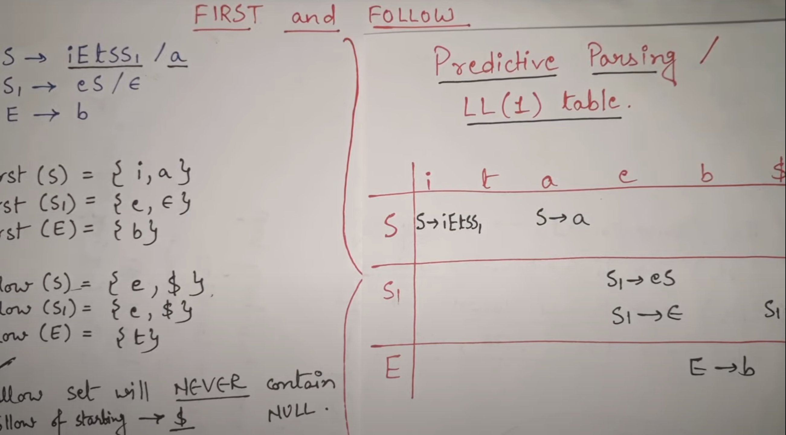

[A: why B->t|e not in `table[B][t]`? added, the original table missed all the N-> T entries]

|      | x    | t    | v             | $             |
| ---- | ---- | ---- | ------------- | ------------- |
| S    | A$  | A$      |A$|A$|
| A    | x | BC   | BC            | BC |
| B    |      | t | $\varepsilon$ | $\varepsilon$ |
| C    |      |      | v | $\varepsilon$ |

### Parsing tables for Non-LL(1) Grammars

==**Multiple productions** will map to the same entry of the parsing table, indicating a **conflict**, i.e., insufficient information to pick the next production with certainty.==
$$
\begin{aligned}
&\text { - Consider the grammar } \\
&\qquad S \rightarrow \text { S+S\$ | S*S\$ | num } \\
&\text { - We find that } \\
&\qquad \text { FIRST(S+S) = FIRST(S*S) = FIRST }(\text { num })=\{\text { num }\}
\end{aligned}
$$
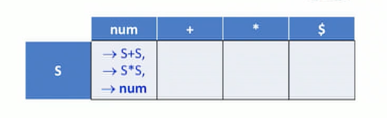

## More on Regular Grammars

- **Regular grammars are right-linear grammar:** all productions (before \$-augmentation) are of the form $A \rightarrow w B$ (terminal + Non-terminal) $A \rightarrow w$ (terminal), with $A, B \in N$ (non-terminal) and $w \in \Sigma^{*}$ 
  - Aside: There is an equivalent formalism with all productions being of the form $A \rightarrow B w$ or $A \rightarrow w$, which is called a **left-linear grammar**.
- Consider the regular language specified by the regular expression $(a \mid b)^{*} a b b$. The following is a right-linear grammar for this language.
  $S \rightarrow T$
  $T \rightarrow a A \mid b T$
  $A \rightarrow a A \mid b B$
  $B \rightarrow a A \mid b C$
  $C \rightarrow a A|b T|\varepsilon$

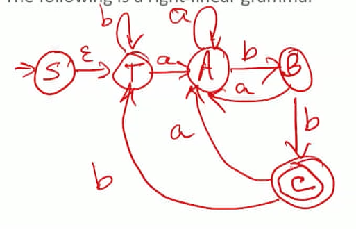

+ Parsing table -> transition function of DFA


### Table-driven predictive parser for general CFL

`state = nextstate[state][nextchar]`;

- We can't do exactly this for arbitrary CFLs, or even CFLs with an LL(1) grammar.
  - The issue is that the memory of the prefix examined and processed has to retain more information than just the path-oblivious (aka "Markovian") summary that the FA model allows.
  - This ultimately stems from the difference between the right-hand sides of productions (the unrestricted $A \rightarrow \alpha$ vs. the restricted $A \rightarrow w B)$. 
  - However, because the left-hand sides of productions are single nonterminals (i.e., **context-free**, i.e.: Single ‘A’ non terminal on the left hand side means we don’t need context for the non-terminal in the production) , this information can be organized in a **LIFO manner**, i.e., using a stack.
  - So our table-driven predictive parser will work using a **parsing stack**, in addition to the input tape and the parsing table.
- Procedure
  - ignore following description, watch this video for an example: https://www.youtube.com/watch?v=dnYVOymOBw8
    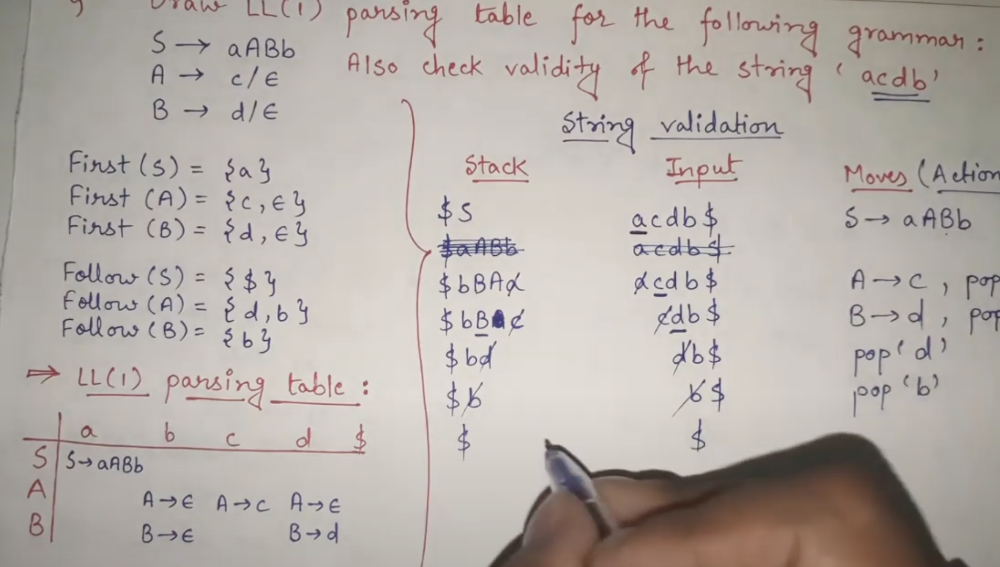
  - Initialize the parsing stack to $[\$, S]$, with $S$ being at TOS.
  - At each step, act based on the **TOS** symbol $X$ and the **input token** $a$.
    - If $X=a=\$$, halt; the parse is successful.
    - If $X=a \neq \$$, pop the stack (A is consumed) and advance the input to the next token.
    - If X!=a and they are both terminals: error
    - Otherwise, $X \in N$
      - If ParsingTable $[X, a]=X \rightarrow Y_{1} \cdots Y_{k}$
        - Pop the stack.
        - $\operatorname{Push}\left(Y_{k}\right) \ldots \operatorname{Push}\left(Y_{1}\right)$
        - [A: next step: `Parsingtable[Y1,a]`? see the youtube example for detailed process]
      - If ParsingTable $[X, a]$ is empty, there is an error in the input.


## Pushdown Automata

- The table + pushdown stack predictive parser that recognizes **context-free languages**.
  - The generalizations come in several areas.
    - The set of $\mathrm{PDA}(Q)$ can differ from the non-terminals of the grammar.
    - The stack symbols can be drawn from another alphabet $\Gamma$.
- As in the case of finite automata, PDAs can come in deterministic or non-deterministic flavors.


|                                     | Finite State (FS)                       | Pushdown (PDA)                                               |
| ----------------------------------- | --------------------------------------- | ------------------------------------------------------------ |
| Non-deterministic vs. Deterministic | similar in power                        | Non-deterministic PDAs are more powerful than deterministic PDAs. |
| Memory                              | finite state + finite memory            | finite state + unbounded memory                              |
| Tool                                | Table                                   | Table + pushdown stack (unbounded memory)                    |
| Mapping                             | actions taken for $(X, a)$ combinations | mappings from $Q \times F \times \Gamma$ to finite subsets of $Q \times \Gamma^{*}$. [A: explain? look at youtube example] |

### Graphical representation - Grammar Flow Graph (GFG)

- split the finite structure of the graph (the states) from the unbounded amount of memory of the input prefix that it needs to retain (the stack).
- `.A`: handled everything before A, (after expanding A with some production) `A.`: handled A, ready for next

For language L={bbb}:

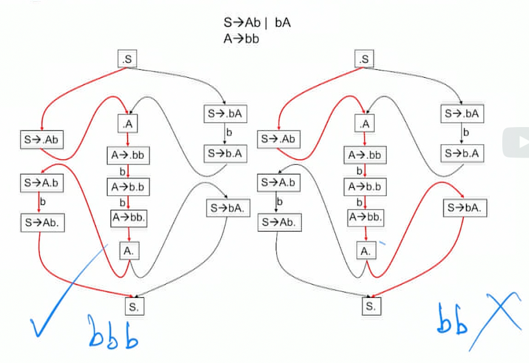

+ FS follows the red path, which can give incorrect result. because this graph requires entering and exiting the middle path from the same side (e.g. the right path enters on the left and exits on the right, which is a problem). 
+ Call and return nodes come in matched pairs: e.g. `b.XY <-> bX.Y`
  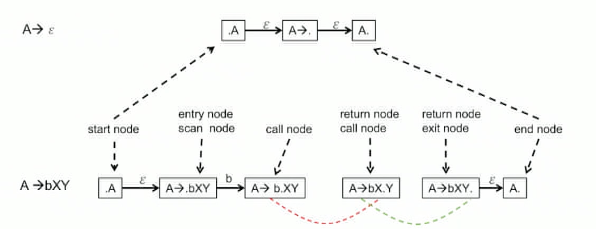


### Nondeterministic GFG Automaton (NGA)

#### Terminology

https://www.youtube.com/watch?v=JtRyd7Svlew

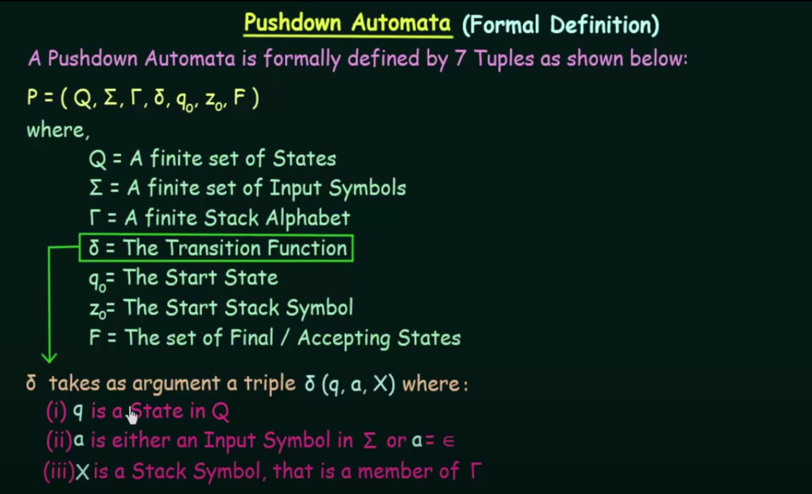

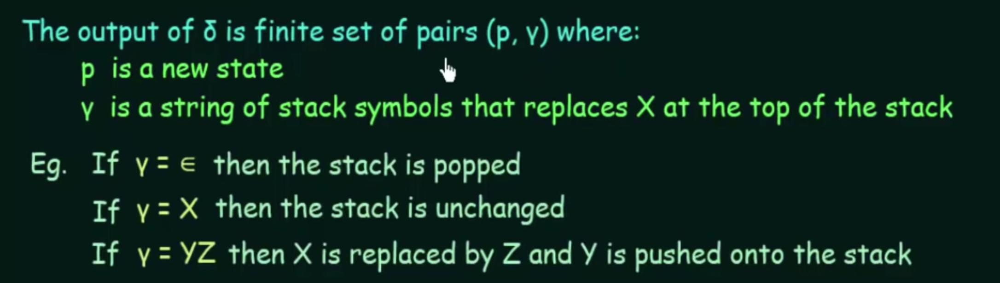

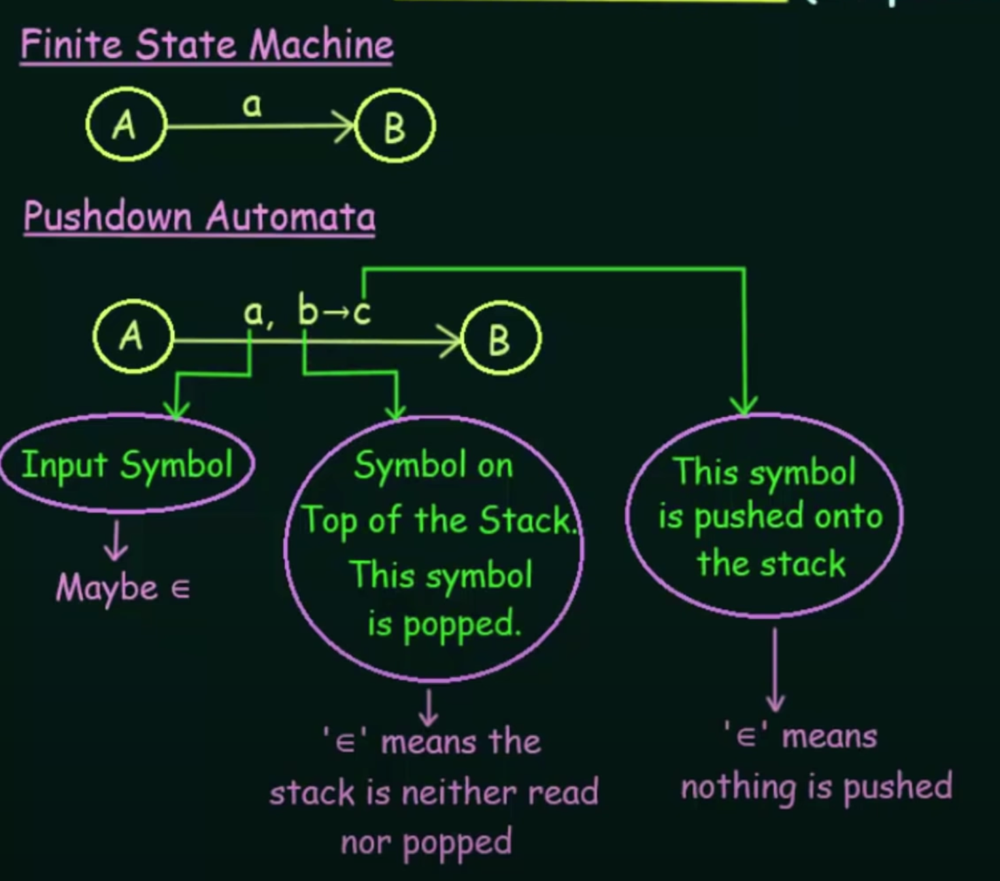

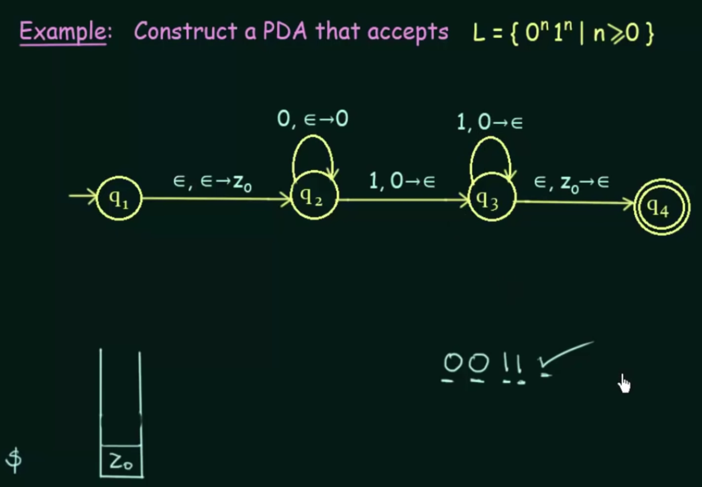

2 cases where PDA accepts: reach a final state / or stack is empty

- Grammar: a CFG $G=(N, T, P, S)$
  - $N$: non-terminals
  - $T$: terminals ($w$)
  - $P$: production
  - $S$: start node
- Graph: its corresponding GFG $\Gamma(G)=(V(G), E(G))$
  - $V$: nodes ($v$)
  - $E$: edges
  - $R$: return nodes  ($k$)
- A configuration is a triple $\langle v, k, w\rangle$ with $v \in V, k \in R^{*}, w \in$ $T^{*} \times T^{*}$ ("node-stack-input").[A: $k$ means stack and $w$ means input?]
- Initial configuration: $\langle\cdot S,[], s\rangle$, where $s$ is the input string.
- Accepting configuration: $\langle S \bullet \square, s \bullet\rangle$
- The transition function depends on the node type. (TOS is on the left hand side of [ ])
  - Start node: $\langle\cdot B, k, w\rangle \Rightarrow\langle B \rightarrow \bullet \beta, k, w\rangle$ (non-deterministic choice). [A: what is the k here? Stack element]
  - Exit node: $\langle B \rightarrow \beta \cdot k, w\rangle \Rightarrow\langle B \cdot, k, w\rangle$.
  - Scan node: $\langle A \rightarrow \alpha \cdot t \gamma, k, u \cdot t v\rangle \Rightarrow\langle A \rightarrow \alpha t \cdot \gamma, k, u t \cdot v\rangle$
  - Call node: $\langle A \rightarrow \alpha \cdot B \gamma, k, c\rangle \Rightarrow\langle\cdot B,[A \rightarrow \alpha B \bullet \gamma, k], c\rangle$.
  - End node: $\langle B \bullet[A \rightarrow \alpha B \cdot \gamma, k], w\rangle \Rightarrow\langle A \rightarrow \alpha B \cdot \gamma, k, w\rangle$
  - Return node: Nothing to do (why?).

#### Properties of the NGA

- The NGA is a special kind of PDA.
- ==Paths traversed in the GFG by the NGA are **complete balanced paths**.==
  - ==Complete: Goes from• $S$ to $S \bullet$ start to final node==
  - ==Balanced: Call and return nodes are correctly matched.==
- Theorems: 
  - `path <-> parse tree`: Every complete balanced path corresponds to a parse tree, and every parse tree has a corresponding complete balanced path.
  - `path <-> sentence label`:The label of every complete balanced path is a sentence generated by the grammar, and every sentence generated by the grammar corresponds to the label of a complete balanced path.
- ==An **unambiguous grammar** is one in which every string in the language of the grammar is generated by **exactly one complete balanced path**.==


### Earley Algorithm

https://www.youtube.com/watch?v=7UsVbTzx_54

#### From Youtube

+ 3 operations:
  + predict: expand next element to be processed, eg. .S -> .NP VP
  + Scan: check for correct terminal match and consume an input e.g. N->.papu => N->papu.
  + complete: after scanning, come back to move dot over one non-terminal (may be a chain reaction). e.g. NP->N., NP -> NP. PP … 
+ Example [TODO(midterm): try this]
  + 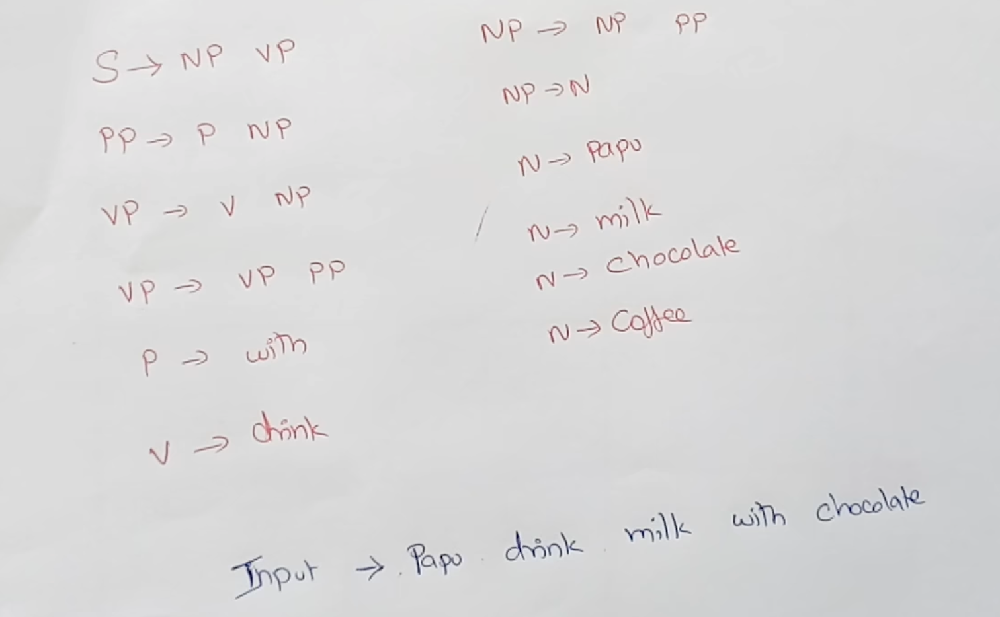 
  + Row: input, column: level of prediction, from bottom up
    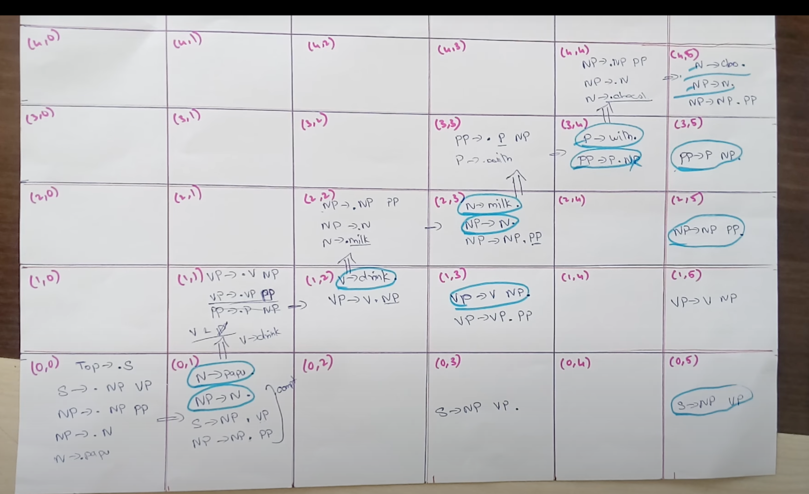

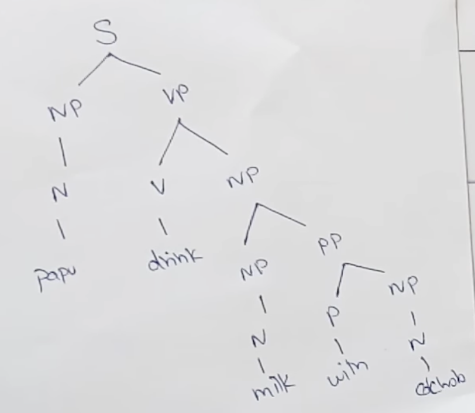

#### Ignore the lecture

- **globally angelic nondeterminism**: The non-determinism in the NGA
  - For a given grammar and input string in the language generated by that grammar, the non-deterministic NGA transitions at start nodes have to ensure that the NGA ultimately reaches $S \cdot$ along a complete balanced path that generates the input string. (Complete)
  - Parsing algorithms are deterministic implementations of this globally angelic non-determinism.
- **Early Algorithm**: Universal, i.e., can handle any CFG.
  - A path-finding algorithm
  - For an input string of length $n$, the algorithm runs in $O\left(n^{3}\right)$ steps and $O\left(n^{2}\right)$ space.
  - Can run faster for particular grammar structures.
    - $O\left(n^{2}\right)$ steps for unambiguous grammars.
    - $O(n)$ steps for $\mathrm{LR}(\mathrm{k})$ grammars.
  - Difficult to explain in classical parsing theory formalisms.
    - E.g., "top-down restricted breadth-first bottom-up parsing". 
  - Has a very simple interpretation in terms of the GFG.
    - Earley's algorithm is a deterministic implementation of the NGA and is the context-free grammar analog of the well-known $\varepsilon$-closure algorithm for simulating NFAs.
    - While the $\varepsilon$-closure algorithm tracks reachability along prefixes of complete paths, Earley's algorithm tracks reachability along prefixes of complete balanced paths.

#### Example

+ $\Sigma_{i}$ the state after processing the i’th input character (can add any number of $\varepsilon$ edges)
  + i=0: .bbb
  + i=1: b.bb
  + i=2: bb.b
  + i=3: bbb.
  + if I can find a $s. \in \Sigma_3$ , then there is a complete path from $.s$ to $s.$ i.e. $.s \stackrel{*}{\Longrightarrow} s.$
+ $\varepsilon$ closure doesn’t work because $S.$ can be reached with $bb$, which doesn’t belong to language
+ Earley algorithm: keep a tag on  the depth of the call stack

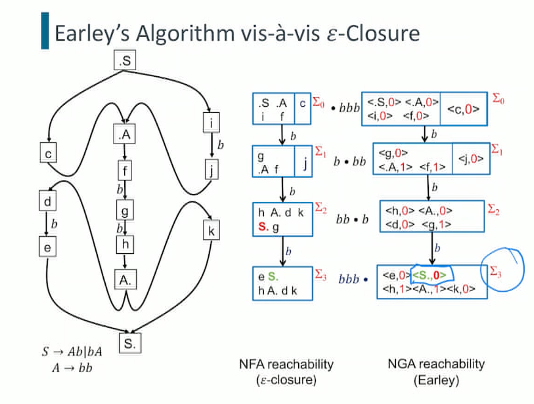

#### Simplifications of Earley's Algorithm

- Grammars for programming languages have certain properties.
  - Unambiguous
    - Each sentence in language is produced by one complete balanced path.
    - Caveat: May need to follow multiple parallel paths during parsing, but only one will survive at the end.
  - Parse tree is produced incrementally as string is read.
    - Distinct from ambiguity.
    - E.g., $A \rightarrow b A b \mid b$ is unambiguous but can't be incrementally parsed.
- Two important grammar classes
  - LL: parse tree can be produced incrementally in pre-order. Top-down parsing
  - LR: parse tree can be produced incrementally in post-order. Botton-up parsing
- Parsers for LL and LR grammars are optimized versions of the Earley parser that exploit GFG structure to match calls and returns without using tags.
  - In particular, LL parsers (e.g., recursive-descent) need to follow just a single path through the GFG, and can therefore use the runtime stack to track return addresses.
- Regular grammars
  - e.g. `a|bc*`
    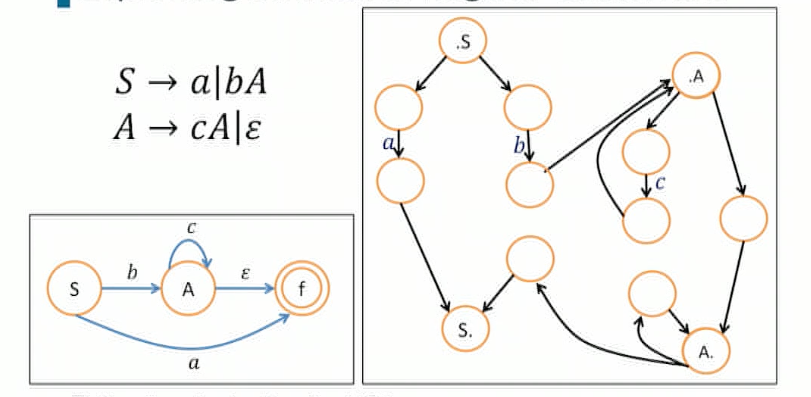
  - **Tail-call optimization** for NGA
    - If the <u>last symbol in production is a non-terminal,</u> call node does not have to push return node on stack ("replace recursion by iteration").
    - This is the case for a right-linear grammar, so we can eliminate the stack.
    - In this case, the GFG devolves to a NFA.