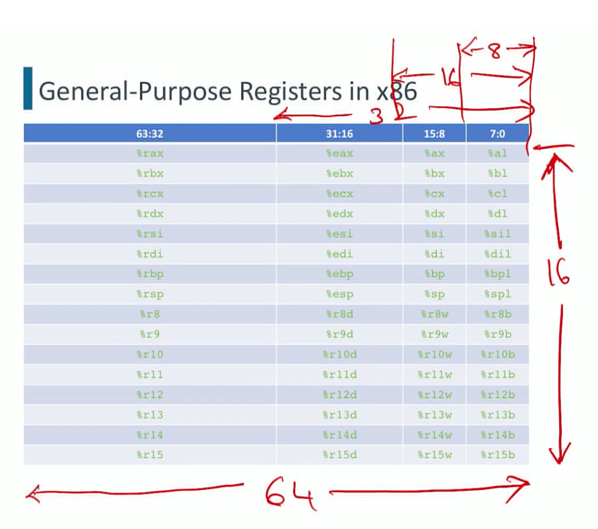

# Intro to Register Machines

### Basics

+ Focus: interface 4: User ISA


+ Taxonomy: 2 and 3- operand machine, one of the operands for result address


### Instruction Encoding

- Definition:
  - At the ISA semantics level, an instruction is a **mapping from machine states to machine states.** $I:\Sigma \rightarrow \Sigma$
  - At the ISA representation level, an instruction is a bit string that is interpreted as a verb rather than as a noun.
    - Encoding specifics vary widely across machines.
- Components
  - **Source operands**: What input values it needs to read (how many there are, how wide they are, where they come from).
  - **Opcode**: What operation it performs on those input values.
  - **Destination location**: Where the output value of the operation is stored.
  - What **side-effects**, if any, occur. e.g. exception conditions
- History: the RISC-CISC debate
  - The dominant ISA style in the mid-1970s featured complicated operations that combined memory access with data manipulation. [PDP-10, IBM 360] Because at that time most programs are written directly in assembly. But they were difficult for fast implementations
  - Measurements of actual usage of instructions revealed that such **complicated instructions were used rarely.**
    - IBM (801 project), Berkeley, Stanford.
  - This led to a new style of ISA design, characterized by:
    - **Separating memory access from data manipulation.**
    - Providing (orthogonal) primitives rather than solutions.
    - **Co-designing ISA and compiler.**
    - Amenable to fast implementations leveraging Moore's Law.
  - From John Cocke's Turing Award lecture (1988)
  "Another satisfying aspect of the 801 project was that many of our ideas were considered sufficiently interesting by others and stimulated considerable additional research and experimentation in many universities. Berkeley coined the name "RISC" (Reduced Instruction Set Computing) for similar work."
  - The term CISC was coined retroactively to mean "pre-RISC".
  - Modern examples
    - CISC: x86
    - RISC: ARMv8
      - Primarily sold as IP cores to licensees, who use the core to create microcontrollers, CPUs, and SoCs based on those cores.
      - Low cost, minimal power consumption, lower heat generation than competitors make it desirable for light, portable, battery-powered devices.
      - Also used in desktops, servers, and supercomputers.
      - Dates back to the 32-bit ARM1 from $1985 .$
      - Additional instruction sets for specialized purposes: Thumb for improved code density, Jazelle for directly handling Java bytecodes, security extensions.

# X86 ISA

## Intro

### User-Visible Architectural State

+ Program state
  + **Program counter** (%rip for 64 bit, %eip for 32 bit)
    + Special register. Not directly accessible from user-mode code.
  + **Integer register file** $(\mathrm{R}[])$.
    + **16 named general-purpose registers (GPR)** storing 64 -bit values.
    + Distinct name space from memory. **Accessed by name.**
  + **Condition flags.**
    + EFLAGS (32)/ RFLAGS (64) registers: Multiple **single-bit registers** containing status information about the most recently executed arithmetic/logical instructions.
    + Used to **support branching**.
+ Memory state
  + Memory $(\mathrm{M}[\mathrm{J})$.


### C and intel terminologies

$$
\begin{array}{|c|c|c|c|}
\hline \text { C declaration } & \text { Intel term } & \text { ASM suffix } & \text { Size (B) } \\
\hline \hline \text { char } & \text { Byte } & \text { b } & 1 \\
\hline \text { short } & \text { Word } & \text { w } & 2 \\
\hline \text { int } & \text { Double word } & 1 & 4 \\
\hline \text { long } & \text { Quad word } & \text { q } & 8 \\
\hline \text { char } * & \text { Quad word } & q & 8 \\
\hline \text { float } & \text { Single precision } & \text { s } & 4 \\
\hline \text { double } & \text { Double precision } & 1 & 8 \\
\hline
\end{array}
$$

+ Eg: ADD B, ADD W, ADD L, ADD Q ….

### x86 Assembler Formats

- Two incompatible formats of writing assembly-language instructions.
  - ATT format (linux): Source operands first, destination last. **Register names have the % prefix.**
  - Intel format (windows): Destination first, followed by source operands. Register names don't have the % prefix.
- We will use SASM (a cross-platform IDE) to abstract away from these inessential differences. SASM supports multiple assemblers.
  - NASM (Netwide Assembler) https://nasm.us
  - MASM (Microsoft Macro Assembler)
  https://docs.microsoft.com/en-us/cpp/assembler/masm/microsoft-macroassembler-reference?view $=\mathrm{msvc}-160$
  - GAS (GNU Assembler) https://www.gnu.org/software/binutils/
  - FASM (Flat Assembler) http://flatassembler,net/download.php

### General purpose rgisters in x86

+ Name table



+ Width: 64 bits in total for each register
+ Usage
  +  full 64 -bits. AQ [Q: what do these abbrieviations mean?]
  +  the bottom 32 -bits. NL
  +  the bottom 16 -bits. AW
  + the bottom 8-bits. AB
+ naming:
  + rbp: base pointer
  + Rsp: stack pointer


## Data

### Sources and Destinations

- The generic form of an instruction is  `<op> <src-opnds> , <dst>`
  - eg. `a = b + c`, 
    - `src: rvalue, b + c`
    - `dst: lvalue, a`
- Where can source operands (**rvalues**) come from?  `b(name) -> @b (location) -> @b contains the (value)`
  - A constant value.
  - The **contents of a GPR.**
  - The **contents of one or more memory cells.**
- Where can results be placed (**Ivalues**)? only `(name) -> (location)`
  - A GPR.
  - One or more memory cells. **Cell: an atomic addressable unit of memory**, ie. Bite0sized, shorts, ins, longs …

### Operands

#### Immediate Operands (I-form, I-mode )$X

- constants that are embedded directly within the instruction.
  - E.g.,  `$-577, $0x1F`
  - Allowable range depends on the instruction.
- The concrete syntax is $\$ X$. It evaluates to $X$.

#### Register Operands r

- This specification form is used for values that are the contents of a GPR.
  - E.g., `%rbx, %ecx`
  - The width of the result $(8,16,32$, or 64 bits) is implicit in the register name.
- The concrete syntax is $r$. It evaluates to $\mathrm{R}[\mathrm{r}]$.

#### Memory Operands

- This specification form is used for values that are the contents of one or more memory locations.
  - Width:  Encoded by the ASM suffix of the opcode. Call this width $b$ (Bytes).
  - Location: Too many choices, and may want to access different memory locations from the same piece of code (e.g., A $[i])$.
- Forumla to calculate the location: **addressing mode** (AM), encoded in the instruction.
  - Calculate location during runtime: AM is **evaluated as part of instruction execution** to provide a value called the **effective address** (EA). Call this value $a$.
  - examples:
    - A[i]: starting at address a, AM is a linear function of i, which is dependent on the type of elements of i
    - deference a pointer: use content of the memory as address of something else
  - The EA is used to access memory bytes $M[a]$ through $M[a+b-1]$ (or $M_{b}[a]$ for brevity)

##### Memory addressing modes and EAs


+ Absolute: `X(address) -> M[X](value at address)`
  + recall immediate mode we have `$X` and evaluates to `X`
  + here we have bare `X`, evaluates to the content of memory location `X`, or `M[X]`
+ Indirect: `ra(register name) -> R[ra] (value at register) = X -> M[R[ra]](value at X)`
  + R[ra] can change during runtime
+ Base + displacement: add an immediate operand X to value at register
+ Indexed: useful for eg. 2D array
+ Scaled indexed: just scale contents of index register


## Instructions

### MOV

#### Basic MOV instructions

- move data from source operand to destination operand
- $\operatorname{MOV}\left\{\begin{array}{l}B \\ W \\ L \\ Q\end{array}\right\}, S, \quad D: D \leftarrow S$
  - width: defined by 1 B, 2 W, 4 L, 8 Q
  - specifier $\mathrm{S}$ and one destination specifier D.
- Restrictions
  - $\mathrm{S}$ and D can't refer to memory locations simultanously. No direct memory to memory transfer (M<-M), only R<-I, M<-I, R<-R, M<-R, R<-M
    - workaround:  R<-M + M<-R
  - If $S$ is immediate, it is at most 32 bits wide.
    - workaround: `MOVABSQ I, R`: To handle a full 64 -bit immediate source operand.
- Eg. `MOVQ 0xFFFFFFFF, %rax`, `0xFFFFFFFF` because %rax is 8 bites, the immediate only occupy least siginificant 4 bytes, and most siginificant 4 bytes will be zero (`FF` takes 1 byte)


#### Width-Expanding MOV Instructions

- Used to transfer a narrower S to a wider D, D must be a register.

- Widths of source and destination are encoded by the ASM suffix of the opcode.

  - MOVZ: zero extend (MOVQ handles MOVZLQ) [Q: what happens if we MOVL to a 8 byte D? And why does MOVQ do the filling that automatically but not for others?]
    $$
    \begin{aligned}
    &\text { - } \operatorname{MOVZ}\left\{\begin{array}{c}
    B W \\
    B L \\
    B Q \\
    W L \\
    W Q
    \end{array}\right\}, S, D: D \leftarrow \text { ZeroExtend }(S) . \text { No MOVZLQ: why? } \\
    \end{aligned}
    $$
    

  - MOVS: SignExtend, with two-complement
    $$
    \begin{aligned}
    &\text { - } \operatorname{MOVS}\left\{\begin{array}{c}
    B W \\
    B L \\
    B Q \\
    W L \\
    W Q \\
    L Q
    \end{array}\right\} \quad S, D: D \leftarrow \text { SignExtend }(S) \\
    &\text { - CLTQ: } \% \text { rax } \leftarrow \text { SignExtend(\%eax) }
    \end{aligned}
    $$

    - CLTQ: extend from eax to rax

- **Variable length** of x86 instructions: Different instructions take different number of byte to encode (e.g. CLTQ 1 byte)


### Stack Manipulation Instructions

**Stack grows top down** : TOS is at lowest address


+ `PUSHQ S`: push source content to stack

  `R[%rsp] <- R[%rsp]  - 8`: increment stack pointer (unit is 8 bytes, inc by going down)

  `M[R[%rsp] ] <- S` : push source to address pointed by stack pointer

+ `POPQ D`
  `D <- M[R[%rsp]]`

  `R[%rsp] <- R[%rsp]  + 8`


### Unary and Binary operations


+ D is used as both source and destination
  - This leads to update-in-place semantics, where the old value at the destination is overwritten by the result value $-$ and is therefore lost.
  - If it is necessary to **preserve the old value, copy it explicitly (e.g., with a MOV instruction).**
+ Logical are bitwise
+ For integer mul: lose overflow part of result
+ Shift: k is an immediate
  + Right shifts:
    + Arithmetic shifts (sar, shr): fill most significant bit with sign bit of D
    + Logicak shift (sal, shl): fill with 0
  + Left shift always fill with 0
  + Shift amount k can be
    - Immediate: if know in compile time
    - Register `%cl`: if not known in compile time, have to use register `cl` , only the necessary number of lower-order bits (as determined by the ASM suffix of the opcode) are used: 3 for $B, 4$ for $W$, 5 for $\mathrm{L}, 6$ for $Q$.

### LEAQ

**"Load Effective Address Quad"**

- Usage

  - classified as a data movement operation, it can do a limited amount of computation (with EA calculation).
  - This instruction is often used to generate code for multiplication by small constants (struct/ object field addresses).

- Definition

  - Form: `LEAQ S, D`.
  - Restriction: 
    - **S: memory operand**
    - **D: register**
  - The effective address that $\mathrm{S}$ evaluates to is placed in $\mathrm{D}: D \leftarrow E A(S)$.
  - Compare to using MOVQ:
    - S -> (AM -> EA(S) ->) M -> rd [A: what are we doing here with MOVQ, why store in M first? EA(S) is by definition a memory addressing function]

  

- Examples of The LEAQ Instruction: arithmetics for compile time constants
  - 


### Control transfer (branching)

#### Status flags

+ Definition:

  + x86 separates genertion of condition and examination of condition
  + status flags: the boolean registers serving as interface for above two tasks

+ Six designated bits within the 64 -bit RFLAGS register that indicate the results of arithmetic, Iogical, and shift operations. The lower 32 -bit section of this register is called EFLAGS.

  + CF: Carry Flag (last instruction has unsigned overflow).

  + ~~PF: Parity flag.~~

  + ~~AF: Atxillary Garry flag,~~

  + $\mathrm{ZF}:$ Zero Flag (last instruction result $0 \times 0 $ )

  + SF: Sign Flag (result negative)

  + OF: Overflow Flag (the operation cause a two's-complement overflow, either positive or negative) [Q: will we be tested on two-complements calculation or only conceptual understanding is fine?]

    ```
    If 2 Two's Complement numbers are added, and they both have the same sign (both positive or both negative), then overflow occurs if and only if the result has the opposite sign. Overflow never occurs when adding operands with different signs.
    
    i.e.	Adding two positive numbers must give a positive result
     	Adding two negative numbers must give a negative result
    Overflow occurs if
    
    (+A) + (+B) = −C
    (−A) + (−B) = +C
    Example: Using 4-bit Two's Complement numbers (−8 ≤ x ≤ +7)
    
     (−7)   1001
    +(−6)   1010
    ------------
    (−13) 1 0011 = 3 : Overflow (largest −ve number is −8)
    ```

##### Implicit Setting of status flags

- Arithmetic, logic, and shift operations set the flags (mostly) in the expected manner.
  - Logical operations set $\mathrm{CF}$ and $\mathrm{OF}$ to 0 .
  - Shift operations set $\mathrm{CF}$ to the last bit shifted out. $\mathrm{OF}$ is changed only when the shift amount is 1 (complicated rules).
  - INC and DEC set OF and $\mathrm{ZF}$, but leave CF unchanged (not ‘set to 0’).
- LEAQ does not alter the status flags.

##### Explicit Setting of status flags

- arithmetic: `cmp X S1, S21` : Sets status flags based on the value of $\mathrm{S}_{2}-\mathrm{S}_{1}$ but discards the value.
- logical: `testX S1, S2`: Sets status flags based on the value of $\mathrm{S}_{2} \& \mathrm{~S}_{1}$ but discards the value.
- $\mathrm{X} \in\{\mathrm{B}, \mathrm{W}, \mathrm{L}, \mathrm{Q}\}$
- Only “-” and “&” operations

##### Accessing or Using Status Flags

- Usually not accessed directly, but through a set of conditions (CND) that are combinations of the status flag values and correspond to typical tests needed in compiling programming language constructs.
- Three instructions
  - `setCND D`: Set a single destination byte specified by D (which can be either in register or in memory) to 0 or 1 depending on a combination of status flags specified by CND.

    - width is hardcoded - byte
    - CND suffix specifies condition

  - `JCND L`: Jump to label $\mathrm{L}$ if the combination of status flags specified by CND evaluates to true.

  - `cmovCND S, D`: If condition CND evaluates to true, move the contents of $S$ to D; otherwise, do nothing.

    - $$
      D \leftarrow\left\{\begin{array}{l}
      S \text {, if CND} \\
      D \text {, otherwise }
      \end{array}\right.
      $$

    - Operand $S$ is R-type or M-type.

    - Operand $D$ is R-type $(16,32$, or 64 bits only).

    - Transfer width is inferred from destination register name.

+ Conditions (CND)
  + comparison (> >= < <=) are with 0 (>0 …) [Q: why SF^OF is < (signed) and CF is < unsigned?]


#### Unconditional Jumps

- Two forms at assembly-language level: direct and indirect.
  - Direct: jmp $\mathrm{L}$, where $\mathrm{L}$ is a label. `PC -> L`
    - At machine code level, the instruction has a large number of variants, and the label is translated into an absolute or relative offset from `%rip`.
  - Indirect: jmp $* \mathrm{D}$, where $\mathrm{D}$ is a register or memory format operand specifier. `PC -> M[EA(D)] = L`
    - No indirect conditional jumps.
    - used for switch statements (with jump table)


# Procedural Linkage (method invocation)

[TODO: review back and summarize the difference between different architecture procedural linkages]

## X86

### Definition

- A procedure linkage is a contract between the compiler, the operating system, and the target machine that clearly divides responsibility for naming, allocation of resources, addressability, and protection.
- Standard procedure linkage
  - Pre-call and post-return sequences at each call site.
  - Prologue and epilogue sequences in each procedure.


+ Map standard procedual linkage to SAM:

  ```
   + P
      + Prologue: ADDSP numLocalVars
      + Pre-call:
        + PUSHIMM 0
        + [Code for parameters]
        + LINK
        + JSR Qstart
      + Post-return:
        + POPFBR
        + ADDSP -numParams
      + Epilogue:
        + PEnd:
          + STOREOFF -1
          + ADDSP -numLocalVars
          + JUMPIND
    + Q
      + Prologue: 
        + Qstart:
        + ADDSP numLocalVars
      + [Code for block]
        + return:
          + [Code for return expression]
          + JUMP QEnd
      + Epilogue:
        + QEnd:
          + STOREOFF -1
          + ADDSP -numLocalVars
          + JUMPIND
  ```

### background

- On real machines, the procedure linkage conventions of the $\mathrm{ABI}$  [A: ABI: application binary interface] are complicated, and are often a function of the processor, OS, programming language, and (possibly) compiler.
  - This can lead to potential lack of interoperability.
- Also, the machine-level data widths and alignment requirements of different data types has to be taken into account.
- On IA-32, there were at least six different conventions for C/C++, differing in parameter passing details, stack cleanup responsibilities, and handling of struct/class arguments and results.
- On x86-64, there are two major conventions: the (windows) Microsoft $\times 64$ calling convention and the (linux) System V AMD64 ABI.
  - gcc and clang support both, depending on operating system.

### Architecture

- #### Procedure linking information - pointers

  - ` %RBP`The stack-frame base pointer: identifies a fixed reference point within the stack frame for the called procedure. (FBP for SAM)
  - `%RIP`: return-instruction pointer (RIP): instruction in calling procedure which should be resumed after called procedure returns

- #### Procedure calls are supported with CALL and RET instructions.

  - CALL:
    - `Stack <- R[%rip]` : Pushes the current value of %RIP on the stack. 
      - Prior to branching to the first instruction of the called procedure, the CALL instruction pushes the address in the %RSP register onto the current stack. 
    - `%rip <- offset`: Loads the offset of the called procedure in %RIP.
    - Begins execution of the called procedure.
  - RET:
    - `%rip <- Stack`: Pops the TOS value (the return instruction pointer) into %RIP.
      - Upon returning from a called procedure, the RET instruction pops the RIP from the stack back into the %RSP register. Execution of the calling procedure then resumes.
    - If the RET has an optional argument $n$, increments %RSP by $n$.
    - Resumes execution of the calling procedure. [Q: PC -> RIP?]

- #### Pass Parameters (or results) in any of three ways: 

  - through GPRs, 
    - The processor does not save the state of the GPRs on procedure calls. 
    - up to six parameters
    - copying the parameters into any of GPRs (except %RSP and % RBP) prior to executing the CALL instruction.
  - on the stack.
    - large number of parameters 
    - parameters placed in the stack frame for the calling procedure. 
    - use the stack-frame base pointer (%RBP) to make a frame boundary for easy access to the parameters.
  - an argument list in memory. 
    - larger number of parameters 
    - Pass a pointer to the argument list to the called procedure through a GPR or the stack.

- #### caller save GPRs & RFLAGS for use when resuming: 

  - The processor does not save the contents of the GPRs or the RFLAGS register on a procedure call. 
  - Need to be saved on the stack or in memory. (not for normal user level calls)
    - PUSHA: save all GPRs
    - POPA: restore all GPRS
    - PUSHF/PUSHFD: save all RFLAGS
    - POPF/POPFD: restore all RFLAGS

## AMD64 ABI

- Registers (just an convention, not dictated by hardware, for interoperability)
  - Callee-saved (preserved) registers (6): GPRs %rbp, %rbx, %r12, to %r15 belong to calling function
    - called function is required to preserve their values. 
    - A called function must preserve these registers' values for its caller. (write back in epilogue)
    - Volatile
  - Caller-saved registers (9): The remaining registers belong to the called function.
    -  If a calling function wants to preserve such a register value across a function call, it must save the value in its local stack frame.
    - Non-volatile
  - Rsp: reserved, not used by either


- Stack Frame
  - Grows downwards from high addresses.
  - The end of the input argument area shall be aligned on a 16 -byte boundary.
  - Once control has been passed to the function entry point, %rsp points to the return address, and the value of $(\%rs p+8)$ is a multiple of 16 .
  - red zone: The 128-byte area beyond the location pointed to by %sp is considered to be reserved and shall not be modified by signal or interrupt handlers. 
    - Therefore, functions may use this area for temporary data that is not needed across function calls. 
    - In particular, leaf functions may use this area for their entire stack frame (function that does not call others), rather than adjusting the stack pointer in the prologue and epilogue. 
  - The conventional use of %rbp as a frame pointer for the stack frame may be avoided by using %rsp (the stack pointer) to index into the stack frame. This technique saves two instructions in the prologue and epilogue and makes one additional GPR (%rbp) available.

- Parameter Passing [Simplified]

  - Arguments are classified into multiple classes based on size.
    - **INTEGER**: Integral types that fit into one of the GPRs.
    - **MEMORY**: Types that will be passed and returned in memory via stack.
  - Once arguments are classified, the registers get assigned (in left-to-right order) for passing as follows:
    - INTEGER, 
      - the next available register of the sequence %rdi, %rsi, %rdx, %rcx, %r8, %r9 is used. [Q: if more than 6, just use memory?]
      - Once registers are assigned, the arguments passed in memory are pushed on the stack in reversed (right-to-left) order.
    - MEMORY, 
      - pass the argument on the stack at an address respecting the argument's alignment (which might be more than its natural alignment).
- Returning of Values [Simplified]
  - INTEGER, the next avallable register of the sequence %rax, %rdx is used.

  - MEMORY, then the caller provides space for the return value and passes the address of this storage in $\% r d i$ as if it were the first argument to the function. In effect, this address becomes a "hidden" first argument. On return %rax will contain the address that has been passed in by the caller in $\%\mathrm{rdi}$.

    

## Alternate Linkage: $\times 64$ Calling Convention

[Ref: https://docs.microsoft.com/en-us/cpp/build/x64-callingconvention?view=msvc-160\&viewFallbackFrom=vs-2017]

- By default, the first four arguments to a function are passed in registers. Integer-valued arguments in the leftmost four positions are passed in left-to-right order in RCX, RDX, R 8, and R9, respectively. The fifth and higher arguments get pushed on the stack in right-to-left order. All integer arguments in registers are right-justified.
- A scalar return value that can fit into 64 bits is returned through RAX.
- Registers RAX, RCX, RDX, R8, R9, R10, and R 11 are volatile. Consider volatile registers destroyed on function calls unless otherwise safety-provable otherwise by analysis.
- Registers RBX, RBP, RDI, RSI, RSP, R 12, R13, R 14, and R15 are nonvolatile. They must be saved and restored by a function that uses them.


# ARM

## Characteristics

- Reduced Instruction Set Computer (RISC) architecture.
  - A large uniform register file.
  - A load/store architecture, where **data-processing operations only operate on register contents, not directly on memory contents.** [Q: which instruction in x86 operates directly on memory contents?]
  - Simple addressing modes, with all load/store addresses determined from register contents and instruction fields only. Never go to memory to do an address computation
- Armv8 architecture supports backwards compatibility.
  - A 64 -bit Execution state, AArch64.
  - A 32 -bit Execution state, AArch32, that is compatible with previous versions of the Arm architecture (Armv7-A architecture profile + extensions).
  - Multiple permitted extensions to architecture.
- AArch64 execution state
  - Addresses are held in 64 -bit registers.
  - Instructions in the base instruction set can use 64 -bit registers for their processing.
  - Supports the A64 instruction set.


## Execution state

### Registers

- 31 64-bit GPRs, R0 through R30.
  - Each register can be addressed as a 64-bit GPR named $\mathrm{X} 0$ through $\mathrm{X} 30$. The least significant 32 bits of each register can be addressed as a 32 bit GPR named wo through W30.
  - X30 is used as the procedure link register.  (X86 procedual linkage happens through runtime stack)
  - The Zero Register (ZR) is sometimes written as $\mathrm{X} 31$ in pseudocode. (get 0 if read from ZR)
- A dedicated 64 -bit Stack Pointer register, SP.
  - The least significant 32 bits can be accessed using the register name WSP.
  - Aligned to a 16-byte boundary (configurable).
- A 64 -bit Program Counter (PC) holding the address of the current instruction.
  - Software cannot directly write to PC.
  - Word-aligned (word $=32$ bits $=4$ bytes).


### Condition Flags

- Four condition flags.
  - N: Negative Condition. (x86 SF)
  - Z: Zero Condition. (x86 ZF)
  - C: Carry Condition (unsigned overflow).  (x86 CF)
  - V: Overflow Condition (signed overflow).  (x86 OF)
- Set by flag-setting instructions.
- Conditional instructions test the $\mathrm{N}, \mathrm{Z}, \mathrm{C}$ and $\mathrm{V}$ Condition flags, combining them with the Condition code for the instruction to determine whether the instruction must be executed.
- Can also be directly read or written.
  - The NZCV special-purpose register stores these values.
  - The instruction MRS reads the NZCV register.
  - The instruction MSR immediate writes immediate to the NZCV register.

### Memory

- Supports 64 -bit virtual addressing.
- Address calculations are performed using 64 -bit registers.
  - Supervisory software can configure the top eight address bits for use as a tag.
- Alignment
  - A64 instructions must be word-aligned.
  - **Data accesses must be aligned to the size of the data element being accessed.**
- Endianness
  - A64 instructions have a fixed length of 32 bits and are always littleendian. 
    - A big-endian system stores the [most significant byte](https://en.wikipedia.org/wiki/Most_significant_byte) of a word at the smallest [memory address](https://en.wikipedia.org/wiki/Memory_address) and the [least significant byte](https://en.wikipedia.org/wiki/Least_significant_byte) at the largest. A little-endian system, in contrast, stores the least-significant byte at the smallest address.
  - Data endianness is configurable by supervisory software.


### A64 Instruction Set

- fixed length of 32 bits and are always little-endian.
- **Functional groups** by encoding structure
  - A **miscellaneous** group of branch instructions and other stuff.
  - **Data-processing** instructions associated with GPRs.
    - All are held in **registers**.
    - Include an operand with a **constant immediate value.**
  - **Load and store** instructions associated with the GPR.
- Regular bit encoding structure.
- A64 assembly language
  - Instruction mnemonics overloaded; exact form distinguished based on operand types.
  - 16 condition codes: 
    - EQ, NE; zero
    - CS, CC; carry flag
    - MI, PL; sign flag
    - VS, VC; overflow
    - HI, LS; unsigned compares
    -  GE, LT, GT, LE; signed compares
    - AL, NV. always branch


### Address Generation

- Supports 64 -bit virtual addresses.
- Register indexed addressing
  - The A64 instruction set allows a 64 -bit index register to be added to the 64-bit base register, with optional scaling of the index by the access size. Additionally it allows for sign-extension or zero-extension of a 32 bit value within an index register, followed by optional scaling.
- PC-relative addressing
  - Support for position-independent code and data addressing.
  - PC-relative literal loads have an offset range of $\pm 1 \mathrm{MB}$.
  - Compare-based conditional branches have a range of $\pm 1 \mathrm{MB}$.
  - Test bit conditional branches have a range of $\pm 32 \mathrm{~KB}$.
  - Unconditional branches, including branch and link, have a range of $\pm 128 \mathrm{MB}$


### Load/Store Addressing Modes

- 64 -bit base address from a GPR (X0-X30) or SP.
- Optional immediate or register offset.
- Addressing modes

  

+ [Q: what is pre-indexed and post-indexed?]


### Armv\&: Procedure call/return

- A64 instructions
  - Branch with Link: BL <label> (CALL)
    - Branches to a PC-relative offset, setting the register $\times 30$ to $\mathrm{PC}+4$. (return address)
  - Branch with Link to Register: BLR <Xn> (CALL indirect, jump to dynamic label stored in a register)
    - Calls a subroutine at an address in a register, setting register $\times 30$ to $\mathrm{PC}+4$.
  - Return from subroutine: RET $\{\langle\mathrm{Xn}>\}$ (return address)
    - Branches unconditionally to an address in a register.
    - Register defaults to $\mathrm{X} 30$ if absent.
- Parameter passing and result return
  - First 8 Arguments passed in GPRs R0 through R7, and remaining on the stack (left-to-right).
  - Primitive results returned in R0. Otherwise, the caller reserves block of memory for result and passes the address to the callee in $\mathrm{X} 8$.