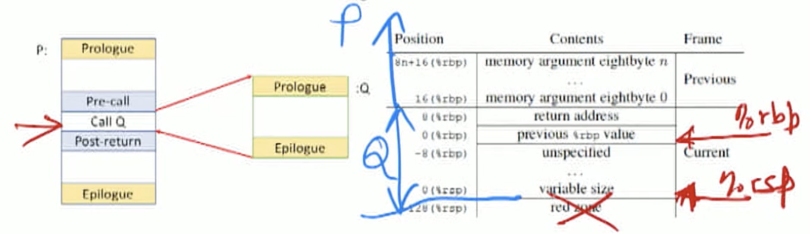

# Code genertion for x86

## Basics

### SaM vs x86

- Major differences
  - Instruction set design: 0-operand (SaM) vs. 2-operand (x86) D <- D or S.
  - Storage state: Memory only (LIFO) vs. random-access memory + general-purpose registers.
  - Addressing modes: Base + Offset only vs. richer set.
  - Run-time stack organization: Growing upwards vs. growing downwards.
  - Argument and result passing conventions: Stack-only vs. GPR + stack.
- To focus on building a simple correct code generator, make the following simplifying assumptions.
  - All local variables have a "home location" on the stack frame.
  - Access local variables using B+O mode with \%rsp as the base register. Always have positive offsets from rsp
  - Reserve GPrs \%rbp, \%rsp, frax, $\% r d i, \% r s i, \% r d x, \% r c x, \% r 8$, and $ \%r 9$ for their standard usages according to the ARM64 ABI. (6 for parameter and 1 for result passing)
  - Use other GPRs as scratchpad registers for expression evaluation.
  - Prefer to use caller-saved registers over callee-saved registers. [Q: what’s the difference using an example?]
  - Separate memory access from data-processing. Ops on register operands only
- Things to consider.
  - Keep arguments register-only, or also have a "home location" on the stack frame? Need to test if num arguments is > 6. Access arguments on stack using %rbp
  - Save/restore all callee-saved registers in prologue/epilogue?
  - Do not design a custom (simplified but non-standard) linkage for LiveOak?  [TODO: check what is the linkage convention?]

### Terminology

- Basic block - seqneuntial control transfer only
  - A maximal single-entry single-exit sequence of statements.
  - Control enters at the beginning of the block.
  - Control leaves at the end of the block without halting or branching except possibly at the end.
- Definitions and uses
  - The statemen $x=$ expn said to define $x$ and use all the variables in expn (which may includé $x$ ).
  - S: x =x+1 + y
    - Use(x) = {x, y}
    - Def(x) = {x} 
- Liveness
  - name whose value at that point is later in the program (same/ different block)
  - Highly conservative approximation: All named program variables are live at the exit point of a basic block.

### Tracking Variable Mappings

- Two descriptors used within the compiler to keep track of locations of variables and temporaries. [Q: put simply, Map<register, value>, Map<name, register> ?]
  - **Register descriptor (RD)**: What is in each register.
    - Empty (except for arguments and results) at the beginning of a basic block.
    - At any point in the basic block, contains the values of zero or more literals, identifiers, or temporaries.
    - eg: x = 2, RD(%r12) = {2, x}, x = x + y, RD(%r12) = {x} [Q: why can it have more than one values? Why do we need literal 2 here?]
  - **Address descriptor AD** : The location(s) where the current value of a name can be found at run-time.
    - Register, memory location (stack frame or static area), or some combination of these.
    - Can be maintained in symbol record or AST node record.
    - Maintain a **modified flag** ( $M F$ ) to indicate when a variable is defined by a statement, to trigger the **saving of the register-resident value to home location Memory location** at the end of the basic block.
    - For both named entities and unnamed intermediate result, e.g. a = x + y + z, x + y is the intermediate result


## Code generation

### Basic Block

#### Expr y = X

- Base case, right hand side $X \in\{$ num, $y\}$
  - If $A D(X)$ is already some register $R$, return $R$. 
  - Otherwise, $R=$ getreg(); (register allocator)
    - $A D(X)=A D(X) \cup\{R\} ; R D(R)=R D(R) \cup\{X\} ; M F(X)=$ false
      - Add a register
      - Add X to the register
    - Emit the instruction MOV<x> Val-or-memloc $(X),<R>$
      - <x> = Q … suffix
      - if just a simple constant, use immediate mode (val)
      - <R> for register
    - Return $R$.
-  Subtree $T=\operatorname{op}\left(T_{1}, T_{2}\right):$
  - Get registers of sub expression: $R_{1}=\operatorname{codegen}\left(T_{1}\right) ; R_{2}=\operatorname{codegen}\left(T_{2}\right)$.
  - Emit the instruction $<O P\rangle\left\langle x>\left\langle R_{1}\right\rangle,\left\langle R_{2}>\left(\right.\right.\right.$ i.e., $R_{2} \leftarrow R_{2}$ op $\left.R_{1}\right)$.
  - Clean up registers of destroyed value : 
    - $A D\left(T_{2}\right)=A D\left(T_{2}\right) \backslash\left\{R_{2}\right\} ; R D\left(R_{2}\right)=R D\left(R_{2}\right) \backslash\left\{T_{2}\right\} ; M F\left(T_{2}\right)=$ true
    - If istemp $\left(T_{1}\right)$
      - $A D\left(T_{1}\right)=A D\left(T_{1}\right) \backslash\left\{R_{1}\right\} ; R D\left(R_{1}\right)=R D\left(R_{1}\right) \backslash\left\{T_{1}\right\}$
  - Return $R_{2}$
- Assignment operator: e.g. x = expr, expr in register r.   
  - RD(r) = RD(r) U {x}
  - AD(x) = AD(x) U {r}
  - MF(x) = true
  - [Q: where does the data movement happen? Only if we keep all variables in registers not in memory? Where do we use the MF value?]
- At end of basic block, store values of live variables defined by statements within the basic block to their home (memory) locations.

+ The **Register Allocator**: getrego

  + Initialize the register map so that the appropriate registers contain the input parameters of the method.

  + Scan the list of all registers to find $r$ whose $R D(r)$ is empty. Return $r$.

  + If no such register exists:

    + Select a register except for reserved ones $s$ to spill.

    + Generate code to store its contents back to memory, if needed. [Q: Code Generation for the x86 (Part 1)

      Bookmark this page 42: 38 if only been read, and determin by MF. What does it mean? Store or not store? ]

    + Return s.

  + Also consider not loading constants to registers, but using them as immediate operands of data-processing instructions instead.

    - val-or-memloc $(\mathrm{X})$

### Booleans

- Follow the $L_{\text {true }}$ and $L_{\text {false }}$ style of short-circuit code generation, as we discussed for SaM.
  - Set condition flags: Use the CMPx (for arithmetic) and TESTx (for logical) instructions
    - `CMP S1, S2`:  S2 - S1 ? 0
    - `TEST S1, S2`: S2 & S1
  - Control transfer: Use the Jcnd instructions to check the condition flags

- Example

  ```
  if (x < (y + z)) x = x - y;
  rewrite t <- y+z:  if (x < t)
  rewrite to x-t<0
  [TODO: check x86 code for this]
  
  void f(int x, int y, int z) {
    if(x < (y + z)){
        x = x - y;
    }
  }
  
          pushq   %rbp
          movq    %rsp, %rbp // callee saved
          // save parameters to memory
          movl    %edi, -4(%rbp)
          movl    %esi, -8(%rbp)
          movl    %edx, -12(%rbp)
          // cond
          movl    -8(%rbp), %edx // load y
          movl    -12(%rbp), %eax // load z
          addl    %edx, %eax // y + z
          cmpl    %eax, -4(%rbp) // x - (y+z)
          jge     .L3 // jump if x - (y+z) >= 0
          // if
          movl    -8(%rbp), %eax
          subl    %eax, -4(%rbp)
  .L3:		// else
          nop
          popq    %rbp
          ret
  ```

  ```
  if (p && (*p < x)) x = *p;
  1. p &&: check p is non-null. rewrite to p & p, this is equivalent to p
  ```

### Choice and Iteration

- Code shape is exactly the same as in SaM.
- The only difference is in how code is generated for the condition.

### Code Generation for Methods

- Four pieces of linking code
  - Prologue and epilogue sequences in each method definition.
  - Pre-call and post-return sequences around the call site.
- Stack frame layout
  - Use both %rbp and $\% r$ sp. Don't use red zone. [Q: does each method have a red zone?]
  - Use $\% \mathrm{rbp}$ to access any data from caller P’s stack frame.
  - Use either $\% \mathrm{rbp}$ or $ \%\mathrm{rsp}$ to access data from callee's stack frame.
  - follow data alignment rules. **Data accesses must be aligned to the size of the data element being accessed.**
    

+ Example

  + Note how $P$ behaves both as a caller (of $Q$ ) and as a callee (of its caller).

  + The lines in green are the prologue and the epilogue, and show P's callee-saved actions. Note how the pushq and popq actions happen in opposite order.

  + The lines in yellow show P's caller-saved actions.

  + The lines in red are the normal actions of $\mathrm{P} .$

  + ```
    long P(long x, long y){
    	long u = Q(y);
    	long v = Q(x);
    	return u + v;
    }
    
    x in rdi, y in rsi
    Q expect argument in rdi [A: how does P know that? just by convention following the order]
    
    
    // long P(long x, long y){
    pushq %rbp # callee saved
    movq   %rsp, %rbp
    pushq %rbx	# callee saved
    subq $8, %rsp
    movq %rdi, %rbp #caller saved x
    // 	long u = Q(y);
    movq %rsi, %rdi #move y to parameter
    call Q # linkage
    movq %rax, %rbx #caller saved u
    //	long v = Q(x);
    movq %rbp, %rdi #move x to parameter
    call Q
    //	return u + v;
    addq %rbx, %rax # return value in %rax now
    addq $8, %rsp
    popq %rbx # callee restore (LIFO)
    popq %rbp # callee restore
    retq
    }
    
    
    ```