# Register Allocation

## Background

### Framing The Register Allocation Problem

- Problem
  - GPR access is faster than memory access
  - large number of program variables and temporary values, small number of GPRs.
- Key idea
  - Generate "abstract" assembly code **assuming an unbounded number of  virtual registers**.
  - Perform **register allocation i.e., map the virtual registers to the fixed finite number of GPRs**, 
    - satisfying semantic correctness, architectural idiosyncrasies, and linkage protocol constraints.
- Key questions
  - Scope: Local, global, or interprocedural (across function calls, complicated)
  - When: Static or dynamic
- Keymetrics
  - Size of generated code, execution speed of generated code, speed of allocation.

### Common Issues

- Machine idiosyncrasies
  - [Aliasing] Assigning a value to one register can affect the value of another , eg. rax, eax, ax, al
  - [Register configurations] Register pairs, e.g., full-width multiplication.
  - [Miscellaneous] Destructive operations, condition flags.
- Pre-coloring
  - Forcing some variables to be assigned to particular registers, e.g., arguments and return values in procedure linkage on $\times 86$.
- Problem complexity
  - ==**Global register allocation is NP-complete**,== by a reduction from the standard NP-complete problem [GT4] of graph k-colorability ( "Given a graph $G=(V, E)$ and a natural number $k$ such that $2<k \leq|V|$, determine whether or not there is an $k$-coloring of $G^{\prime \prime}$ ).
  - Not a significant problem in practice, but worst-case scenarios can be constructed.

### Design Space Dimensions (for global register allocation)

- [Ref: "Register Allocation Deconstructed", D. R. Koes and S. C. Goldstein, Proc. $12^{\text {th }}$ International Workshop on Software \& Compilers for Embedded Systems (SCOPES), pp. 21-30. 2009.]
- Assignment
  - The action of assigning a register to a variable.
  - E.g., integrated optimal, graph heuristic (for static), linear scan heuristic (fast, dynamic, JIT compilers).
- Spilling
  - The action of storing a variable into memory instead of registers.
  - E.g., integrated optimal, separate optimal, separate heuristic.
- Move Insertion
  - The action of inserting register-register moves, i.e., making a variable live in different registers during its lifetime.
  - E.g., Integrated optimal, integrated optimal ignoring uncoalescable, separate optimal, separate aggressive, none.
- Coalescing
  - The action of limiting the number of moves between registers, thus limiting the total number of instructions.
  - E.g., Full, limited, none.

## Local Register Allocation

Improved Local Register Allocation
- Scope
  - Evaluating an arithmetic expression.
  - No reordering of AST using commutative or associative properties.
  - No common subexpression elimination.
- Example: $(A-B)+((C+D)+(E * F))$.
  - How many temporaries does it take to generate 3-address code for this expression? 11 -> 6 -> 3

    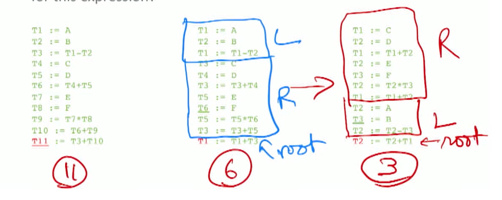

### ==Sethi-Ullman Numbering Algorithm==

- [Ref: "The Generation of Optimal Code for Arithmetic Expressions", R. Sethi and J. D. Ullman, Journal of the ACM 17(4), pp. 715-728. October 1970.]

- Two-pass algorithm.
  - Pass 1: Recursively determine $T_{E}$, the minimum number of temporaries required to evaluate the given expression $E$.
    - Recursive definition of $T_{E}$ :
    - 

  $$
  \begin{array}{cc}
  E \rightarrow \text { id } & T_{E}=1 \\
  E \rightarrow \text { unop } E_{1} & T_{E}=T_{E_{1}} \\
  E \rightarrow E_{1} \text { binop } E_{2} & T_{E}=\left\{\begin{array}{cc}
  \max \left(T_{E_{1}}, T_{E_{2}}\right), \quad \text { if } T_{E_{1}} \neq T_{E_{2}} \\
  1+T_{E_{1}}, & \text { otherwise }
  \end{array}\right.
  \end{array}
  $$

  - Pass 2: Recursively generate code for $E$, being supplied with a list of temporary names (i.e., registers) of length $\geq T_{E}$.
    - 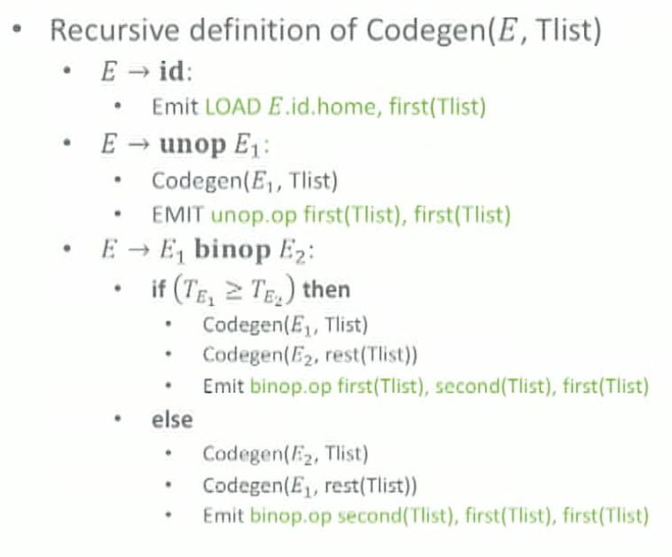

- **Doesn't change the amount of computation.**

- Will in general reduce register pressure, resulting in **fewer GPR spills**.

## Control Flow Graphs and Liveness Analysis

### Motivation

- global register allocation requires information about the liveness of names.
  - not explicit in the program.
  - Must be calculated statically (i.e., at compile-time).
  - Must correctly characterize all dynamic (run-time) paths.
- Control flow makes it hard to extract this information.
  - Branches and loops in programs.
  - Different branches may be taken in different executions.
  - Different numbers of loop iterations may be executed in different executions.

### ==Control Flow Graphs (CFG)==

#### Definition

- a graph representation of the computation and control flow in the program.
  - Provides a framework for static analysis of program control-flow.
- CFG nodes: **basic blocks**.
- CFG edges:  possible **flow of control** from the end of one basic block to the beginning of another basic block.
  - Edges are sometimes labeled with the Boolean value for which they are taken.
  - There may be multiple incoming/outgoing edges for a given basic block.
- ==A possible execution is a **consistent path** in the CFG.==
  - There may be paths in the CFG that correspond to infeasible executions.
  - Happens if result from previous block can affect result of the next block

#### Examples

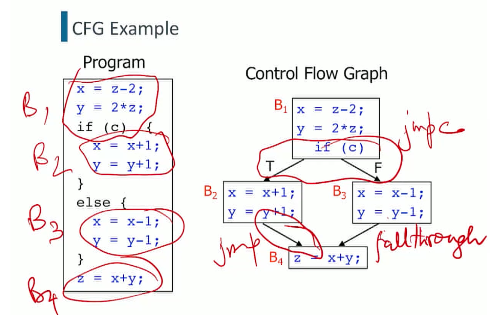

H/ LLIR: High / low level intermediate language

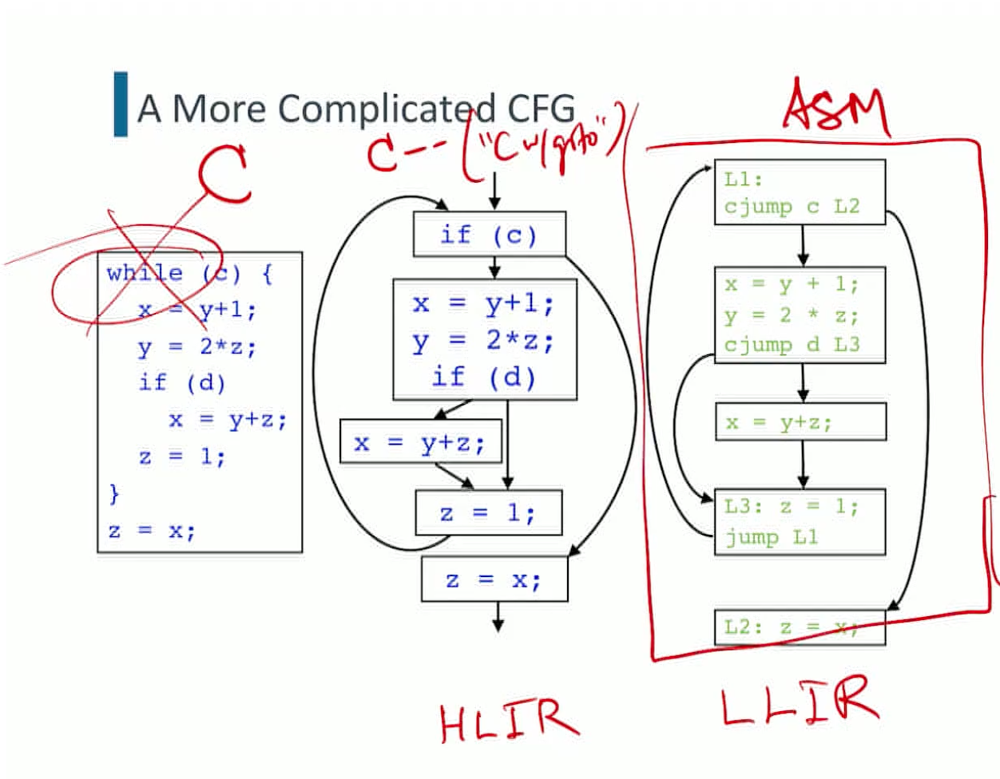

#### Usage

- Extract information including live values at compile time (statically) 
- Process
  - Define 2 program points in the CFG. Defined for instructions and basic blocks
    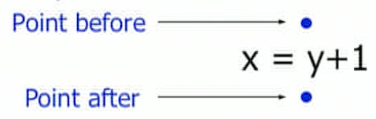
    - Within a basic block, the program point after an instruction is the same as the program point before its successor instruction
      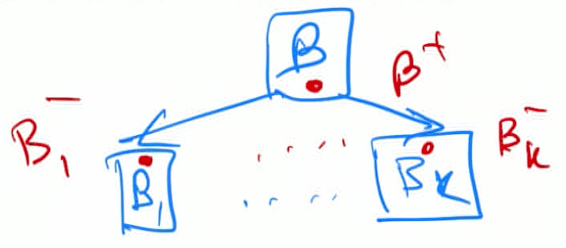
  - Extract flow of information between these program points.
    - Effect of instruction execution
    - Effect of control flow

### Live variables as an Example

#### Definition

- ==A variable $v$ is live at a point $p$ in a CFG if **there is a path from $p$ to a use of $v$, and that path does not contain a (re-)definition of $v$.**==
  - A statement is a definition of a variable $v$ if it may write to $v$.
  - A statement is a use of variable $v$ if it may read from $v$.
- Computing liveness
  - Write down a system of equations that define live variable sets at each point in the CFG.
  - Solve the system iteratively.
- [TODO (midterm): practice writing this] 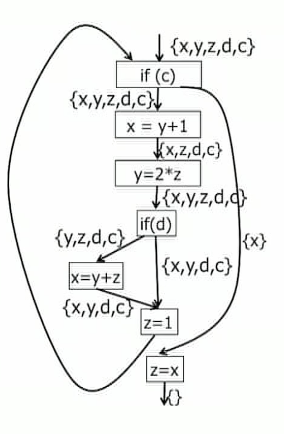

+ Compute $\text{use}(I)$ and $\operatorname{def}(I)$ sets for an instruction $I$ based on its structure.
  - $I \rightarrow x=y$ binop $z: \operatorname{use}(I)=\{y, z\} ; \operatorname{def}(I)=\{x\}$.
  - $I \rightarrow x=$ unop $y:$ use $(I)=\{y\} ; \operatorname{def}(I)=\{x\}$.
  - $I \rightarrow x=y: \operatorname{use}(I)=\{y\} ; \operatorname{def}(I)=\{x\}$.
  - $I \rightarrow x=f\left(y_{1}, \ldots, y_{n}\right): \operatorname{use}(I)=\left\{y_{1}, \ldots, y_{n}\right\} ; \operatorname{def}(I)=\{x\}$.
  - $I \rightarrow$ if $(x): \operatorname{use}(I)=\{x\} ; \operatorname{def}(I)=\emptyset$
  - $I \rightarrow$ return $x:$ use $(I)=\{x\} ; \operatorname{def}(I)=\emptyset$
+ For instruction $I$, let:
  - $\operatorname{In}(I)=$ the set of live variables at the program point before $I$.
  - Out $(I)=$ the set of live variables at the program point after $I$.
+ For basic block $B$, let:
  - $\operatorname{In}(B)=$ the set of live variables at the program point before $B$.
  - $\operatorname{Out}(B)=$ the set of live variables at the program point after $B$.

#### Computation

##### ==Out(I) -> In(I): + use - def==

- 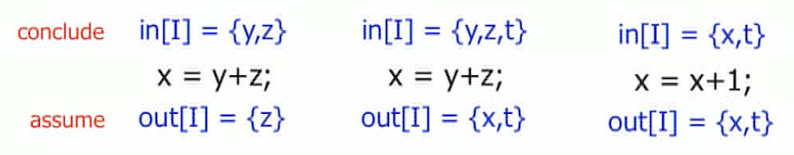
- Assignment: add use, remove def

$$
\operatorname{In}(I)=(\operatorname{Out}(I) \backslash \operatorname{def}(I)) \cup \operatorname{use}(I)
$$
- Backward flow of information.
  - Given $\operatorname{Out}(B)$, can compute $\operatorname{In}(B)$.
    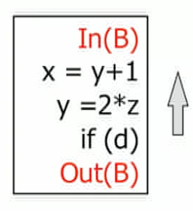

##### ==Control flow - Union successor==

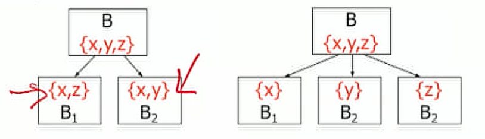

- General rule
$$
\operatorname{Out}(B)=\bigcup_{B^{\prime} \in \operatorname{succ}(B)} \operatorname{In}\left(B^{\prime}\right)
$$
- Backward flow of information.
  - Given all the $\operatorname{In}\left(B^{\prime}\right) \mathrm{s}$, can compute $\operatorname{Out}(B)$.

##### Iteration

- Initialize all live variable sets to $\emptyset$.
- select an instruction $I$ or basic block $B$ and update $\ln (I)$ or $\operatorname{Out}(B)$ accordingly.
- Stop when we reach a fixed point (i.e., sets don't change any more, i.e., all equations have been satisfied).

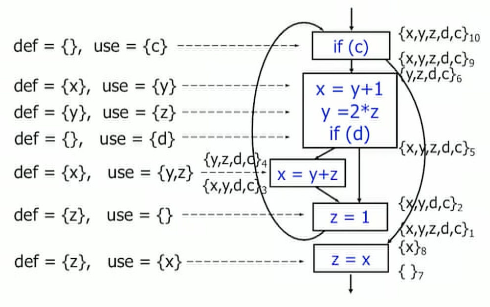

## Global register allocation

### Graph Coloring Algorithm

+ CFG definitions
  + CFG $G=(V, E)$, 
  + every node (i.e., basic block) $b \in V$, 
  + Out $(b)$, the set of names live out of $b$.

+ Global register allocation:
  + assign temporary variables to a fixed set of registers.

+ Requirements
  + Two simultaneously live variables cannot be allocated to the same register (to interfere)
  + ==Two names $m$ and $n$ interfere if **either**:==
    + ==**Both** names are initially live (e.g., function arguments), or== 
    +  ==$\exists b \in V:\{m, n\} \subseteq \operatorname{Out}(b)$==.

+ Interference Graph: YAG

  + Given the CFG $G=(V, E)$, its interference graph $I_{G}=\left(V^{\prime}, E^{\prime}\right)$ is defined as follows.
    - nodes - variable names: $V^{\prime}$ 
    - ==edge: if names interfere $(m, n) \in E^{\prime}$ (live at same time, need to be on different register)==

+ Graph coloring algorithm

  + Definitions:
    + color: registers
    + Illegal: if two interfering nodes have same register(color)
  + Example
    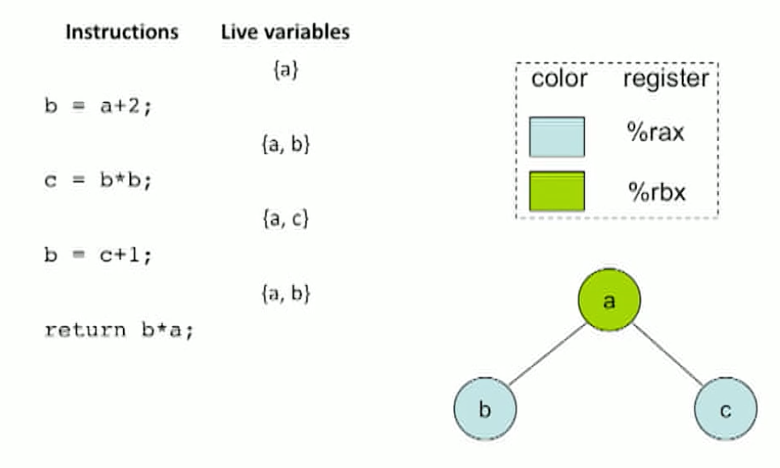
  + Finding optimal register allocation to avoid move instructions is NP complete

+ ==Kempe's algorithm (1879) for $K$-coloring a graph.==

  + Step 1 (simplify):

    - Find a node with at most $K-1$ edges and cut it out of the graph.
    - Remember this node on a stack for later steps.
    - Intuition: Once a coloring is found for the simpler (and smaller) graph, we can always color the stack we saved on the stack.
    - Failure mode: No such low-degree node exists.
    + The simplification step fails if every node has at least $\mathrm{K}$ neighbors.
      - Sometimes, this simplified graph may still be $\mathrm{K}$-colorable.
      - Determining K-colorability in all situations is an NP-complete problem. So we will need to approximate.
    + - Success:
        - 
      - Fail:
        - 

  + Step 2 (color):

    - When the simplified graph has been colored, add back the node on th top of the stack and color it a color not taken by any of the adjacent colors.
    - Such a color exists by construction.

  + Step 3 (**spill**):

    - Once all nodes have $K$ or more neighbors, pick a node to "spill" to the run-time stack.
    + Many heuristics can be used to pick a spill candidate.
      - Chaitin: Spill the variable $v$ with the smallest value of $\operatorname{Spill} \operatorname{Cost}(v) /$ iDegree $(v)$
      - 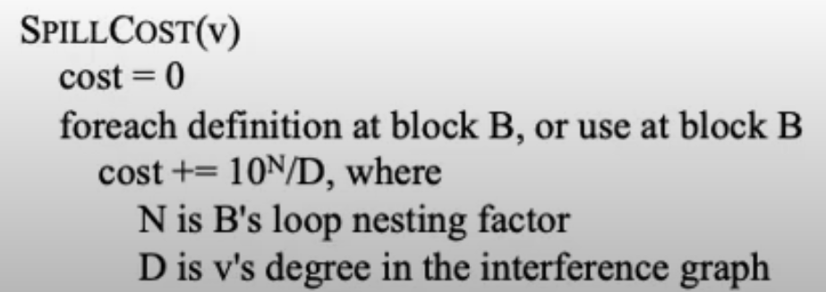
      - SPILLCOST(v) $=\left(\Sigma\left(\mathrm{S}_{\mathrm{B}} \times 10^{\mathrm{N}}\right)\right) / \mathrm{D}$, where
        $\mathrm{S}_{\mathrm{B}}$ is the number of uses and defs at $\mathrm{B}$ $\mathrm{N}$ is B's loop nesting factor
        D is v's degree in the interference graph
      - Spill a variable that is not in an inner loop.
    + How to spill
      - Need to generate extra instructions to load variables from the stack and to store them. These instructions themselves use registers.
      - Rather than reserving registers for this purpose, simply **re-write the code, introducing a new temporary, and then re-run liveness analysis and register allocation. Fewer variables will spill; the process usually converges rapidly.** [A: how’s that done in the example of graph coloring? just re-color starting from this point, or merge the current node with spilled node]
      - Intuition: You weren't able to assign a single register to the variable that was spilled, but there may be a free register available at each spot where you need to use the value of the variable.
      - Linear scan: https://www.youtube.com/watch?v=YmDoiA1_ri4&list=PLC-dUCVQghfdu7AG5f_p4oRyKgjDuoAWU&index=79
  
  + Pre-Coloring
    - Some variables are pre-assigned to registers.
      - E.g., method arguments and return values.
    - Treat these names as special temporaries. Add them to the interference graph with their colors at initialization time.
    - Such a pre-colored node cannot be removed in an attempt to simplify the interference graph.
    - ==Once the interference graph has been simplified down to precolored nodes only, start adding back other nodes as before.==
  
  + This heuristic was applied by Chaitin in 1981 in the context of register allocation and is known as Chaitin's algorithm in the compiler literature.
  
    

#### Optimizing Moves: Coalescing

- Motivation: Code generation tends to produce a lot of extra move instructions (generically, think MOV $t 1$, t2).
  - ==If two such move-related nodes $t 1$ and $t 2$ are not connected in the interference graph, coalesce them into a single variable.==
  
- Problem :Coalescing can increase the degree of the coalesced node and make a graph uncolorable.

- Process:https://groups.seas.harvard.edu/courses/cs153/2018fa/lectures/Lec21-Register-alloc-II.pdf, https://www.youtube.com/watch?v=Y8rNl1cHGFA
  
  - **Build**: construct interference graph
    - Categorize nodes as move-related (if src or dest of move) or non-move-related
  - **Simplify**: Remove non-move-related nodes with degree $<k$
  - **Coalesce**: Coalesce nodes using Briggs' or George's heuristic (only non-interfering nodes)
    - Briggs: safe to coalesce $x$ and $y$ if the resulting node will have fewer than $k$ neighbors with degree $\geq k$.
    - George: safe to coalesce $x$ and $y$ if for every neighbor $t$ of $x$, either $t$ already interferes with $y$ or $t$ has degree $<k$
      - These strategies are conservative: will not turn a $k$ colorable graph into a non-k-colorable graph
    - Possibly re-mark coalesced nodes as non-move-related
    - Continue with Simplify if there are nodes with degree $<k$
  - **Freeze**: if some low-degree $(<k)$ move-related node, freeze it
    -i.e., make it non-move-related, i.e., give up on coalescing that node
    - Continue with Simplify
  - **Spill**: choose node with degree $\geq k$ to potentially spill
    - Then continue with simplify
  - **Select**: when graph is empty, start restoring nodes in reverse order and color them
    - Potential spill node: try coloring it; if not rewrite program to use stack and try again!
  - 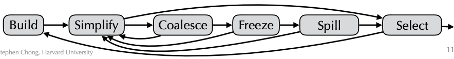
  
  [From lecture: ]
  
  - Simplify and Coalesce
    - Step 1 (simplify):
      - Designate those nodes that are source or destination of a move as **move-related nodes**.
      - Simplify the interference graph as much as possible without removing move-related nodes.
    - Step 2 (coalesce):
      - **Coalesce move-related nodes provided such coalescing results in lowdegree nodes.**
      - Multiple possible approaches to control degree of coalesced node:
      - [Briggs] Avoid creation of nodes of degree $\geq K$.
      - [George] Node $a$ can be coalesced with node $b$ if every neighbor $\operatorname{t}$ of $a$ already interferes with $b$ or has degree $<K$.
    - Step 3 (freeze):
      - If neither steps 1 or 2 apply, freeze a move instruction, i.e., mark the involved nodes as not move-related.
      - Try step 1 again.

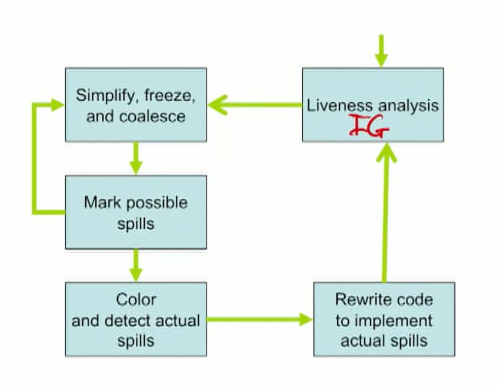

#### Complexity

+ IG is superlinear in number of variables (N vertices, O(N^2) edges)
+ np-complete
+ 

### Linear Scan

#### Motivation

+ Faster than graph coloring, use in JIT compilation

#### Spill-Free (Global) Register Allocation

+ “is the graph k colorable”
  + [SFRA] Given a set $V$ of symbolic registers (i.e., program variables and temporaries) being used across $n$ instructions, and $k$ physical registers, determine **whether it is possible to assign** each symbolic register $s \in V$ to a physical register $\operatorname{reg}(s, P)$ at each program point $P \in\left\{i^{+}, i^{-}: 1 \leq i \leq n\right\}$ where $s$ is live.
  + register-to-register moves are allowed
  + If so, report the register assignments, including any register-register moves that need to be inserted.
  + If not, report that no feasible solution exists.

- We solved this problem earlier using Kempe's heuristic.
- But the interference graph was constructed around a very coarse notion of live intervals.

#### Live Intervals and Live Ranges

- That is, $[i, j]$ is a maximal interval of instructions over which $v$ is live.
- It is coarse because there might be intervals inside [i,j] where v is not live (live holes) and live (live ranges):
  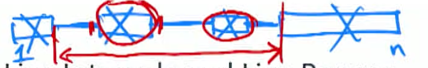
- Using fine-grained live ranges
  - Reuse registers across holes
  - Controw flow requires variable to be on the same registers after some range (may extend across holes), achieve this with register-register moves.

##### Example 1

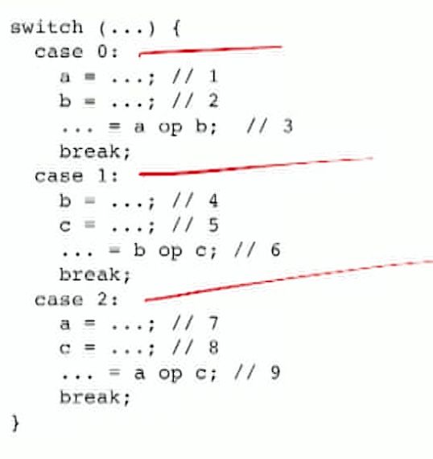

- Can this situation be handled using two physical registers without spilling?
- Graph Coloring says no.
  - The interference graph is the complete graph on $\{a, b, c\}$, and therefore not 2-colorable.
    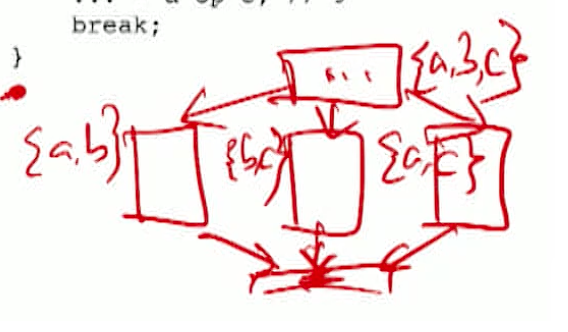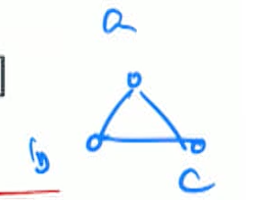
- But this is easily solvable as a SFRA problem instance, with the following assignments.
- reg $\left(a,\left[1^{+}, 3^{-}\right]\right)=r 1$ $\operatorname{reg}\left(b,\left[1^{+}, 3^{-}\right]\right)=r 2$
- reg $\left(b,\left[4^{+}, 6^{-}\right]\right)=r 1$, $\operatorname{reg}\left(c,\left[4^{+}, 6^{-}\right]\right)=r 2 .$
- $\operatorname{reg}\left(a,\left[7^{+}, 9^{-}\right]\right)=r 1$, $\operatorname{reg}\left(c,\left[7^{+}, 9^{-}\right]\right)=r 2$

##### Example 2

- Two registers: The interference graph is the complete graph on $\{a, b, c\}$, and therefore not 2 -colorable.	[TODO (midterm): try to derive the graph]
  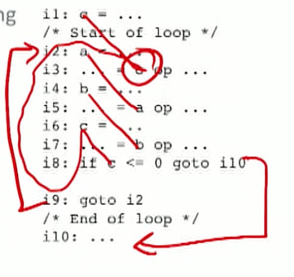
- reg $\left(a,\left[2^{+}, 5^{-}\right]\right)=r 2$
- $\operatorname{reg}\left(b,\left[4^{+}, 7^{-}\right]\right)=r 1$
- reg $\left(c,\left[1^{+}, 3^{-}\right]\right)=r 1$, $\operatorname{reg}\left(c,\left[6^{+}, 8^{+}\right]\right)=r 2$
- Requires the insertion of R-R move instruction $r 1=r 2 ;$ between instructions $i 8$ and $i 9$.

##### Example 3

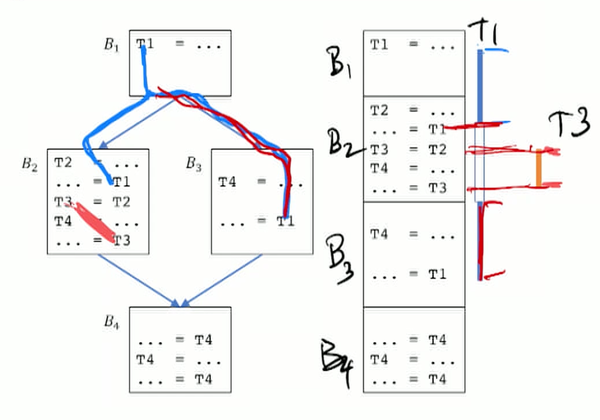

+ T3 can fit in the whole of T1

#### Basic Extended Linear Scan Algorithm

[Q: example for this?]

https://www.cs.rice.edu/~vs3/PDF/cc2007.pdf

- Applicable to SFRA problem instance.
- Will return:
  - Assignment of physical registers to variables for intervals $[P, Q]$, different physical registers may be assigned to the same variable in different intervals
  - with insertion of reg-reg move instructions to handle cases where .
- Guaranteed to find a feasible solution if and only if one exists, with ==time and space complexity **linear** in size of input SFRA problem instance.==
- Intuition
  - Interference among live intervals is captured by whether or not they overlap.
    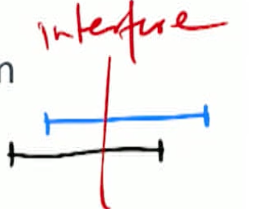
  - Allocate registers to as many intervals as possible without allocating two overlapping live intervals to the same physical register.
  - The number of overlapping intervals changes only at the start and end points of intervals.
- Algorithm
  - [Initialize]: 
    - all intervals: $J=U_{v \in V} J(v)$, the set of all intervals in program.
    - end points of intervals: IEP, the set of endpoints in $\mathcal{J}$.
    - number of live variabls at every end point: numlive $=0 . \operatorname{coun} t[P]=0, \forall P \in I E P$. avail $=\{1, \ldots, k\}$.
  - [Calculate register pressure]
    scan endpoints in increasing order $\forall P \in I E P$
    - If P is the closing point of an interval, decrease the live count: $\forall[x, P] \in J$ : numlive- -. [Q: what does notation [x, P] mean? ]
    - If P is the starting point, increase live count $\forall[P, y] \in :J$ numlive++. 
    - num of live variables at P: $\operatorname{count}[P]=$ numlive.
    - **Failure case:** if numlive > k (num registers)
  - [Assign registers]
    scan endpoints in increasing order: $\forall P \in I E P$
    - ending point, get one register back: $\forall[x, P] \in \mathcal{J}$ : avail $=$ avail $\cup\left\{r_{j}\right\}$, where $r_{j}$ is the physical register previously allocated to interval $[x, P]$.
    - If P is the starting point, allocate register (e.g. for variable v)
      - keep in the same register if:
        - If v is live before this interval
        - If it is register copy [A: what is register copy? from the end of an interval to the beginning of the other, we simply copy e.g. r1 = r1 to assign intervals, and this is an no-op]
      - Updates
        - Assign: $\operatorname{reg}(s,[P, y])=r_{j}$
        - Remove from available set: avail $=$ avail $\backslash\left\{r_{j}\right\}$
  - [lnsert needed register move instructions]
    $\forall P \in I E P:$
    $\forall Q \in I E P$ that is a control flow successor to $P:$
    - $\ M=\varnothing$, $\forall v \mid v$ is live at $P$ and $Q:$
    - Find varible that is allocated to different registers across parts of a control flow,  do reg-to-reg move to bring it back: if $\operatorname{reg}(v, P) \neq \operatorname{reg}(v, Q): M=M \cup\left\{^{\prime \prime} \operatorname{reg}(v, Q)=\operatorname{reg}(v, P) ;^{\prime \prime}\right\}$
    - [Handle cyclic permutations]
      - Treat the move instructions in $M$ as a directed graph $G$ in which there is an edge from $m_{1}$ to $m_{2}$ if $m_{1}$ reads the register written by $m_{2}$.
      - Compute the strongly connected components (SCCs) of $G$.
      - For each SCC, create a sequence of move and **XOR instructions** [Q: what’s the XOR instruction?] as needed to implement the register moves without using further temporary registers, and insert these instructions on the control flow edge from $P$ to $Q$.

#### Register Allocation with Total Spills

- total spills: identifying a subset of variables for which all accesses will be performed through memory instead of registers
- goal:  finding a solution with the smallest spill cost
- Problem definition:
  - set $V$ of symbolic registers (i.e., program variables and temporaries) 
  -  $n$ instructions,
  -  $k$ physical registers, 
  - estimated execution frequencies $f[P]$ for each program point $P$, 
  - minimize the weighted sum of R-R moves and memory accesses. Return:
    - $\operatorname{mem}(v)$: whether $v$ is kept in memory. [Q: mem(v) is for each P? ]
    - $\operatorname{mem}(v)=$ false: a register assignment $\operatorname{reg}(v, P)$ at each program point $P$ where $v$ is live.
- NP-hard, even ignoring R-R moves.

##### Extended Linear Scan Algorithm

- spill identification phase 
  - checks all relevant program points in decreasing order of estimated frequency and spills variables on a stack, using a simplified version of Chaitin's heuristic that doesn't build the interference graph. [Q: should it be increasing order since we want to restore the most costly ones first?]
  - Spills happen in increasing order of spill cost.
  - Results in a feasible SFRA problem instance, possibly with stack. (push in order of increasingt cost, and pop at decreasing cost)
- A spill resurrection phase
  - restore any spilled variables (in LIFO order) that still keeps the SFRA problem instance feasible.
  - Resurrection tries to restore most costly spills first.
- register assignment phase 
  - using the Basic Extended Linear Scan algorithm.