# Context sensitive analysis

## Introduction

### Semantic analysis

+ Lexical: character sequence -> token sequence
+ Syntactic: token sequence -> abstract syntax tree
+ Semantic analysis: meaningful? Type, declaration order, variable initialization, number of arguments …
+ Semantic analysis examples: 
  + [Pascal] Does the declaration of each identifier precede its uses?
  - [All] Does the call of a procedure match its type signature?
  - [Rust] Have all variables been initialized before they are used?
  - [C] Does a break statement have an appropriate enclosing construct?
  - [Ada] Does the same name occur both at the beginning and the end of a named loop or block?
  - [APL] What is the type and dimensionality of a name at a program point?

### Beyond Context-Free Language Features

- The following formal languages can be proven to not be context-free.
・ $L_{1}=\left\{w c w \mid w \in(a \mid b)^{*}\right\} .$ $\cdot L_{2}=\left\{a^{n} b^{m} c^{n} d^{m} \mid n \geq 1 \wedge m \geq 1\right\} .$

- These languages abstract semantic analysis problems.
  - $L_{1}$ : identifiers are declared before their use in a program.
  - $L_{2}$ :  number of formal parameters in the declaration of a procedure agrees with the numbe\} of actual arguments in a use of the procedure.
- Why not use context-sensitive grammars?
  - The problem of parsing a context-sensitive grammar is PSPACEcomplete.
  - Even a CSG would have difficulty (or outright lack the power) to effective encode typical semantic analysis problems.


# Type checking

## Introduction

+  Definition: The set of types in a programming language, along with the rules that use types to specify program behavior, are collectively called a type system.

### Purpose

+ Ensuring run-time safety.
  - Attempt to identify and catch as many ill-defined programs as possible before they execute an operation that causes a run-time error.
  - Infer a type for each expression. Check the types of operands to an operator with the language specification of that operator. Possibly coerce values to fit the specification.
+ Improving expressiveness.
  - Specify behavior more precisely than possible with context-free rules.
  - Operator overloading: what does + signify in most modern procedural languages?
+ Generating better code.
  - If the compiler can accurately determine the types of every expression statically, it can generate type-specific assembly code.
  - This avoids the overheads of maintaining run-time data tags (space) and disambiguating types at run-time (time).

### Terminology

+ Languages
  - Statically typed: Every expression can be type-checked at compile time.
  - Dynamically typed: Some expressions can be type-checked only at run time.
  - Untyped: Really, only has one type (e.g., BCPL).
  - Weakly typed: Has a poor type system.
  - Strongly typed: Every expression can be assigned an unambiguous type.
+ Type systems and implementations
  - Strongly checked: Perform enough checking to detect and prevent all run-time errors that result from misusing a type. (Java, not C)
  - Unchecked: The implementation assumes a well-formed program.
  - Statically checked: All type inference and checking is actually done at compile time.
+ Java couldn’t be statically typed and checked because the execution model doesn’t allow seeing all the code at once.
  - type inference must be perform as classes are loaded, and some run-time checking is performed.
  - lint enforces some rules that can help

### Judgments and Typing Rules

- Typing rules contain judgments of the form $E \Rightarrow e: T$, 
  -  $E$ is an environment containing, for example, the types of identifiers and functions.
  - e: expression
  -  "In the environment $E$, expression $e$ has type $T$”
- Break into $F$ , signature, and $G$, context
  - The signature shows the types of functions
  - The context shows the types of variables.
  - So we will write $F, G \Rightarrow e: T$.
- Typing rules have the form

$$
\frac{J_{1} \quad J_{2} \ldots J_{n}}{J} C(n \geq 0)
$$
+ Interpretation
  + J1… Jn: premises 
  + C: condition
  + J: conclusion
  + Read the rule as "From the judgments $J_{1}$ through $J_{n}$, if condition $C$ holds, conclude $J$ :"
  + Judgments expressed in formal language; condition in natural language.

### Examples of Typing Rules and Derivations

- Typing rules for arithmetic expressions
- Lemmas: $\frac{E \Rightarrow e_{1} \text { int } E \Rightarrow e_{2} \text { :int }}{E \Rightarrow e_{1}+e_{2} \text { :int }}, \frac{E \Rightarrow e_{1} \text { :int } E \Rightarrow e_{2} \text { :int }}{E \Rightarrow e_{1} * e_{2} \text { :int }}$.
  - E-> E + E : if e1, e2 are int, e1+e2 is int
  - E -> E * E : likewise
- Axioms: $\overline{E \Rightarrow x: T} \quad x: T \in E, \quad \overline{E \Rightarrow i: \text { int }}$  i is an integer literal.
  - E-> id: If environment have type binding x to T
  - E-> num: If i is integer
- Given these typing rules, how does one derive the judgment $x:$ int, $y$ :int $\Rightarrow x+12 * y$ : int?
  - 12 is int
  - y int
  - 12 * y int
  - x + 12 * y int

## Type systems

### Type expressions

+ Every language construct has a type associated with it. This type will be denoted by a **type expression**.
+ Examples
  - Basic types are type expressions.
  - Certain operators (such as tuples, records, arrays, functions, classes, inheritance, ...) can be applied to other type expressions to create new type expressions. Such operators are called **type constructors.**
  - We may also give **(user-defined) names** to type expressions (think typedef in $\mathrm{C}$ or names of classes in $\mathrm{C}++\mathrm{t}$. Such type names are also valid type expressions.
+ equivalence and inclusion
  - Equivalance: For type expressions $s$ and $t, s \equiv t$ means that these expressions "represent the same type".
  - Includesion: For type expressions $s$ and $t, s\prec t$ means that a construct of type $s$ can be used in a context requiring a construct of type $t$. t includes s

### Basic Example

- A type system modeled after C's type system.
- Basic types
  - Arithmetic types: char, int, uint, long, ulong, float, double.
  - The void type specifies an empty set of values.
  - The error type will be used to signal a type inference error. Not accessible for user, only for returning error during type checking
- Derived types
  - Arrays: If $T$ is a type expression and $N$ is an integer literal, then ARRAY $(N, T)$ is a type expression denoting the type of an array with elements of type $T$.
  - Products (tuples): If $T_{1}$ and $T_{2}$ are type expressions, then their Cartesian product $\mathrm{T}_{1} \times T_{2}$ is a type expression. The operator $\times$ is left-associative. T1xT2 != T2xT1 (order sensitive)
  - Records (struct): If $I_{1}, \ldots, I_{k}$ are distinct identifiers, and $T_{1}, \ldots, T_{k}$ are type expressions, then RECORD $\left(I_{1}: T_{1}, \ldots, I_{k}: T_{k}\right)$ is a type expression denoting a record type with $k$ named fields. Whether order sensitive is language dependent
  - Pointers (address): If $T$ is a type expression, then PTR $(T)$ is a type expression denoting the type "pointer to an entity of type $T^{\prime \prime}$.
  - Functions: If $D$ and $R$ are type expressions denoting a domain type and a range type, then $D \rightarrow R$ is a type expression denoting the type of a function mapping elements of $D$ to elements of $R . \rightarrow$ is right-associative.
- Usage
  - `+ : (int x int) -> int`


### Type Inference for Expressions and Statements

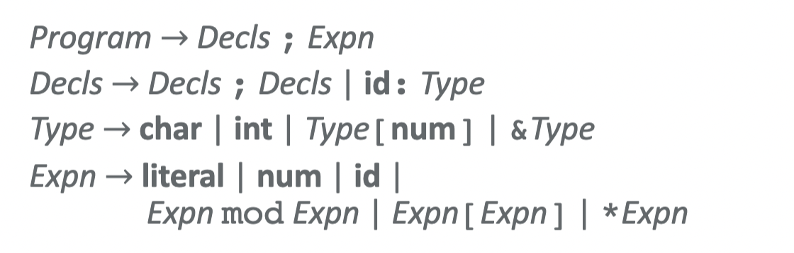

- Type[num]: array; *Expn: pointer

- Initial environment
  -  signature (functions): $F=\{$ mod: int $\times$ int $\rightarrow$ int $\}$
  - context (variables): $G=\emptyset$

- Example:

  - ```
    x: int; G={x: int}
    y: int; G={x: int, y: int}
    expr: x mod y; int x int -> int, valid
    ```

- Declaration: add bindings to G, $G^{\prime}=(G, x: T)$  or $\overline{F, G \vdash x: T} \quad x: T \in G$, need to check:

  - x not already in G
  - x follows Type sublanguage (allowed types)

- Expressions

  - 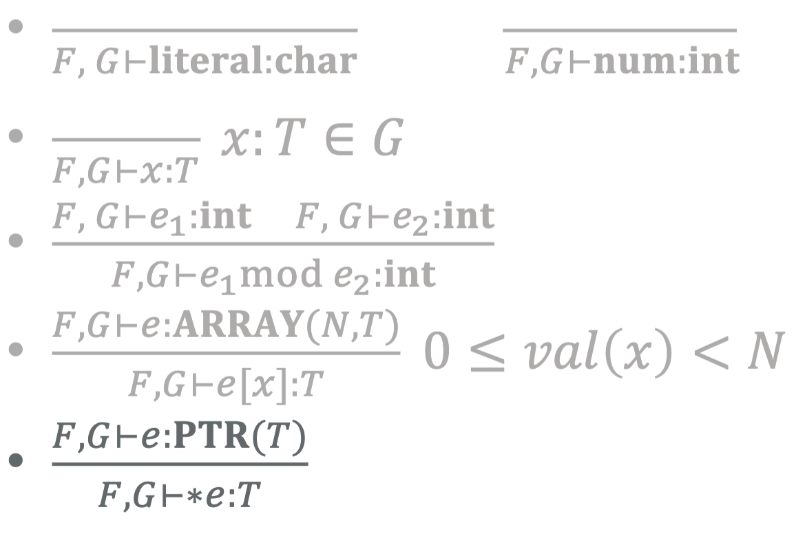
  - Literal -> literal, num -> int, user defined id -> id
  - int mod int -> int
  - arrat(N, T)[x] , x is int-> T, environment is 0<=x<N (this range check is dynaminally checked)
  - *PTR(T) -> T

More complex example:

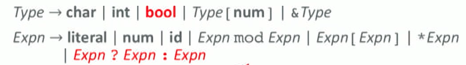

- Ternary choice:
  - if T, T’ are equivalent and e1 is bool, then result is of type T: $\frac{F, G \vdash e_{1}: \text { bool } \quad F, G \vdash e_{2}: T \quad F, G \vdash e_{3}: T^{\prime}}{F, G \vdash e_{1} ? e_{2}: e_{3}: T} T \equiv T^{\prime}$
  - if different, then results in error: $\frac{F, G \vdash e_{1}: \text { bool } \quad F, G \vdash e_{2}: T \quad F, G \vdash e_{3}: T^{\prime}}{F, G \vdash e_{1} ? e_{2}: e_{3}: \text { error }} T \not \equiv T^{\prime}$

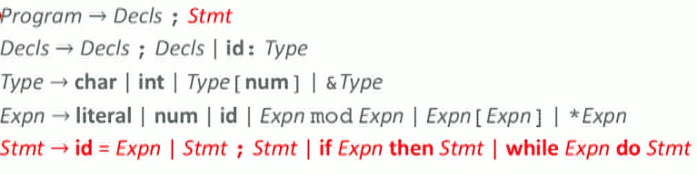

+ if x: T and e T’, stmt is valid if T==T’: $\frac{F, G \vdash e: T^{\prime}}{F, G \vdash x=e \text { is valid }} x: T \in G, T \equiv T^{\prime}$
+ stmt is invalid if T!=T’: $\frac{F, G \vdash e: T^{\prime}}{F, G \vdash x=e \text { is invalid }} x: T \in G, T \not \equiv T^{\prime}$
+ Declaration, if stmt s is valid in an environment containing x: T, then in environment where it doesn’t contain x: T, when we add declaration x: T, s is valid: $\frac{F,(G, x: T) \vdash s \text { is valid }}{F, G \vdash x: T ; s \text { is valid }} x \notin G$

## Equivalence of Type Expressions

### Structural equivalance

If we don't have type names, then structural equivalence is the natural choice. Used by most languages

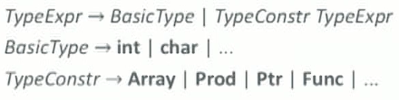

- Base case
  - If $T_{1} \in$ BasicType $\wedge T_{2} \in$ BasicType, then $T_{1}=T_{2}$.
- Induction: ASTs of T1 and T2 must be identical
  - If $T_{1}=\operatorname{Array}\left(N_{1}, T_{1}^{\prime}\right) \wedge T_{2}=\operatorname{Array}\left(N_{2}, T_{2}^{\prime}\right)$ then $N_{1}=N_{2} \wedge T_{1}^{\prime} \equiv_{S} T_{2}^{\prime}$
  - Similarly for other type constructors.
  - Otherwise false.
- [C] `int *f (void); int (*g) (void)` 
  - f ===  (int *) f(void)  type of `f`: function type, argument type void, result type pointer to an int	
  - 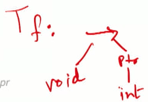
  -  g: a pointer to a function that takes void argument and return int
    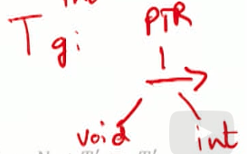

+ Bit operations for quick detection of structral equivalence
  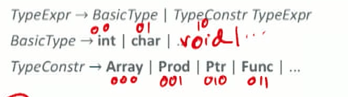
  + This idea works if the **type constructors are unary.**
    - E.g., drop the length of arrays and the argument types of functions.
  - Encode basic types with some number of bits.
  - Have a unique bit pattern for each type constructor.
  + Concatenate bits to get a unique pattern for each type.
    - 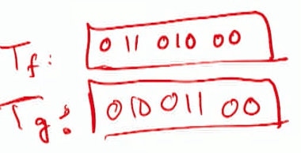
  - Used in early C compilers.

### Type names equivalance

If we do have type names, then we could choose either structural equivalence or name equivalence.

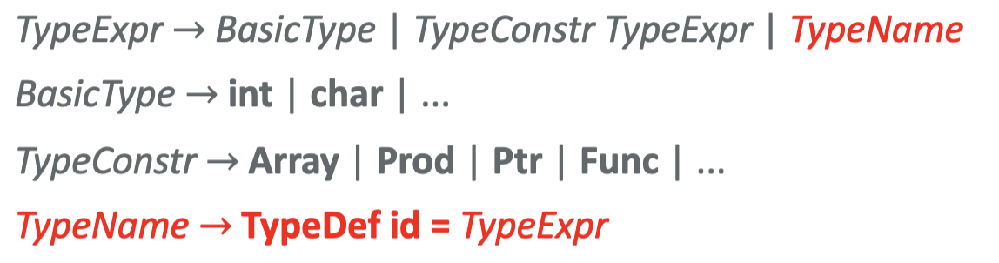

- [Structural Equivalence] Definition of $T_{1} \equiv_{S} T_{2}$.
  - If $T_{1} \in$ Basictype $\wedge T_{2} \in$ Basictype, then $T_{1}=T_{2}$.
  - If $T_{1}=\operatorname{Array}\left(N_{1}, T_{1}^{\prime}\right) \wedge T_{2}=\operatorname{Array}\left(N_{2}, T_{2}^{\prime}\right)$ then $N_{1}=N_{2} \wedge T_{1}^{\prime} \equiv_{S} T^{\prime}$ …
  - If $T_{1} \in$ Typename $\wedge T_{2} \in$ TypeName, ==then $T_{1} \equiv_{S} T_{2}$.==
  - Otherwise false.
- [Name Equivalence] Definition of $T_{1} \equiv_{N} T_{2}$.
  - If $T_{1} \in$ Basictype $\wedge T_{2} \in$ BasicType, then $T_{1}=T_{2}$.
  - If $T_{1}=\operatorname{Array}\left(N_{1}, T_{1}^{\prime}\right) \wedge T_{2}=\operatorname{Array}\left(N_{2}, T_{2}^{\prime}\right)$ then $N_{1}=N_{2} \wedge T_{1}^{\prime} \equiv_{N} T_{2}^{\prime} \ldots$
  - If $T_{1} \in$ TypeName $\wedge T_{2} \in$ TypeName, ==then $T_{1}=T_{2}$.==
  - Otherwise false.

### Circular types

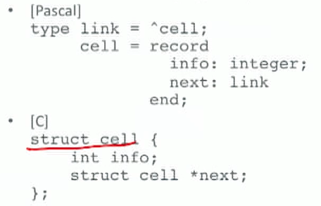

1. Acyclic and cyclic representations

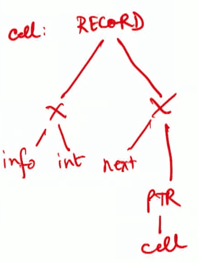

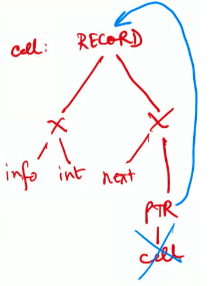

## Examples

- C [C17 ballot, §6.2.7]
Two types have compatible type if their types are the same. [...] For two structures, corresponding **members shall be declared in the same order** (order matters for structural equivalence). For\} two structures or unions, corresponding bit-fields shall have the same widths. For two enumerations, corresponding members shall have the same values.
- Java [JLS16, §4.3.4]
Two reference types are the same **compile-time type** if they are declared in compilation units associated with the **same module** $(\$ 7.3)$, and they have the same binary name (§13.1), and their type arguments, if any, are the same, applying this definition **recursively**.
$[\ldots]$
At run time, several reference types with the same binary name may be loaded simultaneously by different class loaders. These types may or may not represent the same type declaration. Even if two such types do represent the same type declaration, they are considered distinct.
Two reference types are the **same run-time type** if:
- They are **both class or both interface types, are defined by the same class loader, and have the same binary name** $(\xi 13.1)[\ldots]$.
- They are **both array types, and their component types are the same runtime type** (\S10 (Arrays)).

# Polymorphism

## Introduction

### Definition

- Programming languages based on the idea that functions, and hence their operands and results, have unique types are said to be **monomorphic**.
  - Every value and variable in a program can be interpreted to have one, and only one type.
- Programming languages in which some values and variables in a program may have more than one type are said to be **polymorphic**.
  - **Polymorphic functions: Functions whose operands can have more than one type.**
    - E.g., length: List $\alpha \rightarrow$ int in Haskell 2010 .
  - **Polymorphic types: Types whose operations are applicable to values of more than one type.**
    - E.g., the abstract base class numbers. Number in Python $3 .$

### Types

- **Universal polymorphism**

  - Will normally work on an infinite number of types that have a given common structure.
  - Will execute the **same code** for arguments of any admissible type.
  - Two forms
    - **Parametric polymorphism**: Think generics.
    - **Inclusion polymorphism**: Think subtypes and inheritance.

- **Ad-hoc polymorphism**

  - Will only work on a finite set of different and potentially unrelated types.

  - May execute completely **different code** for each type of argument.

  - Can be considered as a small set of monomorphic functions.

  - Two forms

    - **Overloading**: Convenient syntactic shorthand.
    - **Coercion**: Semantic operation inserted (either statically or dynamically) to convert an argument to the expected type, to prevent a type error. works for inclusion type

  - Example

    - What form of ad-hoc polymorphism is being exhibited here?
      a. $\quad 3+4$
      b. $\quad 3.0+4$
      c. $\quad 3+4.0$
      d. $\quad 3.0+4.0$
    - Possible answers.
    A. The operator + has four overloaded meanings, one for each of the four combinations of argument types. I, F, F, F
    B. The operator $+$ has two overloaded meanings, corresponding to integer and real addition. When one of the arguments is of type integer and the other is of type real, then the integer argument is coerced to the type real. I, F, F, F
    C. The operator $+$ is defined only for real addition, and integer arguments are always coerced to corresponding reals. F, F, F, F

  - Overload in Live Oak

    - 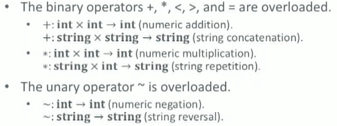
    - Check for type of each side of binop and determine the correct operation

  - Coercion in C (C17 Draft §6.3, Simplified)
    - Every integer type $T$ has an integer conversion rank $\rho(T)$ that imposes a partial order on these types.

    - $T_{1} \prec T_{2} \equiv \rho\left(T_{1}\right) \leq \rho\left(T_{2}\right)$.

    - 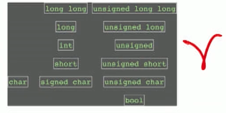

    - i.e. bool can be used as unsigned char ….

    - Wherever an int or unsigned may be used in an expression, you can also use any object or expression with an integer type $T$ with $\rho(T) \leq \rho$ (int)

      - In other words, if $T \prec$ int.

      - If an int can represent all the values of the original type $T$, then the value is converted to int; otherwise, the value is converted to unsigned.

      - ```
        int n; char *s;				n in nmem, s in smem
        n = 10*n + (*s - '0');
        
        int + char: upconvert char to int
        
        int n; char *s; 			
        char t = *s - '0';		MOVZBL *smem, %r8d
        											SUBB $0x30, %r8b
        											// equivalent to MOVB, SUBB, MOVZBL
        int t2 = t;						MOVL nmem, %r9d
        n = 10 * n;						IMULL $10, %r9d
        n = n + t2;						ADDL $r8d, %r9d
        											MOVL %r9d, nmem
        ```

      - 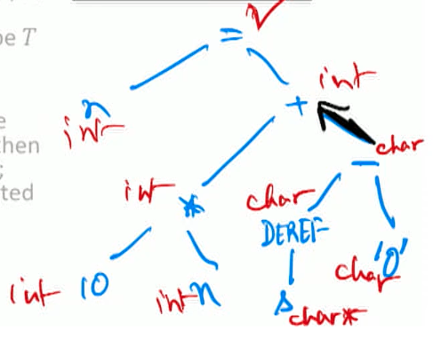

## Parametric polymorphism

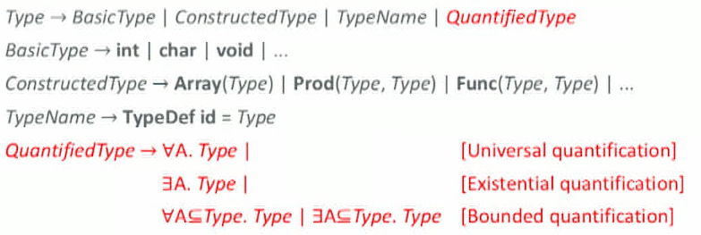

- **Universal quantification** : $\forall$ leads to parametric polymorphism.
- **Existential quantification** $ \exists$ enables abstract data types with hidden representation. => existential quantification [A: concrete example? https://stackoverflow.com/questions/14299638/existential-vs-universally-quantified-types-in-haskell]
- **Bounded quantification** provides a conceptual model for inheritance in object-oriented languages.
- Example
  - $\forall \alpha . \exists \beta \quad s.t. Type$

### Example: Map-Reduce

- Consider the following ML-style function definitions:
- 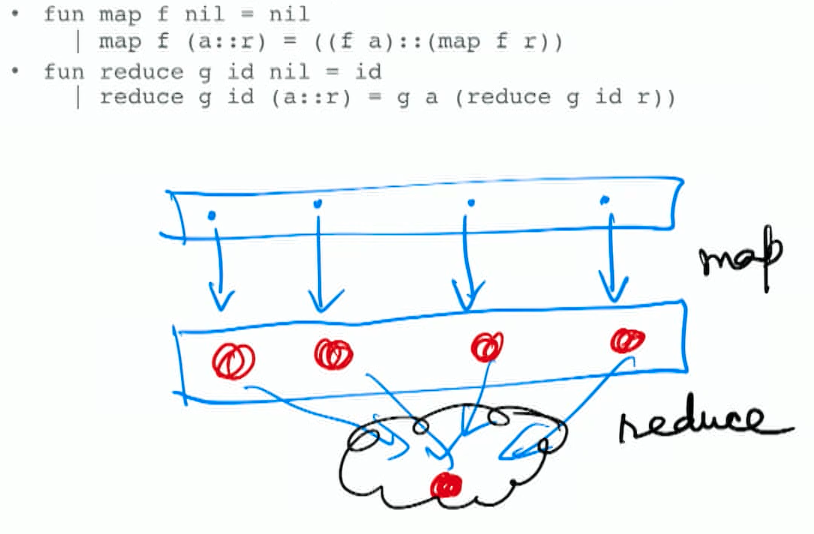
- Map: function f
  - if empty: return empty
  - if single argument `a`: return `f(a)`
  - if a single `a` and a multiple `r`(rest): `concat(f(a), map(f, r))`
- Reduce: Function g
  - Id: idenitity
  - if empty: return identity
  - rest is similar to map
- Question 1: What are the polytypes of the functions map and reduce as defined above?
  - Provided that:
    - The infix **: :** operator is the polymorphic **list constructor**, with polytype $\forall \alpha, \alpha \times \alpha$ List $\rightarrow \alpha$ List.
    - The name $\operatorname{nil}$ is the polymorphic empty list, with polytype $\alpha$ List.
  - Solution strategy:
    - Form a system of equations among unknown type variables.
      - The known information about : : and nil are the "constants".
      - Multiple uses of the same identifier must have must be assigned the same type.
      - The conditional expression ( $\mid)$ has the same type as that of its two arms.
    - Solve this system of equations for the unknown type variables.
      - Map:
        - Let $\tau_{\mathrm{id}}$ be the type variable assigned to identifier id.
        - $\tau_{\operatorname{map}}=\tau_{f} \times \tau_{n i l} \rightarrow \tau_{n i l}$
        - list construsctor “::” : $\forall \alpha, \alpha \times \alpha$ List $\rightarrow \alpha$ List.
        - for `(map f r)`: $\alpha$ List $=\tau_{\text {map }} \tau_{f} \tau_{r}$ [Q: what the ‘times’ here means for types?]
        - for `(f a)`: $\tau_{f}=\tau_{a} \rightarrow \alpha$
        - for `(a :: r)`: $\tau_{a::r}=\alpha$ List
        - then take together $\tau_{\operatorname{map}}=\tau_{f} \times \alpha$ List $\rightarrow \alpha$ List
        - 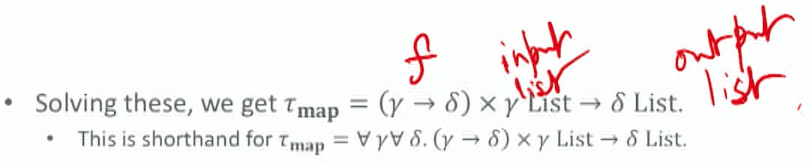
    - Reduce
      - similarly
        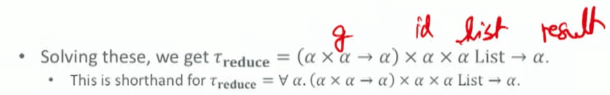
- Question 2: What are the monotypes of the uses of map and reduce in the following expression?
  - provided that
    - (reduce plus $0.0$ (map sqrt (1::4::9::16::nil)))\}
    - The function identifier sqrt has monotype int $\rightarrow$ real. (`f`)
    - The function identifier plus has monotype real $\times$ real $\rightarrow$ real. (`g`)
  - From above:
    - The function identifier map has polytype $\forall \gamma \forall \delta .(\gamma \rightarrow \delta) \times \gamma$ List $\rightarrow$ $\delta$ List.
    - The function identifier reduce has polytype $\forall \alpha \cdot(\alpha \times \alpha \rightarrow \alpha) \times \alpha \times$ $\alpha$ List $\rightarrow \alpha$.
  - From arguments
    - The literal $0.0$ has type real. (`id for g`)
    - The expression (1::4::9::16::nil) has type int List. (`input for f`)
  - Take together
    - For map: $($ int $\rightarrow$ real $) \times$ int List $\rightarrow$ real List. 
    - For reduce: (real $\times$ real $\rightarrow$ real $) \times$ real $\times$ real List $\rightarrow$ real.
- Pros and cons
  - cons: need to be very precise on type matching everywhere
  - pros: guarantee runtime type matching

### The Hindley Milner Type Inference Algorithm

+ Goal: to infer polymorphic types

#### Strategy

1. Assign symbolic type names $t_{1}, t_{2}, \ldots$ to all subexpressions of the AST of the function definition.
- Constant nodes receive known type names (possibly polymorphic).
- Two uses of a common declaration receive the same type name.
2. Form a system of equations among unknown type variables, following the language's typing rules "in reverse".
   
- For the judgment $\frac{E \vdash f: T \rightarrow U, E \vdash e: T}{E \vdash f(e): U}$,
  if $f, e$, apply have been assigned symbolic type names $t_{1}, t_{2}, t_{3}$, then add the equation $t_{1}=t_{2} \rightarrow t_{3}$.
  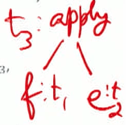
- For the judgment $\frac{E \vdash e_{0}: \text { bool }, E \mid e_{1}: T, E \vdash e_{2}: T}{E \text {-if } e_{0} \text { then } e_{1} \text { else } e_{2}}$, if $e_{0}, e_{1}, e_{2}$, if have been assigned symbolic type names $t_{0}, t_{1}, t_{2}, t_{3}$, then add the equations $\left\{t_{0}=\right.$ bool $\left., t_{1}=t_{2}, t_{3}=t_{1}\right\}$
  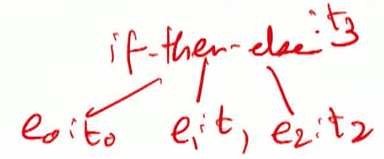
3. Solve the resulting system of equations for the unknown type variables.

#### Example

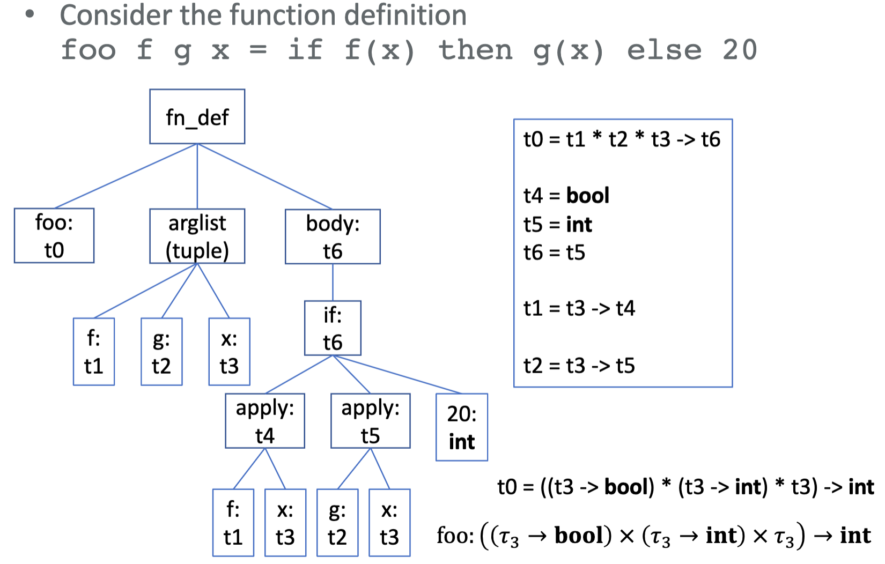

#### Solving the System of Type Constraints

- The Hindley-Milner type inference algorithm is a technique for solving such a system of polymorphic type constraints.
  - The type system is sound,
  - The type system is decidable and produces the most general polytype of an expression.

- Key ideas

  - Match type operators and instantiate type variables, respecting contextual dependencies, using Robinson's unification algorithm from first-order logic. Unification fails in two situations.
    - Trying to match two different **constant types** (such as int and bool) or type operators (such as array and func).
    - Trying to instantiate a variable to a **term containing the variable** (such as $\alpha$ and $\alpha \rightarrow \beta$ ), where a circular structure would be built.
  - There is one crucial extension to the core unification algorithm for handling variable bindings (i.e., declarations): the notion of generic and non-generic type variables.

- Unification

  - Simpler problem: pattern matching for same term between constants and expression
    - Given a constant type expression $C$ (eg. Int) and a pattern type expression $P$ (eg. array of int), where only $P$ contains type variables, find an assignment $U$ of (constant) terms to type variables that will make the two expressions structurally equivalent.
    - Such an assignment $U$, which we will write as a map from variables to terms, is also called a substitution or a unifier.
    - We will write $P[U]$ for the expression resulting from applying the unifier $U$ to the expression $P$. So we need to compute $U$ such that $P[U] \equiv_{S} C .$
    - If $U$ cannot be computed for all type variables, then matching fails.
  - Examples
    - $C=f(a, b, g(t)), P=f(a, \alpha, \beta) . U=\{\alpha: b, \beta: g(t)\}$
    - $C=f(h(a), a, g(h(a)), t), P=f(\alpha, a, g(\alpha), t) . U=\{\alpha: h(a)\}$
    - $C=f(h(b), a, g(h(a)), t), P=f(\alpha, a, g(\alpha), t) . U=\emptyset$ fails to unify (a, b are different constants)
      - 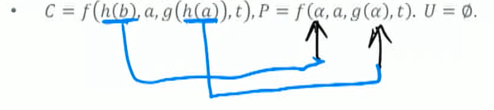
  - Small change to problem statement: both expressions can now contain variables.
    - Given two type expressions $T_{1}$ and $T_{2}$, where both expressions contain type variables, find a unifier $U$ that will make $T_{1}[U] \equiv_{S} T_{2}[U]$.
    - Now $U$ will be a map from variables to (possibly non-constant) terms.
    - Examples
      - $\cdot \quad T_{1}=f(a, \alpha, g(\beta)), T_{2}=f(\beta, k, g(a)) \cdot U=\{\alpha: k, \beta: a\}$ 
      - $\cdot \quad T_{1}=f(\alpha, \beta), T_{2}=f(\gamma, g(\alpha)) .$ $\quad \cdot \quad U_{1}=\{\alpha: \gamma, \beta: g(\alpha)\}, U_{2}=\{\alpha: \delta, \beta: g(\delta), \gamma: \delta\}, U_{3}=$ $\quad\{\alpha: h(\delta), \beta: g(h(\delta)), \gamma: h(\delta)\}$ and **many others will unify the terms.**
        - Unifier $U_{1}$ is the s**implest, the least constrained, and the most general.**
          - That is, there exists another map $S_{12}$ such that $U_{2}=U_{1} \circ S_{12}$, etc. E.g., $S_{12}=\{\gamma: \delta\}, S_{13}=\{\gamma: h(\delta)\}$. But we can't find maps $S_{21}$ or $S_{31}$ that will go the other way.
          - This **most general unifier (MGU)** $U_{1}$ is our desired solution.

  #### Implementing unifier

  Seehttps://github.com/eliben/code-for-blog/blob/master/2018/unif/unifier.pyfor a simple Python implementation.

  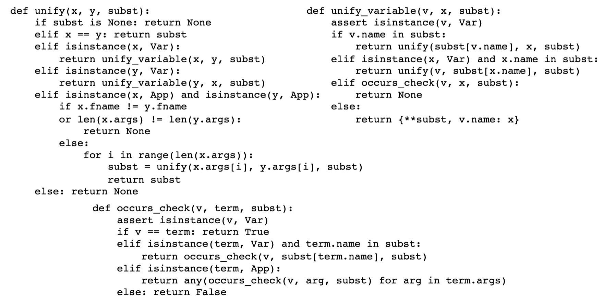

#### Handling Variable Bindings (declarations)

What is the type of this anonymous function (think Python-ish)?
	`lambda f: pair(f(3), f(true))`

- This expression cannot be assigned a meaningful type without violating the soundness of the type system.
  - The symbol $f$ must a function type. From its first use, $f$ must have (poly)type int $\rightarrow \alpha$, while from its second use, it must have (poly)type bool $\rightarrow \alpha$. But \} unification fails on these two terms.
  - The type variable $\alpha$ in the type expression of $f$ is called **non-generic, and it must have the same value in all its uses in the expression.**
- How about this expression?
  - 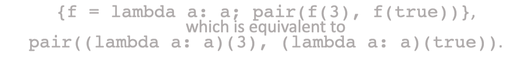
  - This expression can be assigned a completely reasonable type.
  - The **symbol $f$ has the polytype $\alpha \rightarrow \alpha$ within the scope of the block.**
  - The two uses of $£$ within the block can be typed independently (i.e., heterogeneously, if needed).
  - The type variable $\alpha$ in the type expression of $f$ is called **generic, and it can have different values in its multiple uses within the expression.**
- Seehttps://github.com/eliben/code-for-blog/tree/master/2018/type-inferencefor a Python implementation of Hindley-Milner type inference.