# Records as Porto-objects

+ Records: aggregation of heterogenous ojects into a single unit (I1: T1 …., Ik : Tk)
  + Objects: fields, referenced by name
  + Struct in C
    - Can be tagged (struct $\mathrm{T}\left\{\ldots, \mathrm{x}_{i}\right)$ or untagged (struct $\{\ldots, \mathrm{x} ;)$. 
    - type name is “struct T”
    - Often used with typedef (typedef struct $\{\ldots, \mathrm{T} ;$ ) to produce new type names for structure types.
    - Eg. 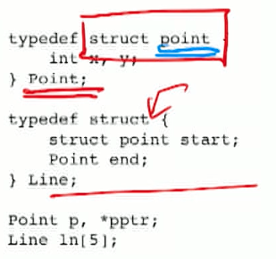

### Run-Time Representation of Records

- Assume that we have the following two functions available.
- size: Type $\rightarrow$ int, giving the number of contiguous bytes of [memory that a variable of a given type occupies at run-time.
addr: Identifier $\rightarrow$ int, giving the starting address in memory of this chunk for a given identifier. e.g. address of last element is addr + size - 1
- If $T$ is a record type, the language definition specifies a mapping of each field $f$ (of type $\tau_{f}$ ) of the record type to **offsets** $\delta_{f}$, such that $\operatorname{addr}(x . f)=\operatorname{addr}(x)+\delta_{f}$.
- And we will have $\operatorname{size}(T) \geq \sum_{f} \operatorname{size}\left(\tau_{f}\right)$.
  - I.e., each field will be contiguous in memory, but there **may be gaps (“padding") between successive fields.**

### Operations on Record Types

#### accessing a field

- Given a variable $x$ of a record type $T$, what does $x . f$ mean?
- Case 1: Rvalue (RHS of the memory section)
  - Returns a value of type $\tau_{f}$ from the bit pattern in memory bytes $\operatorname{addr}(x)+\delta(f)$ through $\operatorname{addr}(x)+\delta(f)+\operatorname{size}\left(\tau_{f}\right)-1$
- Case 2: Lvalue
  - Memory bytes $\operatorname{addr}(x)+\delta(f)$ 

### Record Layout and Data Alignment

- Why do we have size $(T) \geq \sum_{f} \operatorname{size}\left(\tau_{f}\right)$ rather than size $(T)=$ $\sum_{f} \operatorname{size}\left(\tau_{f}\right) ?$
- Why does the $\mathrm{C}$ standard insist that "For two structures, corresponding members shall be declared in the same order." [ C17 ballot, §6.2.7]?

#### data alignment

- Computers often impose restrictions on the valid/desired placement of data objects in memory (i.e., $\operatorname{addr}(x))$ in order to simplify high-performance memory design. These restrictions are called data alignment rules.
- Such restrictions are not particularly onerous, because they can be easily handled by the compiler and the run-time system.
- Reality check: The x64 architecture will work correctly regardless of data alignment (except for some SSE instructions), but performance may suffer.

#### Data Alignment in C

- Basic type: A variable $x$ of a basic data type of size $K$ bytes and located at memory address $\mu_{x}$ is said to be aligned iff $\mu_{x}=$ $0 \bmod K .$ ( a multiple of K ) e.g. for int (4 bytes), then addr(x) needs to be a multiple of 4
- Derived type: A variable $x$ of a derived data type $T$ located at memory address $\mu_{x}$ iff the following two conditions hold:
  - [ The sub-object rule] Every sub-object of this type is (recursively) aligned.
  - [The array rule] Every element of an object $y$ of type "array of $T^{\prime \prime}$ is aligned.

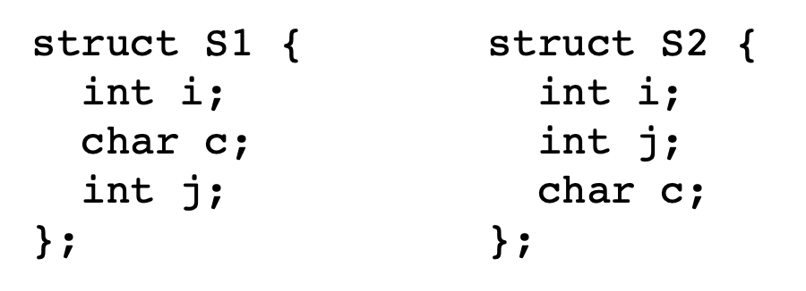 

S1: i: 0-4, c: 4 + 1 = 0-5, j: 8-12, gap at 5-8

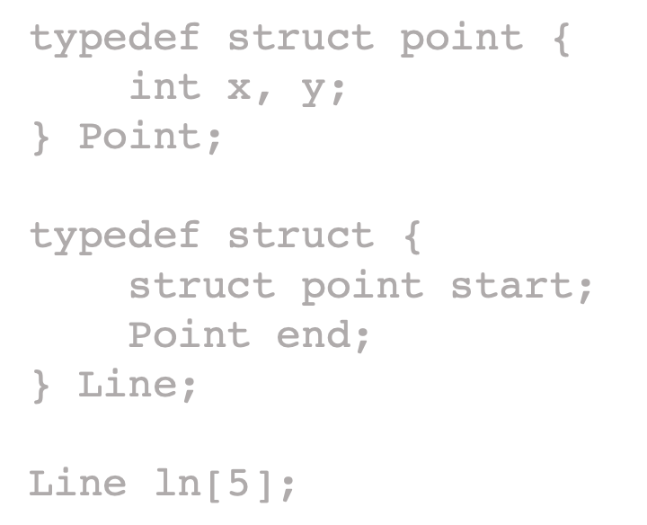

Ln[0] , … need to be aligned

and for each Ln[k], Ln[k].start and Ln[k].end are aligned

Ln[k].start.x is aligned ….

#### Function-Valued Fields in Records

- function pointers as fields in records.

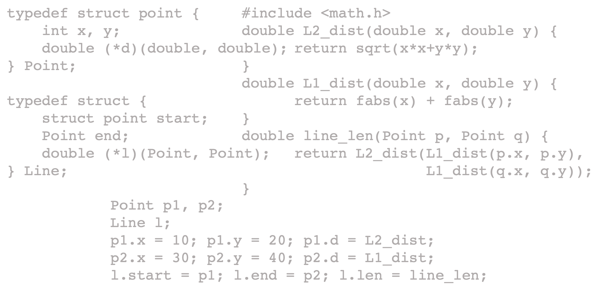

# Object-Oriented Language

### Definition

- [Cardelli/Wegner 1985, \$1.3]
  "... it is useful to define object-oriented languages as extensions of procedure-oriented languages that support typed data abstractions with inheritance. Thus we say that a language is object-oriented iff it satisfies the following requirements:
  - It supports objects that are data abstractions with an interface of named operations and a **hidden local state**[.]
  - Objects have an associated object **type**[.]
  - Types may **inherit** attributes from supertypes[.]"
- [Cooper/Torczon $2004, \$ 6.3 .3]$
"Fundamentally, object orientation is a reorganization of the program's **name space** from a procedure-oriented scheme to a dataoriented scheme.[...] [O]bject-oriented languages differ from procedural languages in that they need some additional compile-time and run-time support. [...] An object is an abstraction that has one or more **internal members**. These members can be data items, code that manipulates those data items, or other objects. [...] A class is an abstraction that **groups together similar objects**."

## Name space

### Share nothing

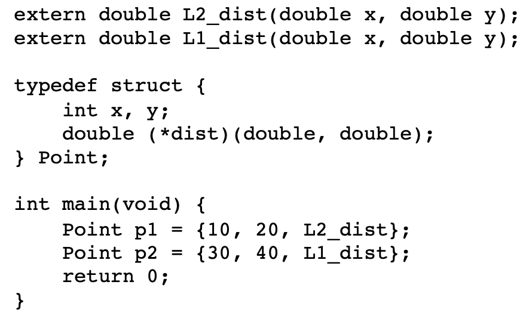

- Only prototypes.
- Greatest flexibility, but wasteful and tedious.

### Code reuse

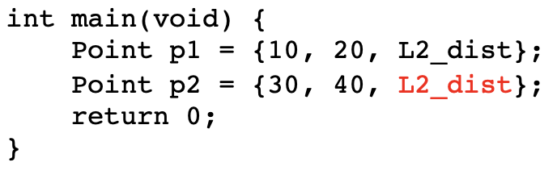

- Greater uniformity.
- Still no grouping construct for similar objects.

### Code reuse + grouping

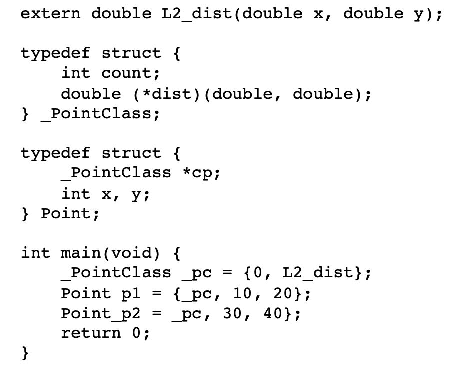

- The data members of Point (aka instance variables) are unique for each instance.
- The code members (aka) instance **methods are consolidated** into a
  PointClass object and are shared among Point objects.
  - The object record of Point has changed.
  - Accessing dist requires an extra level of indirection.
- A class is an object that describes the properties of other objects.
  - A class can have its own class variables and class methods.

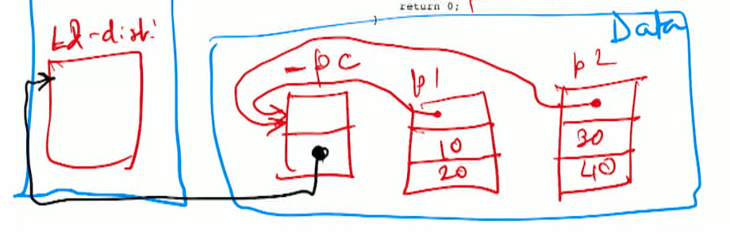

# Inheritance

### Subtyping view

- Type inclusion (aka subtyping) : all the values of type $A$ are also values of type $B$. $A \sqsubseteq B$. A: subtype, B: supertype
- Examples of subtypes.
  - [Function types]
    - f: D->R, g: D’->R’, 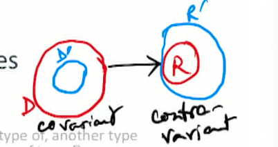
    - Then f is subtype of D
    - $\frac{D^{\prime} \subseteq D \quad R \subseteq R^{\prime}}{D \rightarrow R \sqsubseteq D^{\prime} \rightarrow R^{\prime}} .$
  - $[$ Record types]: all fields in subtype record are subtypes of corresponding fields in super type
$$
{\operatorname{REC}}\left(a_{1}: t_{1}, \ldots, a_{n}: t_{n}, \ldots, a_{m}: t_{m}\right) \sqsubseteq \operatorname{REC}\left(a_{1}: u_{1}, \ldots, a_{n}: u_{n}\right) \equiv \forall i \in[1, n] . t_{i} \sqsubseteq u_{i}
$$
- Subtyping on record types corresponds to the concept of inheritance (subclasses) in programming languages.

### Name spaces view

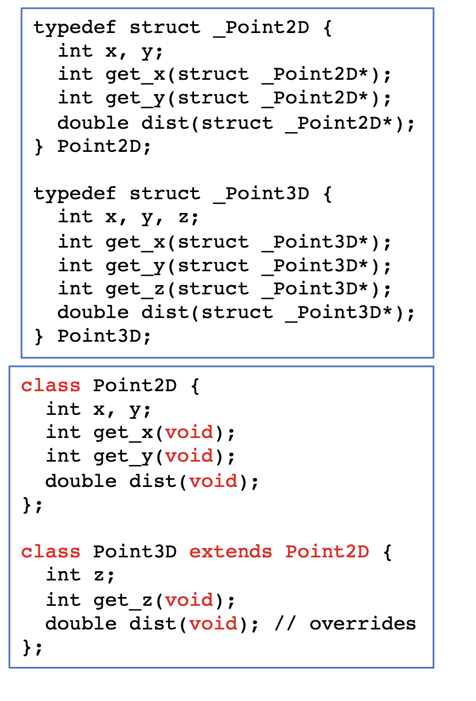

- By the typing judgment rule for records,
  Point3D $\sqsubseteq$ Point2D.
  - Ignoring field order issue.

- We indicate this in the source language with special syntactic sugar `extends`.
  - The members common to Point2D and Point3D are inherited from the supertype.
  - Additional $(z$, get $z)$ and overridden members (dist) are explicitly indicated in Point3D.
  - The type signatures of the instance methods now have an implicit object reference (this or self) as the first argument. (`struct _point2D*` -> `void`)

### Run-Time Memory View

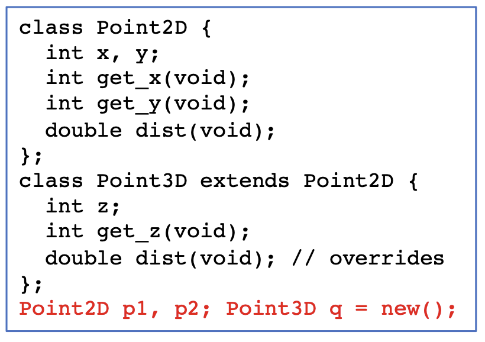

1. How are objects and classes laid out in memory?
   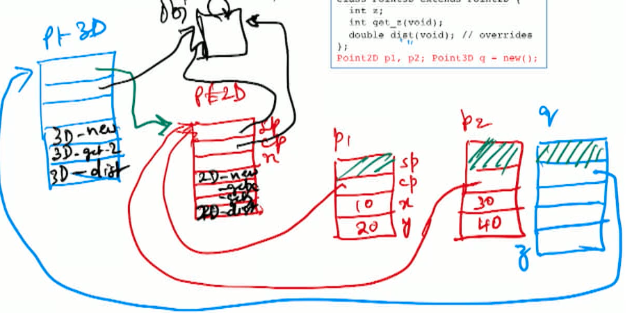
2. How are names mapped to methods? Search up the supertype chain
   1. q.gety(): 3D-gety (name mangling by adding 3D prefix to the method name) CP -> pt3d (not here) -> SP -> pt2D (found)
3. What are the rules for name visibility?
   1. local parameters, local methods, globals 

## Multiple Inheritance

- Consider the following elass record types.
type object $=$ \{age: int $\}$
type Vehicle $=\{$ age: int, speed: int $\}$
type Machine $=\{$ age: int, fuel: String
type Car $=$ \{age: int, speed: int, fuel: String\}
- Then we have the following subtype relations.
Vehicle $\sqsubseteq$ Object
Machine $\sqsubseteq$ Object
Car $\sqsubseteq$ Object, Car $\sqsubseteq$ Vehicle, Car $\sqsubseteq$ Machine
- Can extend this to full-fledged classes with code members.
- If the same method is implemented in multiple superclasses, then we need a linguistic mechanism to specify or disambiguate which methods are inherited from which superclass.
- Q: Since (by the definition of $\sqsubseteq$ ) a Car can be used wherever a Vehicle is expected, and also wherever a Machine is expected, how do we lay out the object record of Car?

### Step 0: Single Base Class

- Let's say we have the following classes (simple C++ syntax).
class A \{int a; void $f($ int $) ;\} ;$
class $B: A\{$ int b; void $g($ int); $\} ;$
class $C: B\{$ int $c ;$ void $h($ int); $\} ;$
- Then the layout of an object of class $\mathrm{C}$ looks like this.
  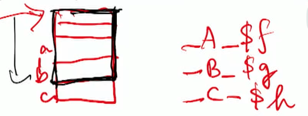
- We also have the declaration
$\mathrm{C}^{*} \mathrm{pc} ;$
- How is the call $\mathrm{pc}->\mathrm{g}(2)$ implemented? `_B_$g(pc, 2)`

### Step 1: Single Base Class, Virtual Functions

- Virtual: can be overridden
  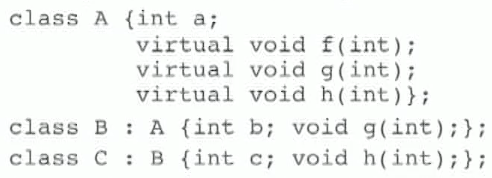
- 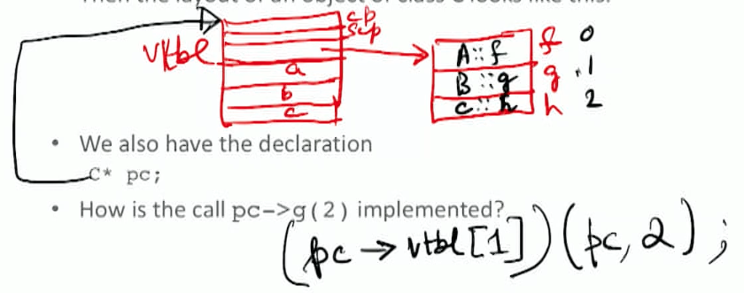

### Step 2: Multiple Base Classes

- Let's say we have the following classes.
class A \{int a; void $f(i n t) ;\}$
class $B$ int b; void $g(i n t) ;\}$
class $C: A, B\{$ int $c ;$ void $h(i n t) ;\}$
- 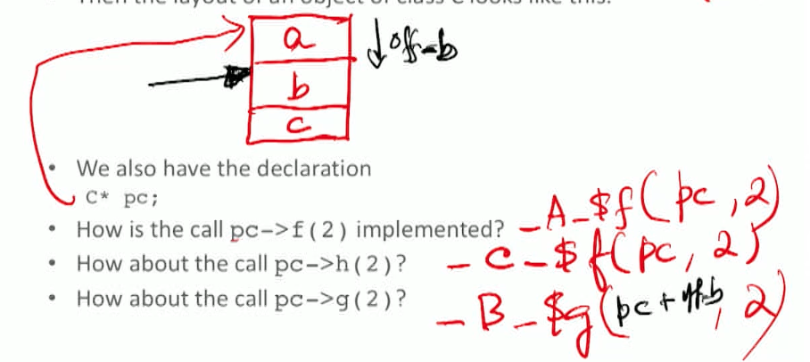

### Step 3: Multiple Base Classes, Virtual Functions

- Let's say we have the following classes.
class A \{virtual void $f($ int); $\}$;
class $B$ {virtual void $f($ int);
				virtual void $g($ int); $\}$;
class $C: A, B$ void $f($ int); $\}$
- Then the layout of an object of class $C$ looks like this.
  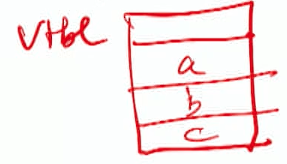
- We also have the declarations
$A^{*} \mathrm{pa}=$ new $\mathrm{C} ; \mathrm{B}^{*} \mathrm{pb}=$ new $\mathrm{C} ; \mathrm{C}^{*} \mathrm{pc}=$ new $\mathrm{C} ;$
- How is the call pa-> $f(2)$ or $\mathrm{pc}->\mathrm{f}(2)$ implemented?
- How about the call $\mathrm{pb}->\mathrm{f}(2) ?$

## Name Mangling

- turning source program names of symbols into their object file names
- Reasons for name mangling
  - Avoid name collisions.
  - Overloading names.
  - Assisting link-time type checking.
  - Passing information from compiler to linker.
  - Enabling cross-language interoperability.
- Used in many popular languages, such as C++, Python, Java, and Rust.

### Name Mangling in C++

- No standard name mangling scheme. Different compiler/OS combinations use different conventions.
  - This is actually encouraged by the Annotated C++ Reference Manual, so that incompatible libraries may be detected at linktime rather than at run-time.
- The function
  `int testfunc (char*, int, double, int, char, int*, float)`
  `{ return 1 ;}`
  may have its name mangled to _Z8testfuncPcidicPif.
  - $_{-} \mathrm{Z}$ is a reserved identifier by $\mathrm{C}+$ rules.
  - 8 is the number of characters in the function's name.
  - testfunc is the name of the function.
  - The argument types are indicated in order.
  On a different system, its mangled name may be ? testfunc Q QAHPADHNHDAHMQ Z.
- Name mangling is disabled inside extern "C" blocks.

### Name Mangling in Rust

- [Ref: The Rust Symbol Name Mangling Scheme, RFC \#2603. https://rust-lang.github.io/rfcs/2603-rust-symbol-namemangling-v0.html]
- Essential goal
  - The scheme must provide an unambiguous string encoding for everything that can end up in a binary's symbol table.
- Desirable properties
  - A mangled symbol should be decodable to some degree.
  - A mangling scheme should be platform-independent.
  - The scheme should be time- and space-efficient.
  - When used as part of a stable $\mathrm{ABI}$, it should be possible to predict the symbol name for a given source-level construct.
- Non-goals
  - The mangling scheme does not try to be compatible with an existing (e.g. $\mathrm{C}++$ ) mangling scheme.
  - The RFC does not try to define a standardized demangled form for symbol names.

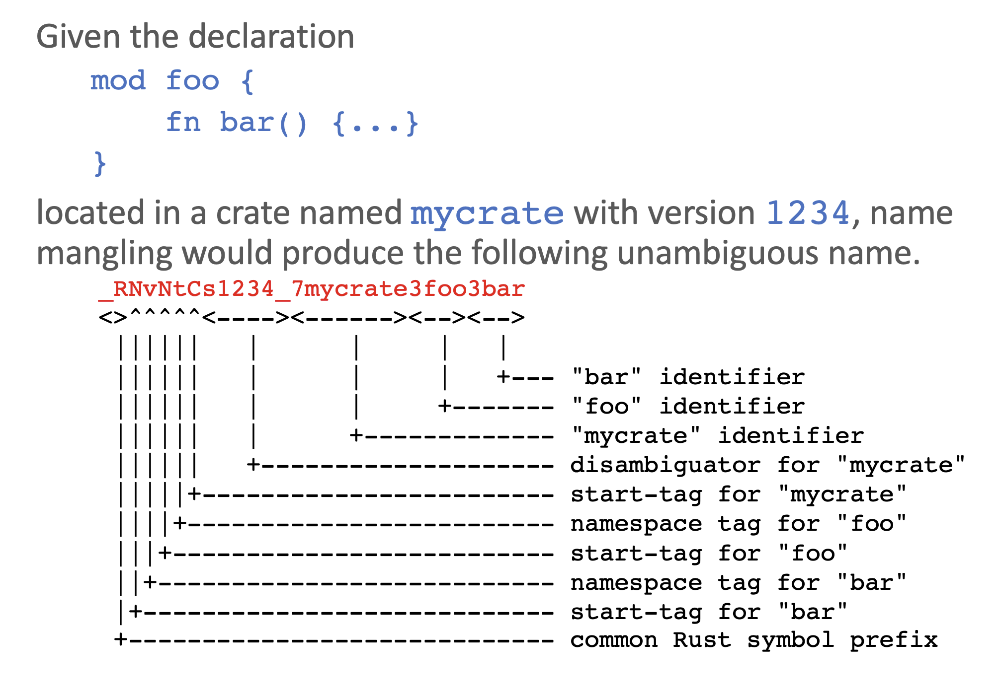

## Java Virtual Machine

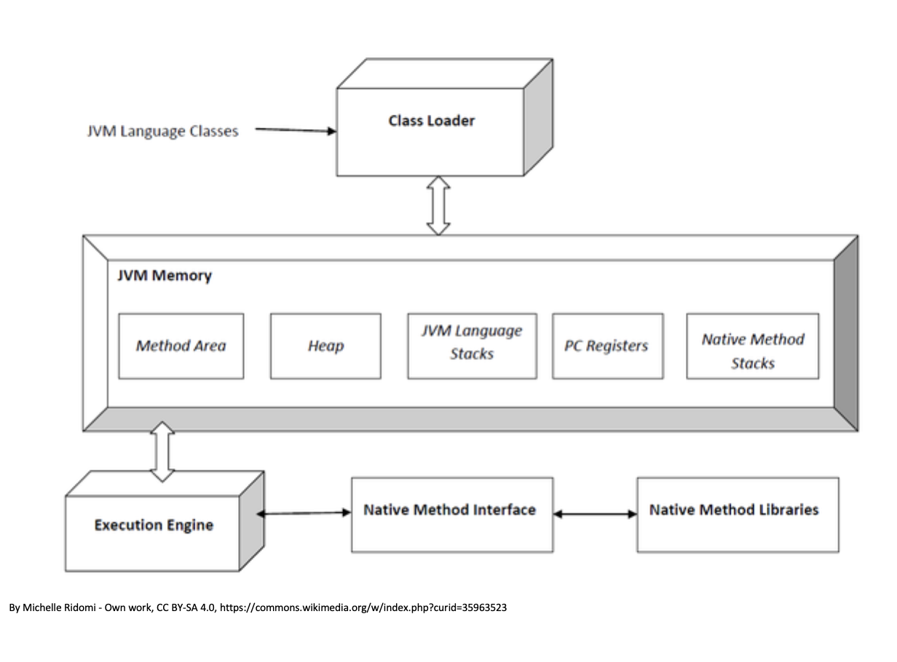

+ Heap: objects
+ Execution engine: bytecode
+ Method area: code for manipulating objects

### Java Virtual Memory Instruction Opcodes

- Bytecode, i.e., 8 -bit opcodes.
- Additional arguments may be specified.
- Instruction categories
  - Constants (00-20): nop, iconst_0, bipush, Idc, ...
  - Loads (21-53): iload, fload_1, aload_3, aaload, ...
  - Stores (54-86)
  - Stack (87-95): pop, dup, swap, ...
  - Math (96-132): ladd, dsub, ishl, iand, ...
  - Conversions (133-147): i2l, f2i, f2d, i2b, ...
  - Comparisons (148-166): Icmp, iflt, if_icmpge, if_acmpne, ...
  - Control (167-177): goto, jsr, ret, areturn, ...
  - References (178-195): getstatic, putfield, invokevirtual, new, ...
  - Extended (196-201): wide, ifnull, goto_w, $\ldots$
  - Reserved (202-255): breakpoint, $\ldots$

### Java $^{\text {® }}$ Virtual Machine Support for Objects

- [Ref: JVM SE16 $(\S 2.11 .5, \S 2.11 .8, \$ 6.5)]$
- Both class instances and arrays are objects.
  - JVM has different sets of instructions for creating and manipulating these two kinds of objects.
  - Ignoring arrays in this presentation.
- Instructions
  - Create a new class instance: `new`.
    - No instruction for object reclamation: handled by GC (garbage collection).
  - Access fields of classes (i.e., `static` fields or class variables): `getstatic`, `putstatic`.
  - Access fields of class instances (i.e.,` non-static` fields or instance variables): `getfield`, `putfield`.
  - Check properties of class instances (or arrays): `instanceof`, `checkcast`.
  - Method invocation: `invokevirtual` instance method, `invokeinterface`, `invokespecial` constructors, `invokestatic` class method.
    - Also `invokedynamic` (ignoring).

### Object AIlocation and Initialization

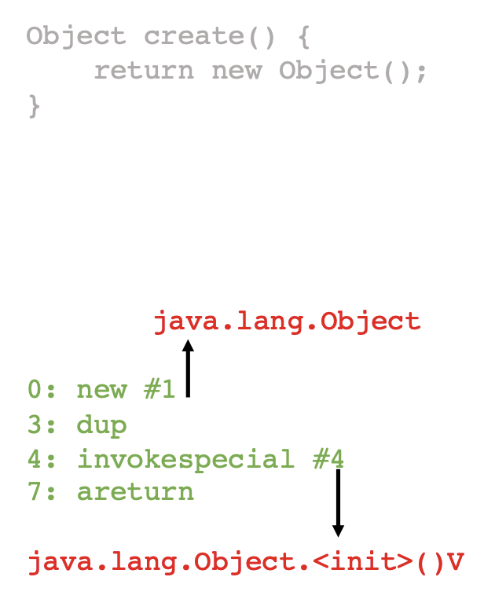

- Combination of `new` (to allocate the object) and `invokespecial` (to execute constructor method).
- Details
  - [`new ib1 ib2`]
    - The bytes ibl and ib2 used to construct an index into the run-time constant pool of current class; the item at that index must be a symbolic reference to a class or an interface type.
    - Type resolution performed; must result in a class type.
      - If the class is currently uninitialized, its `<clinit>` method is invoked.
    - Memory for a new instance of that class allocated from heap.
    - Instance variables of the new object are initialized to their default initial values.
    - A reference to the instance is pushed on the operand stack.
  - [`invokespecial ibl ib2`]
    - consumes the reference to the instance (from dup)
    - Skipping details, but essentially follows the above pattern to locate and resolve the method name and to look up the actual procedure to be executed by **searching through the class, its superclasses, and its superinterfaces.**

### Bytecodes for Method Invocation

- Method invocation: invokevirtual, invokeinterface, invokespecial, invokestatic.
  - invokevirtual: [182, ib1, ib2] Invoke an instance method, dispatch based on class.
    - Object reference and parameters are taken from the operand stack.
  - invokespecial: [183, ib1, ib2] Invoke an instance method; direct invocation of instance initialization methods and methods of the current class and its supertypes.
    - Key difference is that procedure to be executed is searched in class hierarchy.
  - invokestatic: [184, ib1, ib2] Invoke a class (static) method.
    - No object reference as the first argument.
  - invokeinterface: [185, ib1, ib2, count, 0] Invoke an interface (instance) method.
    - The count and 0 are for historical reasons and backwards compatibility.