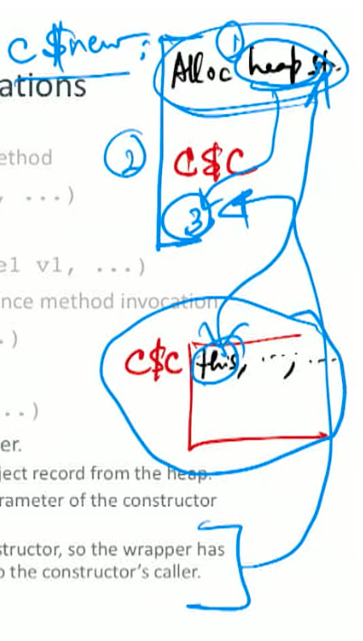

# LiveOak-3

## Language update


Var_decl: data members

Method_decl: instance data members


### Language-Level Transformations

- Translate the definition of an instance method `retType f(typel v1, ...)`
in class $\mathrm{C}$ as though it was written as `retType C$f(C this, typel v1, ...)`, ‘this’ is just the heap address of the object
- If name $r$ is of type $C$, translate the instance method invocation
$$
r \ldots m(e 1, \quad e 2, \ldots)
$$
as though it was written as
$$
C \$ m(r, \quad e 1, e 2, \ldots)
$$
- Handle object constructors with a wrapper (for new C)
  - MALLOC: In the wrapper, allocate storage for the object record from the heap.
  - Pass a reference to this area as the first parameter of the constructor call (which is just a normal method call).
  - There is no return statement in the constructor, so the wrapper has to handle returning the object reference to the constructor's caller.



## SaM

+ Data: 
  + For MALLOC: Size of object taken from TOS; memory address returned on TOS.
  + For FREE: Memory address to be freed taken from TOS.
+ Methods:  JSRIND, need to get method label from method table, and push that onto TOS, then JSRIND to the label
  - The program address of the called method is taken from TOS.
  - The return address of the call site is pushed on TOS.

- Since we don't have inheritance, we will simplify the runtime representation of objects.
  - Retain only the data members in the object record.
  - No need for class object and their associated records and pointers. (JSR instead of JSRIND)
- We will also simplify instance method invocations.
  - No dynamic method dispatch needed, because no new methods to be added or overridden in subclasses. So we will handle it using name mangling of method names in both definitions and invocations.
- This strategy would not generalize to inheritance.
  - Given the LIFO nature of memory, handling class objects is rather cumbersome (but of course possible).
  - If we used this variation, we would extract the correct method name from the class object's method table and dispatch using the JSRIND instruction.


### Constructors

- Handle object constructors with a wrapper.
- Translate the expression `new C(e1, .., en)` as follows.
  -  **caller** : MALIOC and passes that reference as the first parameter to the constructor call.
  - Since there is no return statement in the constructor, the caller also takes care of sticking the object reference into the return value slot of the constructor invocation.

```
// space for return value 
PUSHIMM 0
PUSHFBR
// create object and
// push reference on stack 
MALLOC size-of-C
code for e1
...
code for en

// [Q: what does this do? numParams + 2 - SP]
PUSHSP
PUSHIMM (n+2)
SUB

// precall
PUSHFBR

// call
JSR C$new // to the constructor pop off all parameters except for object reference

// return
ADDSP -n
// stick into return value slot of // dying constructor invocation 
STOREOFF -1
POPFBR
```

### Instance variable references

- If $\mathrm{x}$ is an instance variable of an object of class $\mathrm{C}$, then an unadorned reference to $\mathrm{x}$ within an instance method or constructor is shorthand for this $. \mathbf{x}$.
  - This receiver object is always the first parameter of the method, i.e., in offset $+1$ from the current FBR.
  - The (compile-time) symbol table for class $\mathrm{C}$ has the offset $ox$ for field $x$ in the object record.
- Use the following templates to generate code for read and write references.

```
// Template for ... this.x ... 
PUSHOFF 1
PUSHIMM ox
SUB // ADD if pointer to the record is at the begining of the record
PUSHIND // read value from memory

// Template for this.x = rval;
PUSHOFF 1
PUSHIMM ox
SUB
code for rval
STOREIND // write value to memory
```


## x86

- Object allocations need to be done on the heap.
  - The language run-time needs to provide explicit dynamic memory management primitives.
  - Rather than write one from scratch, may just be easier to use the standard malloc ( ) and free ( ) routines in the C standard library,
    - Cross-language interoperability issues.
- Instance methods need to be dynamically dispatched.
  - The `CALLQ *Opnd` form of the CALLQ instruction supports an indirect procedure call, similar to the indirect unconditional jump instruction.
- Given the greater flexibility of the architecture, it makes sense to implement the reference "object-record/classrecord" model.
  - The **class record variables** can be allocated statically as **global variables** and initialized with the appropriate function pointers.
  - This is possible because we have global visibility of all program modules at compile-time.
    - If we had separate modules that were linked post-compilation, then we would need another level of indirection in the generated code, with placeholders for the appropriate variables that are allocated and initialized at link-, load-, or run-time.
  - To be complete, we should also have an object class as the root of the object hierarchy.
- Any methods that cannot be overridden in sub-classes can be dispatched statically (no need for dynamic dispatch) and need not be allocated in **class method tables**.
  - This may be indicated, e.g., by a keyword like final.
  - Name mangling is still required for method disambiguation.

### Run-Time Data Structure


- Class objects
  - static allocation + initialization, global placement of class objects.
    
- Class instance objects
  - Interactions with inheritance.

  
- Method tables.
  - Inline/out-of-line(pointer from class to separate structure method).
    
  - Hierarchical (point to parent class to access parent methods)/flattened (copy all methods in current class).
    
- Constructors.


