# Memory management

## Dynamic Memory Management

### Introduction

#### Definition

- Dynamic memory management refers to the **run-time** data structures and algorithms used for allocation and deallocation of objects of **variable size** that may remain **alive beyond the lifetime of the method invocation** in which they are allocated.
  - Distinct from global and method-static variables, whose allocations are frozen at compile time.
  - Distinct from method-local variables, which are allocated on the stack frame at run time but do not live beyond the method invocation. (e.g. variable return from result will still be alive beyond the method)
  - Objects of variable size are important; if all objects were of a known fixed-size size, then the problem would be much simpler.
- Two major flavors of dynamic memory management
  - **Explicit**: The application (language user) is responsible for freeing allocated memory. - E.g., malloc ( )/free ( ) in C, new/delete in C++.
  - **Implicit** (aka garbage-collected): application(user) allocate, but allocator responsible for freeing memory
    - E.g., Java, Python.


#### Subsystems and Interactions

- Application (aka **mutator**).
  - Initiator of object allocation requests.
  - May also initiate object deallocation (explicit systems).
- Operating system services.
Supplier of memory pool that allocator uses to satisfy mutator requests.
- Allocator (+ deallocator).
  - Typically part of language RTS.
- Interactions
  - Bidirectional communication: allocator/mutator, and allocator/OS services.

  - [C]

  - ```C
    // Mutator - Allocator interface
    #include <stdlib. h>
    void *malloc(size_t);
    void free(void *);
    
    // allocator - Operating system interface 
    #include <unistd.h>
    void *sbrk(intptr_t); // for linux, allocator request more memory from OS
    ```

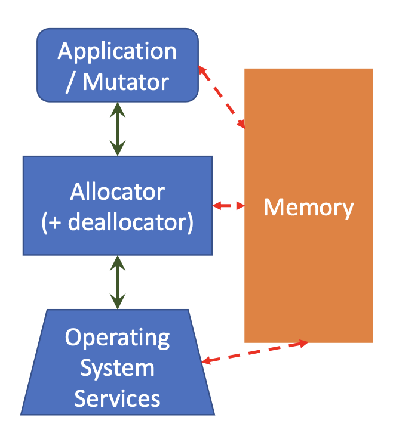

#### The Allocator-Centric Worldview

- allocator possesses some amount of memory that it has obtained from the OS. (orange pool)
- This memory pool ("**heap**"/ arena) is partitioned ("**fragmented**") into [maximal] contiguous chunks ("**blocks**") of two types:
  - A **free block** (available) is one that is currently under the allocator's control.
    - not allocated in the past
    - The allocator can use such a block to satisfy object allocation requests from the mutator.
  - A **used block** is one that is currently allocated and under the mutator's control.
    - In an explicit DMM scenario, such a block is off-limits to the allocator until the <u>mutator issues a deallocation request</u> on it (and thereby transitions it into a free block).
    - In an implicit DMM scenario:
      - The allocator can **reclaim** the block if it determines safe. This will necessarily be a conservative approximation.
      - The allocation can **relocate** the block to a different location if it can do so without compromising the mutator's correctness.

Things vary unpredictably

#### Overheads and Fragmentation

- **Management** Overheads
  - Each allocated **block** must carry some **hidden metadata** so that the allocator can figure out how to handle it when deallocating, reclaiming, or relocating the block.
    - At a minimum, this will have the size of the allocated block.
  - An allocated block may also need to incorporate **padding** in order to satisfy **alignment constraints**.
  - Let this total overhead add up to $v$ bytes.
- Two types of **fragmentation**
  - Internal fragmentation: An allocation request for $n$ bytes of payload is satisfied with a block of $(n+v+k)$ (Payload + overhead + fragmentation) = allocated block bytes.
    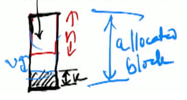
  - External fragmentation: The heap contains free blocks of size $n_{1}$ and $n_{2}$ bytes, n1 + n2 > n + v, but n1 and n2 are not contiguous and neither n1 and n2 are > n + v, which, had they been adjacent in memory, could be used jointly to satisfy an allocation request for $n$ bytes of payload.
    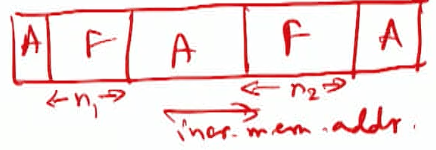


#### Constraints On Allocator

- Correctness
  - Handling arbitrary sequences of requests. (malloc and free do not always come on after another)
  - Aligning blocks so that they can hold any type of data object.
  - Not impacting mutator correctness.
    - For explicit DMM: No manipulation/change of used blocks.
    - For implicit DMM: Provably (or conservatively) safe reclamation or relocation of used blocks.
- Responsiveness
  - Responding immediately to individual requests, without reordering or batching.
- Scalability
  - Using only the heap.
    - Any variable-sized non-scalar data structures used by the allocator must themselves be maintained in the heap.
    - In other words, the <u>allocator can't call itself</u>.


### Basic Techniques

#### The Design Problem

- Since the only thing the allocator can work with is the collection of free blocks, the management of this free space (aka the **free list**) is the <u>fundamental design problem.</u>
- Four design dimensions.
  - Free list organization: How to keep track of the free blocks.
  - Free block selection: How to pick an appropriate free block to satisfy the current allocation request from the mutator.
  - Free block splitting: What to do with the remainder of a free block after allocation.
  - Free block coalescing (free()): How to handle freed allocated blocks.
- The "free list" is conceptual.
  - Everything is just a byte array, and the allocator overlays a particular interpretation of these bytes.
  - Very low-level. No conventional abstractions to help us out.

#### Huge Design Space

- Many policy choices for each dimension, interacting in complicated ways.
  - Free list organization: How to make blocks linked together
    - Implicit, explicit, binned.
    - Singly- or doubly-linked.
    - Null-terminated or circular.
    - Returned blocks maintained in LIFO, address-sorted, or size-sorted order.
  - Free block selection: How to pick an appropriate free block to satisfy the current allocation request from the mutator.
    - Best-fit (closest to requested), worst-fit (biggest one), first-fit, next-fit.
  - Free block splitting: What to do with the remainder of a free block after allocation.
    - No split, always split, threshold split.
    - Allocate block from bottom or top of free block.
- Free block coalescing: How to handle an allocated block that is being returned to the free list.
  - Immediate, deferred, none.

#### The K\&R Allocator

- One of earlest malloc() for C
- From K\&R2e, $\S 8.7$.
  - Short, portable, performant.
- Very few assumptions.
  - Does not assume that successive calls to sbrk() return contiguous memory in process's address space.
  - Only non-portability is the assumption that pointers to different blocks returned by sbrk ( ) can be meaningfully compared.

#### The K\&R Allocator: Design Choices

- Free list organization: How to keep track of the free blocks.
  -  explicit,
  - Singly
  - circular.
  - address-sorted
- Free block selection: How to pick an appropriate free block to satisfy the current allocation request from the mutator.
  - first-fit
- Free block splitting: What to do with the remainder of a free block after allocation.
  - always split
  - Allocate block top of free block.
- Free block coalescing: How to handle an allocated block that is being returned to the free list.
  - Immediate


+ Take care of alignemnt
  + always allocate in unit of 8B

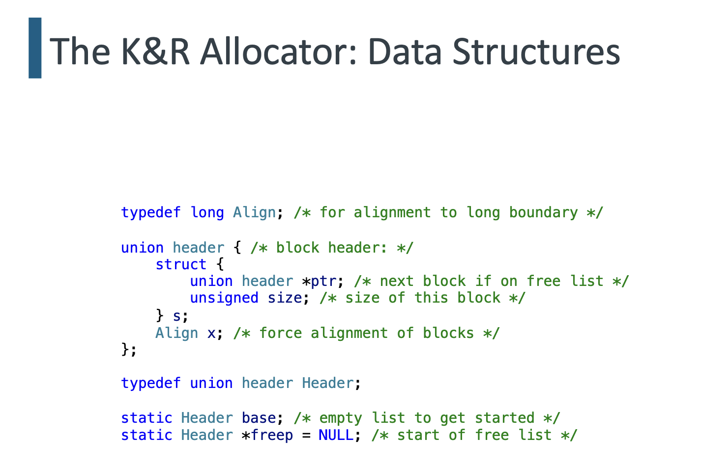

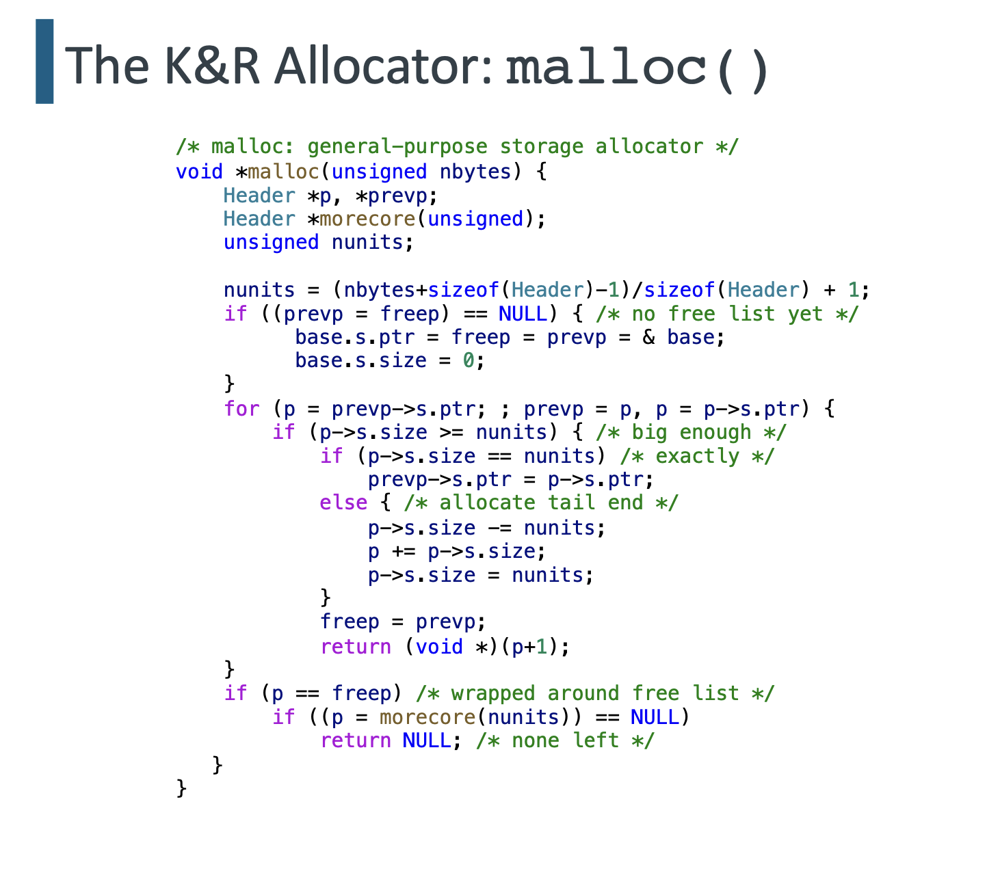

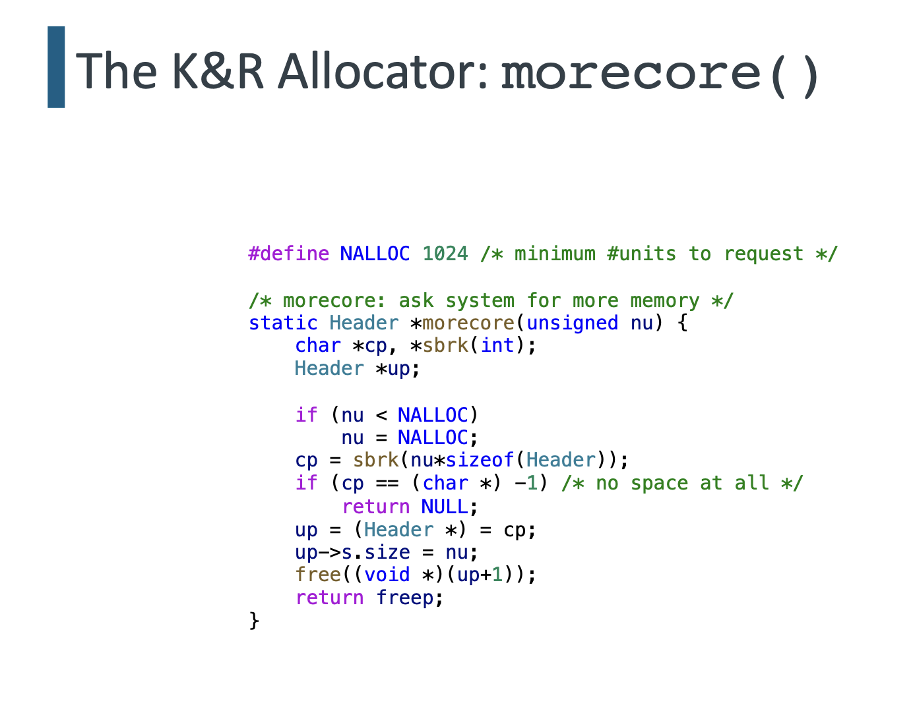

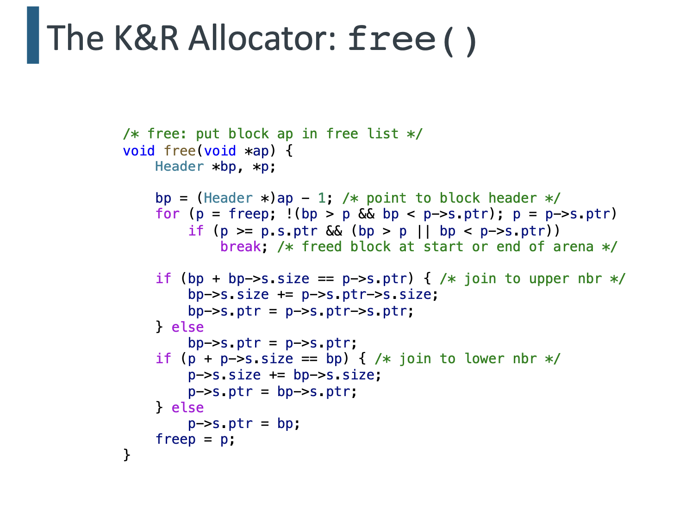

### Advanced Techniques

- [Ref: A Memory Allocator by Doug Lea. http://gee.cs.oswego.edu/dl/html/malloc.html]
- Also see Paul R. Wilson, Mark S. Johnstone, Michael Neely, and David Boles, "Dynamic Storage Allocation: A Survey and Critical Review", in International Workshop on Memory Management, September 1995 for a comprehensive (if dated) survey paper.
- We will discuss the following enhancements.
1. Boundary tags
2. Binning
3. Locality preservation
4. Wilderness preservation
5. Memory mapping
6. Caching


#### Technique \#1: Boundary Tags

- Introduced by Knuth.
- Memory blocks (both free and allocated) contain size information fields at both ends (called **headers and footers**).
  - Allows for quick coalescing.
  - Allows for forward/backward traversal of all blocks starting from a given block.
- Possible optimization: Omit footers in allocated blocks.
  - Reduces overhead slightly.
  - Weakens error detection.

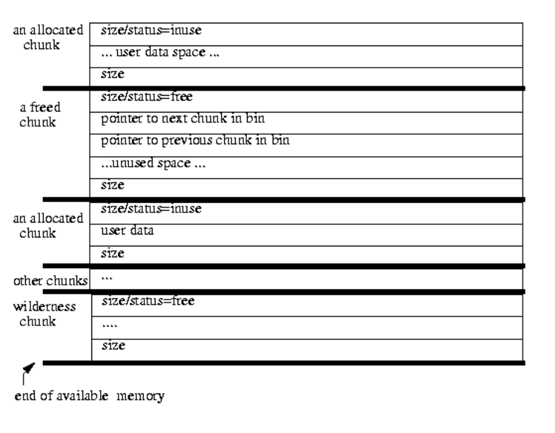

#### Technique \#2: Binning

- Free blocks are maintained in bins, grouped by size. (multiple free lists)
  - 128 fixed-width bins, approximately logarithmically spaced in size.
  - Exact sizes for small objects. 
  - Free blocks kept sorted by size chunks within bins, with ties broken by an oldest-first rule.
  - Search for block selection is **smallest-first, best-fit**.
- Used in conjunction with coalescing.
- Leads to fixed management overhead per block.

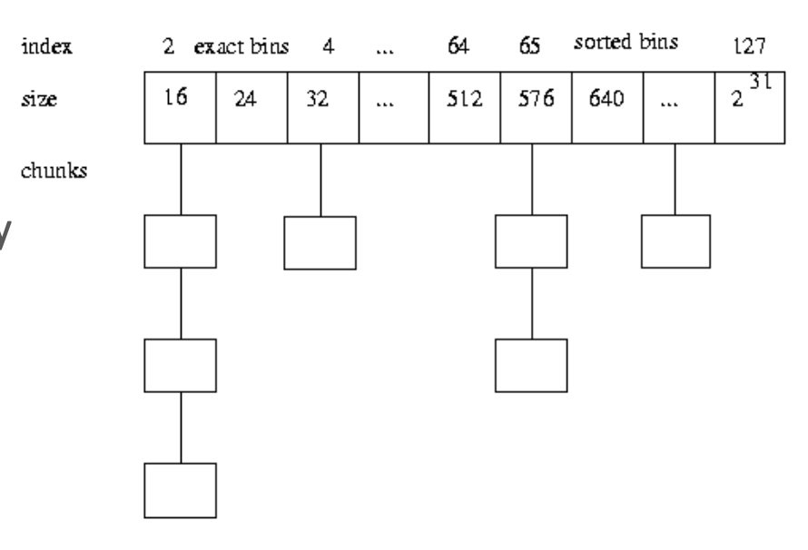

#### Technique \#3: Locality Preservation

- <u>Objects allocated at about the same time by a program tend to have similar reference patterns and coexistent lifetimes.</u>
  - Maintaining locality of such objects minimizes page faults and cache misses.
- If locality were the only goal, an allocator might always allocate each successive block as close to the previous one as possible.
  - However, this nearest-fit (often approximated by <u>next-fit) strategy can lead to very bad fragmentation.</u>
- A version of next-fit can be used only in a restricted context that maintains locality in those cases where it conflicts the least with other goals.
  - If a free block of the exact desired size is not available, the most recently split-off space is used (and re-split) if it is big enough; otherwise best-fit is used.
  - This restricted use eliminates cases where a perfectly usable existing block fails to be allocated, thus eliminating at least this form of fragmentation.

#### Technique \#4: Wilderness Preservation

- The **wilderness block** represents the space bordering the topmost (last block) address allocated from the system.
  - Because it is at the border, it is the only chunk that can be arbitrarily extended (via sbrk ( )) to be bigger than it is.
  - Usually avoided
- Simple strategy: Handle the wilderness block just like any other block.
  - While this simplifies and speeds up implementation, it can lead to some very bad worst-case space characteristics.
  - Among other problems, if the wilderness block is used when another available free block exists, the chances of a later request causing an otherwise preventable sbrk( ) increase.
- A better strategy uses a very simple fix.
  - Artificially treat the wilderness block as "bigger" than all others (since it can be made so, up to system limitations) and use it as such in a best-first scan.
  - This results in the wilderness block always being used only if no other chunk exists, further avoiding preventable fragmentation.


#### Technique \#5: Memory Mapoing

- In addition to extending general-purpose allocation regions via sbrk(), Linux supports system calls such as mmap ( ) /mfree () that allocate and deallocate separate noncontiguous regions of memory for use by a program.
  - Requesting and returning a mmap ( ) -ed block can further reduce downstream fragmentation, since a released memory map does not create a "hole" that needs to be managed.
  - However, because of built-in limitations and overheads associated with mmap ( ), it is only worth doing this in very restricted situations, e.g., the request is greater than a (large and dynamically adjustable) threshold size and the space requested is not already available in the existing arena, so it would have to be obtained via sbrk( ).
- As this technique is not always applicable in most programs, one can also <u>trim the main arena</u>, which achieves one of the effects of memory mapping - releasing unused space back to the system.
  - When long-lived programs contain brief peaks where they allocate large amounts of memory, followed by longer valleys where the have more modest requirements, system performance as a whole can be improved by releasing unused parts of the wilderness block back to the system.
    - Releasing space allows the underlying operating system to cut down on swap space requirements and reuse memory mapping tables.
    - Often, sbrk() can be used with a negative argument to achieve this effect.
    - Should be attempted only if trailing unused memory exceeds a tunable threshold.

#### Technique \#6: Caching

- Operations to <u>split and to coalesce blocks take time</u>. This time overhead can sometimes be avoided by using either of both of two caching strategies.
  - Deferred coalescing: Rather than coalescing freed blocks, <u>leave them at their current sizes in hopes that another request for the same size will arrive soon.</u> This saves a coalesce, a later split, and the time it takes to find a non-exactly-matching block to split.
  - Pre-allocation: Rather than splitting out new blocks one-by one, <u>pre-split many at once</u>. This is normally faster than doing it individually.
- The corresponding caching heuristics are easy to apply because the basic data structures in the allocator permit coalescing at any time.
  - The effectiveness of caching obviously depends on the costs of splitting, coalescing, and searching relative to the work needed to track cached blocks.
  - Less obviously, effectiveness depends on the policy used to decide when to cache versus when to coalesce.


## Garbage collection (implicit)

### Introduction

#### Definition

- Garbage collection is the automatic reclamation of computer storage.
  - Program does not need to invoke free( ) or delete() methods to explicitly reclaim heap memory.
- The **garbage collector**'s role is to identify data objects that are no longer in use and make their space available for reuse by the mutator.
- **Garbage**: object not reachable by the mutator via any path of pointer traversals.
  - Objects that are potentially reachable through such paths of pointer traversals are said to be live.
  - Liveness is a global property of an executing process.
  - Note that this run-time notion of liveness is very different from the compile-time notion of liveness that we discussed in the context of register allocation.

#### Motivation

- Necessary for fully **modular programming**.
  - A method operating on a data structure should by default not Ineed to know what other methods may be operating on the same data structure.
  - If explicit deallocation is the norm, <u>then some module must be responsible for knowing when other modules are no longer interested in the object $-$ thereby introducing unnecessary crossmodule dependencies.</u>
- Unnecessary complications of explicit memory management can:
  - Break the basic abstractions of the programming language.
  - Lead to slow memory leaks.
  - Create "heisenbugs".
  - Make code brittle.

#### Block diagram

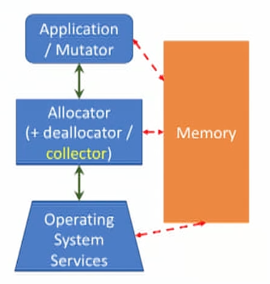

- The run-time allocation routines perform special actions to reclaim space, as necessary, when an allocation request is not easily satisfied.
  - Calls to the "deallocator" are implicit in calls to the allocator.
- Most collectors require some <u>cooperation from the compiler or interpreter, for more accurate garbage detection</u>
  - Object formats must be recognizable by the garbage collector.
  - Certain invariants must be preserved by the running code.
  - These requirements do not prevent the use of compiler optimizations.

#### The Two-Phase Abstraction

- Conceptually, the functioning of a garbage collector consists of two distinct phases (i.e., sets of activities).
  - **Garbage detection**, i.e., distinguishing live objects from garbage objects through some means.
  - **Storage reclamation**, i.e., reclaiming the storage of the garbage objects so that it is available for use by the mutator.
- In practice, these two phases may be functionally or temporally interleaved.

#### Conservatism in Garbage Collectors

- In order to declare an object as being garbage, the collector needs to be able to prove that it will never be used again.
  - An ideal garbage collector would be able to reclaim every object's space just after the last use of the object.
- In general, the <u>problem of determining exactly which objects are live is undecidable.</u>
- All garbage collectors use some efficient but conservative approximation to liveness.
  - In reference counting, the approximation is that an object <u>can't be live unless it is referenced</u>.
  - In tracing garbage collection, the approximation is that an object <u>can't be live unless it is reachable</u>.
- Two forms of conservatism.
  - Temporal conservatism occurs when garbage goes <u>uncollected between collection cycles.</u>
  - Topological conservatism occurs when <u>different paths that share an edge in the graph of pointer relationships are not distinguished.</u>

#### Run-Time Criterion for Liveness

- Defined in terms of a **root set** of variables and reachability from these roots.
- At a garbage collection point, all <u>globally visible variables and local variables of active methods</u> are considered live. - This is a conservative notion.
- The root set consists of the global variables, local variables on the activation stack, and any <u>registers</u> used by active methods.
- The set of live objects at a collection point is defined inductively as follows.
  - Heap objects directly reachable from any of the variables in the root set are live.
  - Any object directly reachable from a live object is live.
  - No other object is live.

#### Object Representations

- Heap objects must be self-identifying.
  - It must easy to determine the <u>type of an object</u> at run-time.
  - Statically typed languages use an extra field containing type information in the hidden headers of allocated objects, and use this information to decode the format of the object.
  - <u>Dynamically typed languages typically use tagged pointers.</u>
- Actually, we can get by with less for statically typed languages.
  - All we need are the <u>types of the root set variables</u>.
  - From that, we can figure out the types of their referents, and decode the fields in these types, and continue this process transitively.
- A class of conservative garbage collectors can work even without this minimal information, at the cost of a more conservative approximation to true garbage.


### Reference counting

- Each object has an associated count of the references (pointers) to it.
  - This field is usually in the object's <u>hidden header</u>.
  - Each time a reference to the object is created (e.g., a pointer copy), the object's count is incremented.
  - When an existing reference to an object is eliminated, the count is decremented.
  - Notice that this requires collaboration from the <u>compiler to generate the necessary code for both incrementing and decrementing the count</u>.
- An object is considered to be garbage and subject to reclamation when its <u>count equals zero</u>.
- When an object is reclaimed, its pointer fields are examined, and any objects it holds pointers to also have their reference counts decremented.
  - This may result in a <u>cascade of count decrements and reclamations</u>.

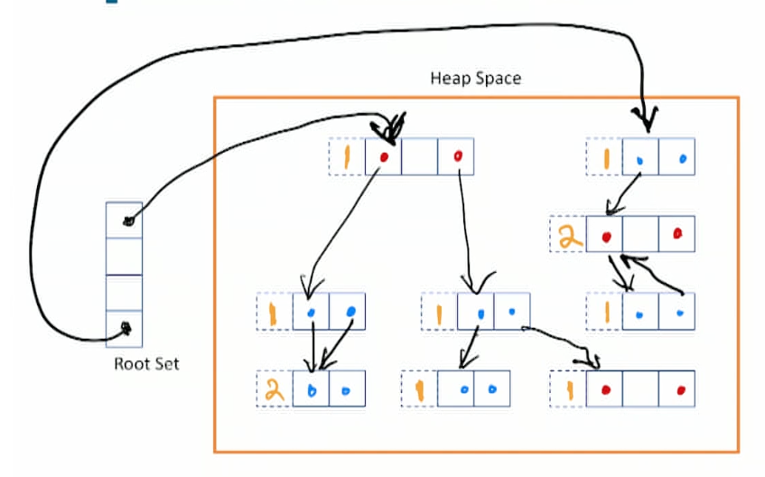

#### Mapping To The Two-Phase Abstraction

- Garbage detection, i.e., distinguishing live objects from garbage objects through some means.
  - The adjustment and checking of reference counts implements this phase.
- Storage reclamation, i.e., reclaiming the storage of the garbage objects so that it is available for use by the mutator.
  - Happens when the reference count reaches zero.
  - Put back to free list and cascade
- Operations are interleaved with the execution of the mutator.
  - Reference count adjustments are intrinsically incremental in nature.
  - Can also be made <u>real time</u>, i.e., performing at most a small and bounded amount of work per unit of mutator execution.
  - The transitive reclamation (cascading) of objects can be deferred by <u>keeping a list of freed objects whose reference counts have become zero but which haven't yet been processed.</u>

#### The Effectiveness Problem: Cycles

- Reference counting **fails to reclaim circular structures**.
  - If the pointers in a set of objects create a directed cycle, the reference counts of the objects are never reduced to zero, even if there is no path to the obiects from the root set
- This is a fundamental limitation of reference counting.
  - The problem arises because reference counting determines a conservative approximation of true liveness.
  - Systems using reference counting usually include some other kind of garbage collector as well to handle this problem.

#### The Efficiency Problem

- The cost of reference counting is that its cost is generally <u>proportional to the amount of work done by the mutator</u>, with a fairly large constant of proportionality.
  - The count of an object must be adjusted when a pointer to it is created or destroyed.
  - If a variable's value is changed from one pointer to another, the counts of two objects must be adjusted.
  - Reclaiming an object when its reference count reaches zero incurs overheads identical to those for explicit deallocation.
  - <u>Short-lived stack variables</u> (e.g., method arguments) can incur a great deal of overhead, especially in leaf methods.
- Deferred reference counting <u>avoids adjusting reference counts for short-lived pointers from the stack.</u>
  - Reference counts are now <u>unsafe</u> indicator of garbage.
  - Reference counts must be <u>updated periodically</u> by considering roots from the stack frames. This period can be tuned.
- A reference counting system may perform with little degradation when almost all of the heap space is occupied by live objects.

### Mark-Sweep Collection

- Garbage detection, i.e., distinguishing live objects from garbage objects through some means.
  - Done by **tracing**: starting at the root set and actually traversing the graph of pointer relationships, usually by either a depth-first or a (breadth-first traversal.
  - Reached objects are marked, either by altering bits within them, or by recording them in a bitmap or some other similar table structure.
- Storage reclamation, i.e., reclaiming the storage of the garbage objects so that it is available for use by the mutator.
  - Memory is **swept**, i.e., exhaustively examined, to find all of the unmarked objects and reclaim their space by linking them onto one or more free lists.

#### Problems With Mark-Sweep Collection

- Difficult to handle objects of varying sizes without **fragmentation** of the available memory.
  - This is basically the external fragmentation problem.
  - Can be mitigated by having binned free lists.
- <u>Cost of a collection is proportional to the size of the heap</u>, including both live and garbage objects.
  - Similar to the issue with an implicit free list allocator. (scan entire heap every time)
- Can <u>worsen locality of reference</u>, especially at the page level.
  - The working set of the mutator can be scattered across too many virtual memory pages.
  - May be somewhat mitigated by empirically observed patterns of clustered object allocation and lifetimes.


#### Mark-Compact Collection

- A variant of mark-sweep that <u>remedies the fragmentation and locality problems</u> of mark-sweep collectors: compact live objects into continugous portion of the heap
  - Mark phase is unchanged.
  - Live objects are then compacted, i.e., **moved until all live objects are contiguous**.
  - This compaction is usually done by a linear scan through memory, finding live objects and "sliding" them down to be adjacent to the previous live object.
  - This implicitly coalesces all the memory holes into a large contiguous free block at one end of the heap.
- Cost-benefit tradeoff: Needs <u>several passes over the heap to compact.</u>
  - Sliding compactors make two or three passes over the live objects.
  - One pass computes the new locations for the objects.
  - Subsequent passes update pointers to refer to these new locations, and to actually move the objects.
  - May be <u>slower than mark-sweep if the fraction of live data is large.</u>


#### Compare to reference counting

+ More precise estimate of liveness
+ can deal with cycles
+ not live, can be slow


### Copying Garbage Collection

- Garbage collection is implicit.
  - **Moves all of the live objects into one area.**
  - The rest of the heap is then known to contain only garbage, and is therefore available for allocation.
  - Also called **scavenging**.
- Copying collectors integrate the two phases (mark + compact the same time), so that most objects need to be traversed once only.
  - Objects are moved to the contiguous destination area as they are reached by this **copying traversal**.
  - The <u>work is proportional to the amount of live data</u>, all of which needs to be copied.

#### "Stop-and-Copy" Using Semispaces

- Split the heap into two contiguous semispaces, the **fromspace** and the **to-space**.
  - Set the from-space to be the current semispace.
- Use only one of the semispaces at a time.
  - Allocate memory in the current semispace as requested by the mutator.
  - Can even be as simple as a bump allocator.
- **Invoke the garbage collector** when the mutator makes an <u>allocation request that overflows the from-space.</u>
  - Copy the live data from the from-space to the to-space.
  - After copying is complete, make the to-space the current semispace, and retry the allocation.

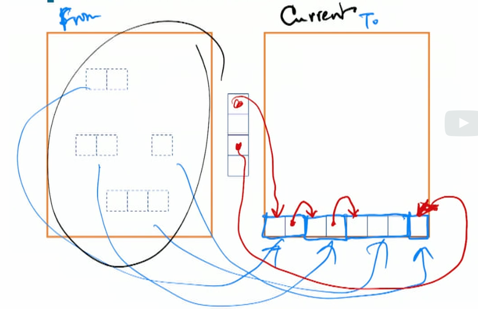

#### Copying Traversal: The Cheney Algorithm

- Copy the immediately-reachable objects into to-space and form the initial queue of objects for a breadth-first traversal.
  - Maintain a **scan pointer** and a **free pointer** in the to-space.
  - objects up to scan pointer: all references from them have been examined (bfs previous layers)
  - between scan and free pointer: object moved but their references are not examined yet (bfs current layer)
- Advance the scan pointer location by location through the first object.
  - For every pointer into from-space that is encountered, copy the referent into to-space at the tail of the queue, update the free pointer to point to this new object location.
- Continue this copying traversal until scan and free point to the same location.
  - At this point, all of the objects that have been reached and copied have also been scanned for descendants.
  - This implies that the scavenging process is complete.
- In reality, need a slightly more complex process to ensure that an <u>object reached by multiple paths is not copied to to-space multiple times.</u>


#### Efficiency of Copying Collection

- Can be made **arbitrarily efficient if sufficient memory** is available.
  - The work done at each collection is <u>proportional to the amount of live data at the time.</u>
  - If approximately the same amount of data is live at any given time during the mutator's execution, then <u>decreasing the frequency of garbage collections will decrease the total effort.</u>
  - A simple way to accomplish this is to <u>make the semispaces bigger.</u>


### Incremental Tracing Collectors

- "Stop-and-copy" collectors are prone to unpredictable delays.
  - These delays arise because the mutator is halted for the full duration of a collection cycle, so that it experiences the collection as a single atomic action.
  - This may not be acceptable in many real-time scenarios.
- This leads us to incremental collector designs.
  - Small units of collector activity must be interleaved with small units of mutator activity.
  - Reference counting collectors are easy to make incremental.
  - What about tracing collectors (either mark-sweep or copying)?
- Fundamental problem
  - Since tracing happens as a sequence of units interleaved with units of mutator activity, <u>the graph of reachable objects is not fixed.</u>
  - The collector needs to have some way of tracking these changes and preventing (or recovering from) any adverse consequences.

#### Towards The Tricolor Marking Abstraction

- Consider a non-incremental tracing collector.
  - Conceptually, we can think of the tracing process as traversing the object graph and coloring its nodes.
  - A node that must be retained is conceptually colored black.
  - A node subject to reclamation is conceptually colored white.
  - When there are no reachable nodes left to blacken, tracing is complete.
- Mark-sweep collector
  - Objects whose mark bit is set are black; others are white.
- Copying collector
  - Unreached objects in from-space are white.
  - Objects moved to to-space are black.
- Unfortunately, this "bicolor" abstraction won't work as-is for incremental collectors.


#### The Tricolor Marking Abstraction

- To handle incremental tracing, we need to introduce a third color, grey.
  - A node that has been reached by the traversal, but whose <u>descendants may not have been,</u> is conceptually colored **grey**.
  - When an object is reached by the traversal, it is initially colored grey.
  - After it is fully scanned and pointers to its descendants have been traversed, it is blackened (and its descendants are greyed).
- Mark-sweep collector
  - Grey objects correspond to those in the stack or queue used to control the marking traversal.
- Copying collector
  - Grey objects are the ones between the scan and free pointers in to-space.
  - Objects that have been passed by the scan pointer are black.

#### Implications of Tricolor Marking

- Traversal of the object graph proceeds in a wavefront of grey objects that separates black objects from white ones.
- This fringe of grey objects must be well-defined and identifiable.
- The mutator must preserve the invariant that **no black object hold a pointer directly to a white object.**
  - Any attempt to create such a pointer needs to be coordinated with the collector to update its bookkeeping,

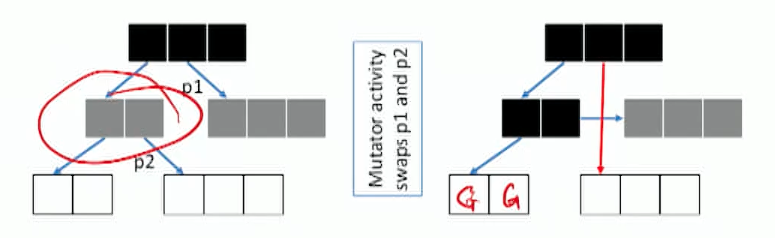

#### Collector-Mutator Coordination

- The problem scenario arises when:
1. The mutator writes a <u>pointer to a white object into a field of a black objec</u>t; AND
2. The mutator <u>destroys the original pointer to the white object before the collector has traversed it.</u>
- Two basic approaches: read barrier and write barrier.
- Read barrier
  - Detect when the mutator attempts to access a pointer to a white object, and <u>immediately color it grey.</u> Very expensive
- Write barrier
  - When the mutator attempts to write a pointer into an object that fits a problem scenario, the write is trapped or recorded.
    - Snapshot-at-beginning: Prevent condition $\# 2$ from happening by <u>first saving a copy of the old pointer for the collector to use.</u>
    - Incremental update: Records pointers stored into a black object (thereby reverting it to grey), or <u>immediately greying the referent.</u>

### Object Lifetimes

- Most objects live for a very short time, while a small fraction of them live much longer. (bimodal distribution)
  - This has been empirically measured in a variety of programs in a variety of programming languages.
  - $80-98 \%$ of all newly-allocated objects die before another megabyte has been allocated.
  - The majority of die even more quickly - within tens of kilobytes of allocation.

- This leads to the major source of inefficiency in simple garbage collectors.
  - Even if garbage collections are fairly close, separated by a few kilobytes of allocation, most objects die before a collection and never need to be copied.
  - However, a large fraction of objects that survive a single collection live through multiple collections. These objects are repeatedly copied at multiple scavenge points.

#### Generational Collection

- Key idea
  - Partition heap into **multiple bins ("generations") for objects of well-separated age ranges.**
  - Scavenge older generations less frequently than younger ones.
  - <u>Advance objects to old generation space as they age</u> (survive several scavenges of their current generation).
- The generational idea pertains to the <u>tracing question.</u>
  - Whether reclamation happens by copying or marking is orthogonal.
  - For concreteness and simplicity, we will assume a "stop-and-copy" collector using semispaces and with two generations.

+ Problem shown below: need to scan older generation if younger generation is updated (copied)

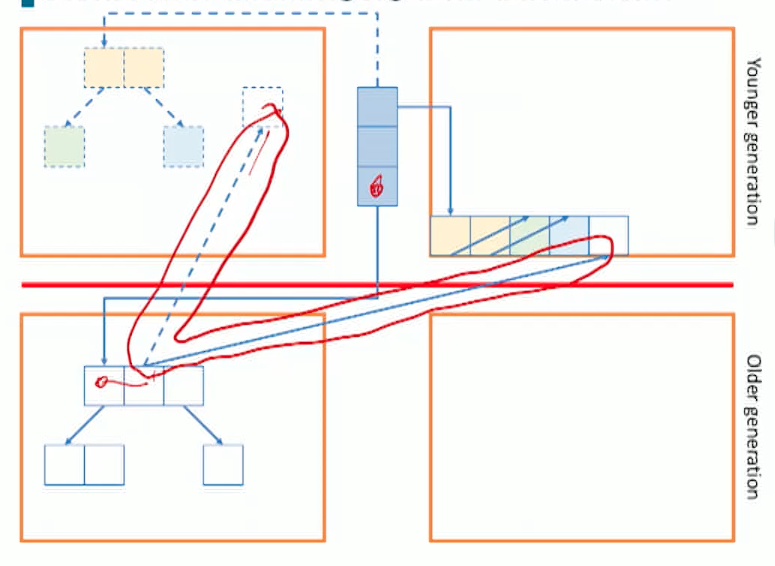

#### Detecting Intergenerational References

- It must be possible to <u>scavenge the younger generation(s) without scavenging older ones</u>.
  - But object liveness is a global property.
  - Any pointers from an older generation to a newer one must be found at scavenge time and used as a root of the traversal.
- Possible solutions.
  - <u>No pointer can point directly from an older generation to a newer generation, but must point to a cell in an indirection table</u>. This table is used as <u>part of the root set.</u>
    - Needs specialized hardware support.
    - Poor effificency
  - Use a pointer recording technique, i.e., keep track of such pointers so that they can be found at scavenge time.
    - This requires something like a <u>write barrier</u>.
    - Results in a <u>conservative approximation</u> of true liveness.
  - Also possible to <u>track pointers the other way, allowing independent scavenging of an older generation.</u>
    - Generally not cost-effective. Easier to just <u>consider all data in the newer generation as possible roots.</u>


#### Design Decisions

- Advancement policy
  - How long must an object survive in one generation before it is advanced to the next?
- Heap organization
  - How should storage space be divided and used between generations, and within a generation?
  - How does this affect locality in virtual memory and cache?
- Traversal algorithms
  - What effect does the traversal algorithm have on locality, and what traversal yields the best result?
- Collection scheduling
  - For a non-incremental collector, how might we avoid or mitigate the effect of disruptive pauses, especially in interactive applications?
  - Can we improve efficiency by careful "opportunistic" scheduling?
  - Can this be adapted to incremental schemes to reduce floating garbage?
- Intergenerational references
  - What is the best way to find the live pointers from older generations into the one(s) we are scavenging?

