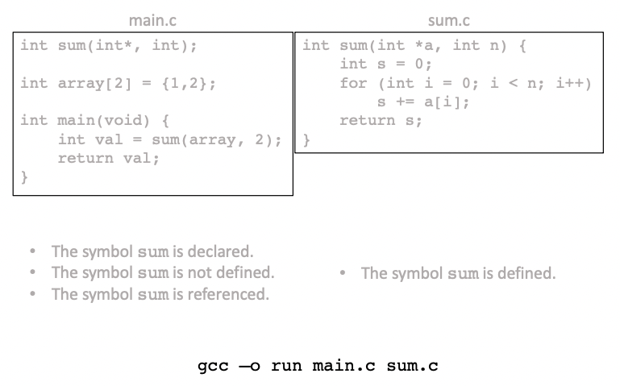

## Object Files

### Object Modules

- The binary output of compiling (and optionally combining) one or more source modules is called an object module.
  - An object file is such a module stored as a binary file in a system environment.
  - E.g., .o files for $C$ source; .class files for Java source; .exe, .dll, .so, a, .app files; etc.
- From a data perspective, an object file is simply a selfdescribing sequence of bytes, according to some file format specification.
  - Generally <u>ISA/OS-specific and therefore non-portable:</u> a.out ("assembler output", original Unix), PE (“Portable Executable", Windows), Mach-O (“Mach Object", macOS), ELF (“Executable and Linkable Format", Linux).
  - <u>"Fat binaries</u>" are executable object files that have been expanded with native code for <u>multiple instruction sets and/or operating systems</u>, which can therefore be run on multiple ISA/OS combinations.

### Types of Object Modules

- **Relocatable** object module
  - Contains binary code and data in a form <u>suitable for combinin</u>g.
  - <u>Cannot be executed in isolation.</u>
  - `progl.c`, will be con verted to `.o`
- **Executable** object module
  - Contains binary code and data in a form suitable for being loaded into memory and <u>executed</u>.
  - `prog1.o`
- **Shared** object module
  - A special type of <u>relocatable</u> object module that can be <u>loaded into memory and linked dynamically</u>, either at program load time or during program execution. Can be shared among multiple processes
    - static lib: `.a`
    - dynamic lib `.so`
    - ​				```gcc -o prog progl.c prog2.c -lm```

### ELF Relocatable Object File Format

- `.xxx`: sections
- section header table: describe all the `.xxx` above, fixed size
- Variables: only for global variables
- 


### Introduction to Linking: Source Files



output files: `main.o, sum.o, run`
+ SYMBOL TABLE: index, global? .section size name
+ .data: offset
+ .text: offset <symbol> 
+ c: …., l1…. from .rel .text
+ 9 and 10: 00 00 00 00, holes need to be plugged in by linker


+ 


+ addresses of <main> and <sum> have changed
+ .data coordinate changes from 000000 to 201010


### What The Static Linker Does

- The (static) linker is solely concerns with the <u>externally-visible symbols</u> of the relocatable modules it is linking.
  - It is not concerned with handling local variables and other symbols that are not visible outside individual relocatable modules.
- The symbol table of a relocatable module provides information about the externally-visible symbols defined in it and the external symbols referenced by it.
  - These <u>definitions and references have to be matched up</u>. This task is called **symbol resolution**.
- The **relocation entries** of a relocatable module provide information about which symbol references in it need to be adjusted (and how) when combining multiple relocatable modules. (<u>adjust location eg</u>.)
  - Each module is generated in its standalone local coordinate system.
  - These multiple local coordinate systems have to be combined correctly into a single (global) coordinate system in the final) executable. This task is called **relocation**.


## Linking Symbol Resolution


### The Tasks of The Linker

- Input: A collection $M=\left\{M_{1}, \ldots, M_{k}\right\}$ of relocatable object modules.
  - Let module $M_{i}=\left(T_{i}, D_{i}, \Sigma_{i}\right)$, with $T_{i}$ denoting its $.$ text section, $D_{i}$ its . data section, and $\Sigma_{i}$ its symbol table.
  - $\Sigma_{i}$ contains information about the symbols <u>defined in or referenced by</u> module $M_{i}$.
- Symbol resolution: Match each reference to a **link-time symbol** in each module with exactly one <u>unique</u> symbol definition from the set of defined symbols across all the modules in $M$.
- Relocation: Merge <u>. text and $.$ data</u> sections from multiple relocatable object modules in a coordinated manner.
  - Create a single . text section $T$ from $\left\{T_{1}, \ldots, T_{k}\right\}$, and a single . data section $D$ from $\left\{D_{1}, \ldots, D_{k}\right\}$.
  - Adjust any text and data symbol references that need to change as a result of this merge.
- Output: The <u>binary executable or shared object file.</u>

### Link-Time Symbols

- A link-time symbol in a relocatable object module is a **procedure name, global variable, or static variable** that is declared, defined, or referenced in the module.
  - Procedure variables: defined and referenced in .text
  - data variables: defined in .data and referenced in .text
- Method-local non-static variables are of no interest to the linker.
  - These are compile-time symbols. They are not even described in the module's symbol table.
  - The compiler binds such symbols to an offset in the activation record for the method in which the symbol is defined.
  - An activation record is instantiated on the run-time stack for each invocation of the method.
- Method-local static variables are allocated in the - data or . bss sections of the module.
  - These are also compile-time symbols, but they are described in the module's symbol table as they require relocation.
  - The compiler ensures that there is only one definition per module for each procedure-local static variable, and creates a unique name for it.

### More on Link-Time Symbols

- Useful Boolean function on symbols:
  - $\operatorname{DEF}(s, m)=$ true, if module $m$ contains a definition of symbol $s$; false, otherwise.
  - USE $(s, m)=$ true, if module $m$ contains one or more references to symbol $s$; false, otherwise.
  - $\operatorname{VISIBLE}(s)=$ true, if $s$ is a non-static symbol; false, otherwise.
- With reference to module $m$, link-time symbol $s$ is said to be:
  - Local, if $\mathrm{DEF}(s, m) \wedge \neg \operatorname{VISIBLE}(s) .$
  - Global, if $\mathrm{DEF}(s, m) \wedge \operatorname{VISIBLE}(s)$.
  - External, if $\mathrm{USE}(s, m) \wedge \neg \operatorname{DEF}(s, m)$.
- The linker resolves external symbol references with global symbol definitions across modules.
  - When the compiler encounters an **external symbol**, it <u>generates a linktime symbol in the module's symbol table, and passes it on to the linker to resolve.</u>
  - The linker tries to find a unique definition for this symbol reference among the symbol definitions across all the modules that it is linking.

### Link-Time Symbols: Examples


### Rules for Unique Resolution

- The global symbols of module $m$ are further divided into strong and weak symbols.
  - Function names and initialized variables are **strong symbols**.
  - <u>Uninitialized variables</u> are **weak symbols**. (strong symbols takes priority)
- Let $s$ and $w$ be the total number of strong and weak definitions <u>matching an external reference $r$</u>.
  - If $s=w=0$, declare a link-time error: no definition found.
  - If $s>1$, declare a <u>link-time error: multiple strong definitions</u>.
  - If $s=1$, resolve $r$ to the unique strong definition (no matter what w is).
  - If $s=0 \wedge w=1$, resolve $r$ to the unique weak definition.
  - If $s=0 \wedge w>1$, <u>resolve $r$ to an arbitrary weak definition.</u>


## Linking Relocation


### The Need for Relocation

- When a source file is compiled into an object module, it has a "local coordinate system" (aka "module addresses" or "link-time addresses") for both . text and .data.
- When multiple object modules are linked, the multiple - text sections need to be combined into a single . text section (a "global coordinate system", aka "run-time addresses") in the output file. Likewise for other sections.
- This requires three separate steps:
1. Relocating sections to their correct RT addresses.
2. Computing the correct RT addresses for all symbol definitions.
3. Modifying ("patching") symbol references so that they point to the correct RT addresses of the symbol definitions to which they have been resolved during symbol resolution.


### ELF Executable Object File Format

+ .rel .text is removed
+ added .init
+ added `Segment header table`, **Segments: **
  + RO: contiguous read only section
  + RW: contiguous read and write section


### Run-Time Virtual Address Space

+ Kernel memory: not accessable
+ Local data
  + static: in user stack
  + Dynamic: in heap. `sbrk` ask for brk pointer to go up


### Steps for relocation

+ Relocating sections
  + find origins for sections, e.g. for .text1, .text2, … to be placed in `a.out`
  + RT address: global address in `out` file
  + RT offset: offest within the section in the `out` file (the combined .text section and .data section)
+ Compute symbol definition addresses
  + LT offset -> RT address
+ patching the symbol references with the address calculated above


### Patching Symbol References

- We have a symbol reference $m . s$, i.e., the symbol $s$ being referenced in module $m$.
  - Symbol resolution has matched it to symbol definition n.t.
  - We have computed the RT address of $n . t$.
- We just need to deal with two issues.
  - Does the reference $m . s$ even need to be patched?
  - If it does, how does it need to be updated?
- The <u>relocation records in the .rel. text and - rel . data sections</u> of module $m$ provide the answers.
  - The symbol references that need to be patched are exactly the ones that are identified in the relocation records (which were generated by the compiler).
  - Part of the record describes the type of relocation needed.
  - <u>ELF defines 32 different relocation types</u>. Two major ones:
    - R_x86_64_PC32: Reference using 32-bit PC-relative address.
    - R_x86_64_32: Reference using 32-bit absolute address.


## JVM


### Linking In The Java Virtual Machine

- Java's approach to linking is **completely dynamic.**
- Individual . class files are loaded, linked, and initialized <u>when they are first referenced.</u>
  - Allows for greater flexibility and portability for the user.
  - Makes the necessary run-time data structures and algorithms more elaborate.
    
- Game plan
  - The class file format.
  - JVM startup and exit actions.
  - Class loading, linking, initialization (simplified: fast path only).

### The class File Format

- [Ref: JVM SE16, Chapter 4]
- A class file consists of a stream of 8 -bit bytes.
- 16-bit and 32-bit quantities are constructed from two or four 8 -bit bytes.
- Multibyte data items are always stored in big-endian order.
- Shorthand
  - u1 for unsigned one-byte quantity.
  - $\mathrm{u} 2$ for unsigned two-byte quantity.
  - u4 for unsigned four-byte quantity.
- A class file consists of a single ClassFile structure.
  - Essentially, a sequence of self-describing nested tables.


- Constant pool (~ .symtab)
  - The central repository of names found in the class.
  - Consists of a number of variable-sized (but self-describing) entries of type cp_info, describing 17 kinds of possible constants.
  - 
- Fields
  - Described by a field info structure
  - Variable-sized, but self-describing.
  - 
- Methods
  - Described by a method_info structure.
  - Variable-sized, but self-describing.
  - A key attribute is Code, which contains the JVM code for the method.
  - 


### Java Virtual Machine Startup and Exit

- [Ref: JVM SE16, §5.2, §5.7]
- JVM startup
  - Create an initial class (or interface) using a class loader.
  - Link this initial class.
  - Initialize this initial class.
  - Invoke the public static method void main (String [ ]) of this class.
- The invocation of this method drives all further execution, including the linking and creation of additional classes and interfaces, and the invocation of additional methods.
- JVM exit
  - The Java Virtual Machine exits when some thread invokes the exit method of class Runtime or class System, or the halt method of class Runtime, and the exit or halt operation is permitted by the security manager,

### Run-Time Constant Pool

- [Ref: JVM SE16, §5.1]
- The JVM maintains a run-time constant pool for **each class** (or interface).
  - Plays a role analogous to that of a **symbol table.**
  - Constructed upon class creation from the constant_pool in the class file representation of the class.
- Two kinds of entries:
  - Symbolic references, which may later be resolved.
  - Static constants (i.e., string and numeric constants), which require no further processing.
- All static constants and some types of symbolic references are **loadable**, i.e., they may be pushed onto the evaluation stack by the ldc (load constant) family of instructions.

### Class Creation and Loading

- [Ref: JVM SE16, §5.3]
- Creation of a class (or interface) $C$ denoted by the name $N$ consists of the construction in the method area of the JVM of an implementation-specific internal representation of $C$.
  - A non-array class is created by loading its binary representation using a class loader $L$.
  - The run-time identity of class is the pair $\langle N, L\rangle$.
- Loading a class (when $L$ is the bootstrap class loader)
  - The JVM passes the argument $N$ to an invocation of a method on the bootstrap class loader to search for a representation of $C$ in a platform-dependent manner (i.e., a class file).
  - Then the JVM attempts to derive a class $C$ from the class file.
    - Parse the class file into an implementation-specific internal representation.
    - If $C$ has a direct superclass $D$, resolve the symbolic reference from $C$ to $D$. Likewise for any superinterfaces.

### Class Linking

- [Ref: JVM SE16, $\S 5.4]$
- Linking a class (or interface) involves verifying and preparing that class, its direct superclass, and its direct superinterfaces, if necessary.
- Linking also involves resolution of symbolic references in the class or interface, though not necessarily at the same time as the class or interface is verified and prepared.
- The JVM specification allow an implementation to be flexible in scheduling linking activities "eagerly" or "lazily", as long as the following invariants are maintained.
  - A class is completely loaded before it is linked.
  - A class is completely verified and prepared before it is initialized.

### Verification, Preparation, Resolution

- [Ref: JVM SE16, §5.4.1-3]
- **Verification** ensures that the binary representation of a class or interface is structurally correct.
- **Preparation** involves creating the static fields for a class and initializing such fields to their default values.
  - This does not require the execution of any JVM code; explicit initializers for static fields are executed as part of initialization, not preparation.
  - Preparation may occur at any time following creation but must be completed prior to initialization.
- **Resolution** is the process of dynamically determining one or more concrete values from a symbolic reference in the run-time constant pool.
  - Required when a JVM instruction like new, invokevirtual, or getfield is executed.
  - Initially, all symbolic references in the run-time constant pool are unresolved.

### Class Initialization

- [Ref: JVM SE16, $\S 5.5]$
- Initialization of a class consists of executing its class initialization method (i.e., $<$ clinit $>$ ).
  - Prior to initialization, a class must be linked, i.e., verified, prepared, and optionally resolved.
- Details of the initialization process are complicated.
  - Because the JVM is multithreaded, initialization of a class requires careful synchronization, since some other thread may be trying to initialize the same class at the same time.
  - There is also the possibility that initialization of a class may be requested recursively as part of the initialization of that class.
  - The implementation of the JVM is responsible for taking care of synchronization and recursive initialization following a specified procedure.


## Binding time choices for library

### What Is A Library?

- A library is a packaged collection of object modules that is included as a unit as needed in a linked program.
- Fundamentally, no more than a set of object modules.
  - Links within these modules are statically resolved.
  - Usually also contains some kind of added directory information to make it faster to search.
- Static libraries
  - A collection of concatenated relocatable object modules, with a header describing the size and location of each module.
  - Identified by filename extension `.a` ("archive") on Linux.
- Shared libraries
  - An object module that can be loaded at an arbitrary memory address and linked (using a dynamic linker) with a program in memory at either load time or run time (dynamic).
  - Identified by filename extension `. so` ("shared object") on Linux.

### What Is Shared

- There is <u>only one copy of the .so file for the entire system.</u>
  - This is unlike static libraries, which are copied, embedded into, and (inked with each executable that calls them.
- .text section: shared (single copy)
  - This effect is accomplished by mapping these (read-only) physical pages into the virtual address spaces of these processes.
- . data section : replicated, one for each executable.
- The requirement that the shared library be loadable at an arbitrary memory address
  - all code in the library must be position-independent.

### Binding Time Choices for Libraries

1. Static linker fully links library with application object modules.
- All references resolved by static linker.
- Loaded by OS loader as part of monolithic executable image.
2. Static linker uses library information, but only links it partially.
   1. Loaded by OS loader as part of fork ( )/exec ( ).
      1. References resolved in bulk before program execution starts. (normal path)
      2. References resolved individually at points of first use.
   2. Loaded by dynamic linker, triggered by first use.
      1. References resolved individually at points of first use. (JVM)
3. Static linker doesn't have library information.
   1. System calls allow the process to request the dynamic linker to load, link, and resolve an arbitrary shared library during application execution.
      1. See $<$ dl fcn. $\mathrm{h}>$ and dlopen ()$, d 1 \operatorname{sym}()$, dlclose () ,
## Position-independent Code

### Specifying Branch and Call Targets

- In assembly language, we indicate (direct) jumps and calls with a symbolic syntax.
  - JMP Label
  -  JCC Label
  - CALL Label
- The machine-level ISA reference specifies these instructions as having an offset operand.
- This offset can be encoded in one of two ways.
  - As an absolute offset ("Go to this address").
  - As a relative offset (“Go so far from the address of the current instruction") - actually, from the address of the sequential successor of the current instruction.


- The <u>encoding remains unchanged even if the numerical value of loop changes.</u>
- This is the most basic form of Position-Independent Code (PIC).
  - The non-sequential control transfer edge is "frozen" at compiletime and can be freely relocated to any memory address.
  - The offsets in the two jump instructions do not need to be patched at link-time.


### Why PIC Matters

- Consider a large library, e.g., the C standard library libc.
  - The library exposes a large number of definitions.
  - Any single program likely references a very small number of these definitions (e.g., file $\mathrm{I} / \mathrm{O}$ but not signals). However, there may be a lot of references to these definitions.
- If we link libc statically with application programs, we resolve and patch these references prior to load-time.
  - The entire library is embedded into each executable, increasing its size on disk and its virtual memory footprint.
  - The OS has to manage many distinct copies of the library, putting a greater load on the VM system.
    - In principle, at least <u>the read-only segment could be shared among all executables linking against libc that are running simultaneously.</u>
- If we link libc dynamically with application programs, we defer patching the references to load-time (or possibly even run-time).
  - Multiple references to the same libc definition still need to be patched individually, resulting in a time overhead. Can we mitigate this overhead? Yes
  - Can we also arrange to share a single copy of the read-only segment? Yes


### Dynamic Linking Workflow on Linux


### The Problem

- We have an application binary (mainvecso) that links with a dynamically linked library (libvector .so), with references that may need run-time resolution.
  - Data references (e.g., to addcount, within the library).
  - Code references (e.g., the call to addvec ( ) from mainvecso).
- In general, the number of references will be much greater than the number of definitions.
- How do we design an efficient resolution scheme that will allow us to patch lazily and to share the $.$ text section of the library among all of its users?
  - (“Lazy resolution") We want to patch only those references that are truly needed during a program run.
  - (“Once-per-definition resolution") We want to minimize the cost of patching multiple references to a single definition.


### The Key Insight

- The problem arises because:
  - we have direct connections from multiple sources (references, in module A) to a single destination (definition, in module B); 
  -  we have to patch the reference end (blue).
  - 
- If we reconfigure the connections to pass through a common yellow "junction box", then we can patch the single connection from this box to the definition.
  - The Global Offset Table (GOT) is just this junction box.
  - The Procedure Linkage Table (PLT) is a mechanism to make sure that the <u>blue edges remain PIC</u>.

### The .got and $\cdot$ plt Sections

- Two special sections in executable ELF and .so files.
  - There may also sometimes be a .got. plt section and a - plt. got section. For simplicity, ignore this complication.
- The $\cdot$ got section is a data (RW) section that contains addresses to any global external run time symbol reference
- The .plt section is a code (RO) section that contains executable code.
  - Consists entirely of stubs of a well-defined format, dedicated to directing calls from the . text section to the appropriate library function.


- There will also be . rel. dyn and .rel.plt sections in the ELF file to enable the dynamic linker to do its job of initializing GOT entries correctly.

### Patching Data References


- The **dynamic linker** relocates each GOT entry to the absolute address of each global variable.
- .got at the begining of the .data section, and once linked, distance between it and the .text section will be fixed


- This uses the special RIP-relative addressing mode, which is available on $x 86$ only in 64 -bit mode.
  - A bootstrapping trick is needed in 32-bit mode.

### Patching Code References


1. The call to addvec ( ) reaches the PLT [ 2$]$ stub instead.
2. The indirect jump through GOT [ 4$]$ reaches the very next instruction (1?).
3. After pushing the argument $0 \times 1$ on the call stack (uniquely identifying the method), control branches to the PLT [ 0$]$ stub, for the dynamic linker.
4. After pushing another argument on the call stack (to identify the relocation entries), control branches indirectly to the dynamic linker.
5. The dynamic linker patches the reference by updating GOT [ 4$]$ to the RT address of addvec ( ), and then jumps to that routine.
6. On subsequent calls to addvec ( ), the indirect jump through $\mathrm{GOT}[4]$ in step #2 bypasses the following steps and goes directly to the routine., since the GOT[4] is already updated, it will return directly after callq. 